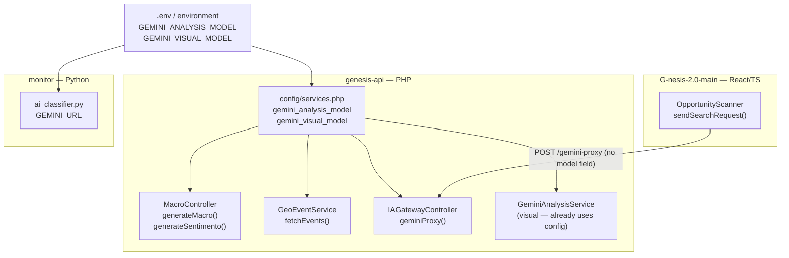

# Design Document — gemini-model-config

## Overview

The Genesis platform calls the Gemini AI API from multiple layers: two Laravel PHP controllers, one Laravel PHP service, one React/TypeScript component, and one Python monitor script. Each of these currently embeds the string `gemini-2.5-flash` (or `gemini-3.1-pro-preview`) as a literal in source code. This makes model rotation impossible without a code change and redeployment on every affected service.

This feature introduces a single environment-variable contract — `GEMINI_ANALYSIS_MODEL` for text/classification tasks and `GEMINI_VISUAL_MODEL` for image/OCR tasks — and routes every call through that contract. The Laravel Config_Layer (`config/services.php`) already exposes both keys with safe defaults; the only work remaining is to remove hardcoded strings from the callers and replace them with the appropriate config/env lookup.

## Architecture

The change is purely a configuration-plumbing refactor. No new services, no new routes, no new data stores are introduced.



All PHP text-task callers go through `config/services.php`; the Python script calls `os.getenv()` directly; the React component omits the `model` field so the backend default is applied.

## Components and Interfaces

### Config_Layer — `genesis-api/config/services.php`

Already correct. Exposes:

```php
'gemini_analysis_model' => env('GEMINI_ANALYSIS_MODEL', 'gemini-2.5-flash'),
'gemini_visual_model'   => env('GEMINI_VISUAL_MODEL',   'gemini-3.1-pro-preview'),
```

No change required. Verification only.

### MacroController — `genesis-api/app/Http/Controllers/Api/MacroController.php`

Two private methods each build a Gemini URL with the model embedded as a literal. The fix reads the model from config and interpolates it:

```php
// Before (both generateMacro and generateSentimento):
"https://generativelanguage.googleapis.com/v1beta/models/gemini-2.5-flash:generateContent?key={$apiKey}"

// After:
$model = config('services.gemini_analysis_model');
"https://generativelanguage.googleapis.com/v1beta/models/{$model}:generateContent?key={$apiKey}"
```

### GeoEventService — `genesis-api/app/Services/GeoEventService.php`

One URL construction around line 205. Same pattern as MacroController.

```php
// Before:
$url = "https://generativelanguage.googleapis.com/v1beta/models/gemini-2.5-flash:generateContent?key={$apiKey}";

// After:
$model = config('services.gemini_analysis_model');
$url   = "https://generativelanguage.googleapis.com/v1beta/models/{$model}:generateContent?key={$apiKey}";
```

### IAGatewayController — `genesis-api/app/Http/Controllers/Api/IAGatewayController.php`

`geminiProxy()` defaults `model` from the request with a hardcoded fallback:

```php
// Before:
$model = $request->input("model", "gemini-2.5-flash");

// After:
$model = $request->input("model", config('services.gemini_analysis_model'));
```

Caller-supplied values still take precedence; only the fallback changes.

### OpportunityScanner — `G-nesis-2.0-main/components/OpportunityScanner.tsx`

Remove the `model` field from the proxy request body entirely. The backend default (driven by `GEMINI_ANALYSIS_MODEL`) applies automatically.

```ts
// Before:
body: JSON.stringify({
  model: "gemini-2.5-flash",
  contents: `...`,
  config: { tools: [{ googleSearch: {} }] }
})

// After:
body: JSON.stringify({
  contents: `...`,
  config: { tools: [{ googleSearch: {} }] }
})
```

### AI_Classifier — `G-nesis-2.0-main/monitor/ai_classifier.py`

Replace the hardcoded module-level assignment:

```python
# Before:
GEMINI_MODEL = 'gemini-2.5-flash'
GEMINI_URL = (
    f'https://generativelanguage.googleapis.com/v1beta/models/{GEMINI_MODEL}:generateContent'
)

# After:
GEMINI_MODEL = os.getenv('GEMINI_ANALYSIS_MODEL', 'gemini-2.5-flash')
GEMINI_URL = (
    f'https://generativelanguage.googleapis.com/v1beta/models/{GEMINI_MODEL}:generateContent'
)
```

`os` is already imported.

### Environment Files

`genesis-api/.env` — add the missing declaration:
```
GEMINI_ANALYSIS_MODEL=gemini-2.5-flash
```

`genesis-api/.env.example` — declare both model variables with comments (create if absent).

## Data Models

No new data models. The only "data" involved is the model identifier string flowing from environment → config → callers.

| Variable | Scope | Default | Used by |
|---|---|---|---|
| `GEMINI_ANALYSIS_MODEL` | env | `gemini-2.5-flash` | MacroController, GeoEventService, IAGatewayController default, AI_Classifier |
| `GEMINI_VISUAL_MODEL` | env | `gemini-3.1-pro-preview` | IAGatewayController scangraph, GeminiAnalysisService |

## Correctness Properties

*A property is a characteristic or behavior that should hold true across all valid executions of a system — essentially, a formal statement about what the system should do. Properties serve as the bridge between human-readable specifications and machine-verifiable correctness guarantees.*

### Property 1: All text-task components resolve the model from configuration

*For any* value of `GEMINI_ANALYSIS_MODEL` set in the environment, every backend text-task component (MacroController `generateMacro`, MacroController `generateSentimento`, GeoEventService, and IAGatewayController `geminiProxy` default) SHALL construct Gemini API URLs that contain that value as the model segment, and none of them shall contain the literal string `gemini-2.5-flash` as a hardcoded constant.

**Validates: Requirements 1.1, 1.2, 2.1, 2.2, 7.3**

---

### Property 2: Config_Layer default fallback

*For any* deployment where `GEMINI_ANALYSIS_MODEL` is absent from the environment, `config('services.gemini_analysis_model')` SHALL return `gemini-2.5-flash`, and the AI_Classifier `GEMINI_MODEL` SHALL equal `gemini-2.5-flash`.

**Validates: Requirements 1.3, 2.3, 3.3, 5.2, 7.2**

---

### Property 3: Caller-supplied model overrides the backend default in geminiProxy

*For any* non-empty model string supplied in a gemini-proxy request body, the IAGatewayController SHALL use the caller-supplied value rather than the configured default.

**Validates: Requirements 3.2**

---

### Property 4: Python AI_Classifier URL round-trip

*For any* value of `GEMINI_ANALYSIS_MODEL` set in the process environment, `GEMINI_URL` in `ai_classifier.py` SHALL contain that exact model identifier as the URL path segment (i.e., `GEMINI_MODEL` appears between `/models/` and `:generateContent`).

**Validates: Requirements 5.1, 5.3**

---

### Property 5: Semantic separation between analysis and visual models

*For any* combination of `GEMINI_ANALYSIS_MODEL` and `GEMINI_VISUAL_MODEL` values, text-task components SHALL only ever use `config('services.gemini_analysis_model')` and visual-task components SHALL only ever use `config('services.gemini_visual_model')` — neither config key is used by the wrong task type.

**Validates: Requirements 6.3, 7.1, 7.4**

---

### Property 6: OpportunityScanner request body contains no model field

*For any* invocation of the OpportunityScanner search request, the JSON body sent to the gemini-proxy endpoint SHALL NOT contain a `model` key.

**Validates: Requirements 4.1**

---

## Error Handling

These changes do not introduce new error paths. The existing fallback behavior is preserved:

- If `GEMINI_ANALYSIS_MODEL` is set to an invalid or unavailable model name, the Gemini API will return a 4xx error. MacroController, GeoEventService, and IAGatewayController all have existing `try/catch` blocks that log and return user-friendly error messages — no new handling needed.
- The AI_Classifier's `GEMINI_URL` will contain the configured model name; if that name is invalid the API will return an error, which is handled by the existing retry/error logic in the script.
- `GEMINI_VISUAL_MODEL` (already working) is unchanged; this feature does not touch the visual path except to verify the config key exists.

## Testing Strategy

### Unit tests

- Verify `config/services.php` returns correct defaults when env vars are absent.
- Verify `config/services.php` returns overridden values when env vars are set.
- Verify `ai_classifier.py` sets `GEMINI_MODEL` and `GEMINI_URL` correctly given env var present and absent.
- Verify `IAGatewayController::geminiProxy()` uses caller-supplied model when provided, and config default when absent.
- Verify `OpportunityScanner` request builder does not include a `model` key in the serialized body.

### Property-based tests

Using a property-based testing library (e.g., **fast-check** for TypeScript/Jest, **Hypothesis** for Python, **PHPUnit** with manual generators for PHP) with a minimum of 100 iterations each:

**Property 1 — All text-task components resolve the model from configuration**
Generate random valid model identifier strings, set `GEMINI_ANALYSIS_MODEL` to each, and assert every text-task URL-builder produces a URL segment matching the injected value.
Tag: `Feature: gemini-model-config, Property 1: all text-task components resolve model from config`

**Property 2 — Config_Layer default fallback**
This is best covered by an example test (env var absent → default = `gemini-2.5-flash`), not randomized iteration, since the input space is binary (set vs not set).
Tag: `Feature: gemini-model-config, Property 2: default fallback when env var absent`

**Property 3 — Caller-supplied model overrides default**
Generate random model identifier strings as request input; assert `geminiProxy` uses that value regardless of what `config('services.gemini_analysis_model')` returns.
Tag: `Feature: gemini-model-config, Property 3: caller model overrides backend default`

**Property 4 — Python AI_Classifier URL round-trip**
Using Hypothesis: generate arbitrary alphanumeric model name strings, set them as `GEMINI_ANALYSIS_MODEL`, re-evaluate the module-level constants, and assert `GEMINI_URL` contains the model name as the path segment.
Tag: `Feature: gemini-model-config, Property 4: GEMINI_URL contains the configured model name`

**Property 5 — Semantic separation**
Verify that no text-task component references `gemini_visual_model` and no visual-task component references `gemini_analysis_model`. This can be implemented as a static analysis test (grep/AST scan) that fails if cross-contamination is detected.
Tag: `Feature: gemini-model-config, Property 5: analysis and visual models are never swapped`

**Property 6 — OpportunityScanner no model field**
Generate arbitrary search symbols; assert that the JSON body produced by the scanner's fetch call does not contain a `model` key for any input.
Tag: `Feature: gemini-model-config, Property 6: OpportunityScanner request has no model field`
