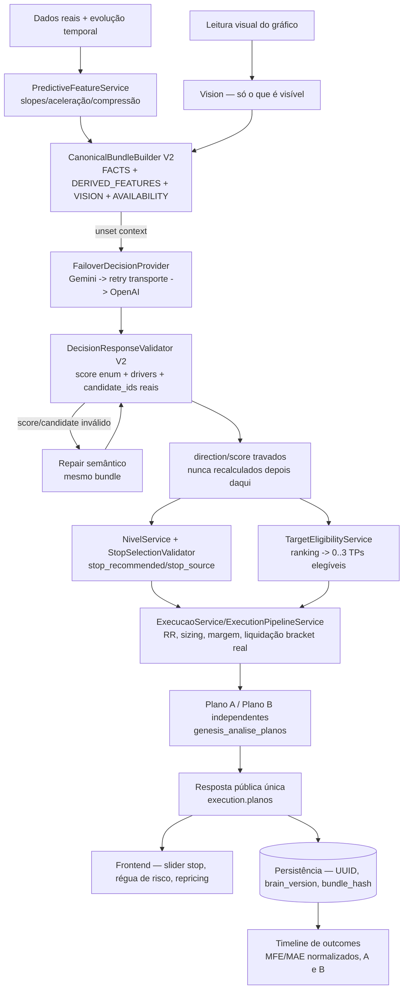

# Design — Gênesis Brain V2

## Visão Geral

Este design fecha o gap entre o estado real do código (auditado em 2026-09-15 contra `genesis-api` e este frontend) e a Fonte (`fonte-brain-v2.md`). Diferente dos specs anteriores (`genesis-r3-2-implementacao`, `genesis-cerebro-grafico-r3-2`), que corrigiam o **cérebro de análise gráfica** (famílias de score, estrutura, CVD, Fibo, OCR), este spec ataca uma camada acima: o **contrato de decisão** (score categórico da IA em vez de soma de famílias), a **matemática operacional** (stop ajustável, repricing, RR, alavancagem/liquidação desacopladas da IA) e a **infraestrutura de produto** (histórico por UUID, outcomes como timeline, provider failover).

Onde a Fonte já contém código completo (schema, prompt, `FailoverDecisionProvider`, `TargetEligibilityService`, contrato de repricing), este design **não duplica o código-fonte** — a tarefa correspondente em `tasks.md` aponta a seção exata da Fonte a copiar/adaptar.

**Achado central desta auditoria que muda a estratégia de execução:** a Fonte foi escrita como se o código-base fosse mais "verde" do que realmente é. Vários dos "bugs já confirmados" citados pela Fonte são reais e batem exatamente com o código (score `(int)` cast, ausência de failover, `3h` fora de `INTERVALOS_BINANCE`, `strength` no caminho de decisão de targets, `MM_TIER1_FALLBACK`, alavancagem no hash de idempotência). Mas pelo menos três pontos que a Fonte trata como trabalho a fazer **já parecem parcialmente ou totalmente resolvidos** por specs anteriores deste mesmo projeto (V6.7–V6.11): exclusão de macro/sentimento do bundle decisório (`unset($bundle['context'])` já existe), rastreamento de stop-fallback com motivo explícito (`stop_motivo`/`MENSAGEM_STOP_FALLBACK_ESTRUTURAL` já existe em `NivelService`), e o mecanismo de leitura de Plano B pode já vir de um relacionamento Eloquent ao vivo (`AnaliseTransformer::planos[]`) em vez do snapshot congelado que a Fonte descreve. Tratar esses três como "construir do zero" desperdiçaria esforço e arriscaria criar um segundo mecanismo paralelo ao que já existe — daí vários requisitos abaixo começarem com uma tarefa de confirmação, não de implementação direta.

## Estado Atual Auditado (2026-09-15)

Auditoria de código real contra `genesis-api` (não apenas leitura da Fonte), cruzada com a história de specs já entregues deste projeto (V6.4 a V6.11, ver `MEMORY.md` da sessão para o resumo cronológico):

| Item da Fonte | Estado real |
|---|---|
| Score `(int)` cast destrutivo (`AnalysisPersistenceService.php:150,226`) | ✅ Confirmado — cast literal presente, exatamente como a Fonte descreve. |
| `GENESIS_V2_VALID_SCORES` enum fechado | ❌ Não existe. `GenesisDecisionSchema.php` ainda exige `score_familias` como campo obrigatório (linhas 62, 95). |
| `ScoreFromFamilies` pesos 30/28/28/14 | ✅ Confirmado — `ScoreFromFamilies.php:24-27`, valores exatos. Chamado diretamente em `GraphicalAnalysisAttemptJob.php:450`. |
| `DirectionCoherenceGate`, `RegimeService` | ✅ Ambos existem (`app/Services/GraphicalAnalysis/DirectionCoherenceGate.php`, `app/Services/RegimeService.php`). Comportamento atual (se escrevem em `direction`/`score` hoje) **não confirmado** nesta auditoria — ler antes de tocar. |
| `TargetCandidateCatalog::strength` no caminho de decisão | ✅ Confirmado — `strength` é calculado e usado como filtro ativo (`> 0.15`) na seleção de candidatos, linhas 142/198. |
| `StopSelectionValidator` aceita `candidate_id=null` | ✅ Confirmado, e já tratado como "resposta válida por definição" no comentário do código. |
| `NivelService` fallback estrutural de stop | ⚠️ **Mais avançado do que a Fonte presume.** Já existe `MENSAGEM_STOP_FALLBACK_ESTRUTURAL` e persistência de `stop_motivo` quando `$ancoraEscolhidaPelaIa` é falso (linhas 82, 235) — um mecanismo de rastreamento de fallback já real, só com nomenclatura diferente de `stop_source`. |
| `cache_ttl` único e global | ✅ Confirmado — `config/binance.php:9`, uma única chave `env('BINANCE_CACHE_TTL', 300)`. |
| `conviccao_min_execucao` | ✅ Confirmado default `50` (`config/genesis.php:11`), a Fonte pede `60`. |
| `rr_minimo` configurável | ✅ Já configurável hoje (`config/genesis.php:4`, default `1.50`) — nenhuma mudança estrutural necessária. |
| `allowed_timeframes` inclui `3h` | ✅ Confirmado, e pior do que a Fonte descreve — 16 valores aceitos hoje vs. 15 em `BinanceService::INTERVALOS_BINANCE` (sem `3h`) vs. 6 propostos pela Fonte como conjunto canônico. Esta é uma redução de superfície bem maior do que "remover só 3h". |
| `CanonicalBundleBuilder` remove `context` do payload decisório | ✅ **Já implementado.** `unset($decisionManifest['context'])` (linha 314) e `unset($bundle['context'])` em `forStage1()` (linha 351). A Fonte §57 afirma isso e está correta — este requisito é de manter/testar, não construir. Ponto de atenção: o mesmo arquivo grava `snapshot['macro']['score']`/`sentiment['score']` num `$snapshot` que alimenta o manifesto de evidências (linhas 93-118) — confirmar que esse caminho é estritamente pós-exclusão do contexto decisório. |
| `analysisIdempotency.ts` inclui alavancagem no hash | ✅ Confirmado — `[s.symbol, s.timeframe, String(s.alavancagem), s.imagemHash].join('|')`, linha 29. |
| `LiquidationCalculatorService` fallback estimado | ✅ Confirmado — `MM_TIER1_FALLBACK`/`MATH_ESTIMATE_TIER1` presentes. |
| `GeminiDecisionClient` sem failover | ✅ Confirmado — comentário explícito no código (linha 32) admite a ausência de fallback. `OpenAiDecisionClient.php` já existe como segundo provider pronto para ser encaixado num wrapper. |
| `DesfechoService` retorna no primeiro evento terminal | ✅ Confirmado — `foreach` com `return` imediato em `STOP_ATINGIDO`/`TP3_ATINGIDO`/`TP2_ATINGIDO`/`TP1_ATINGIDO` (linhas 71-80). |
| `execution.planoB` / merge de estado vivo do Plano B | ⚠️ **Diverge da Fonte.** A classe que a Fonte aponta (`AnalysisPublicResponseBuilder::evidenceValue($analysis, 'pipeline.execution')`) não foi localizada com esse padrão exato. Em vez disso, `AnaliseTransformer.php:18-34` monta `'planos' => $item->planos->map(...)` a partir do relacionamento Eloquent `planos` (`genesis_analise_planos`, confirmado por `AnalisePlano.php`), incluindo `status_acionamento` — pode já ser leitura ao vivo. Ao mesmo tempo, o **frontend** ainda referencia `planoB` em 7 arquivos (`services/geminiService.ts`, `types.ts`, `types/graphicalAnalysis.ts`, `components/AnalysisResult.tsx`, `components/AnalysisHistoryDashboard.tsx`, 2 arquivos de teste) — superfície de migração maior do que a Fonte presume. |
| `PlanoBService.php` | ✅ Existe (`app/Services/GraphicalAnalysis/PlanoBService.php`). |
| `MultiTimeframeSnapshotService` | ✅ Existe. Comportamento atual (quantos HTF, se veta) **não confirmado** nesta auditoria. |
| `EvaluateGenesisOutcomes`, horizontes 60/240/1440 | Presumido existente pela Fonte (§77); não relido nesta auditoria — confirmar antes de estender. |
| `TradeFlowService` | Presumido existente pela Fonte (§16.14); não relido nesta auditoria quanto a metadados de cobertura. |

## Medição 1.1 — Incidência de `stop_selection.candidate_id = null` (2026-09-16)

Fonte: `genesis_analises` do banco local deste sandbox (`genesisteste`, `APP_ENV=local`) — **não é o banco de produção**; este ambiente não tem acesso direto a ele. É a única base real disponível para medir.

- 145 análises no total (2026-05-27 a 2026-09-09), 36 com `decision_payload` no formato atual (schema pós-V6.9), 82 `legado=true` (formato antigo, sem `stop_selection`).
- Das 36 com `decision_payload`, só **10** têm a chave `stop_selection` estruturalmente presente — o campo é recente (item 10, V6.9 correção técnica); análises antes disso não têm o conceito.
- Das 10: **0 com `candidate_id = null`** (0%). Todas de 2026-09, modelo `gemini-3.7-flash`, timeframes `1d`/`4h`, ativos `BTCUSDT`/`SUIUSDT`/`APTUSDT`/`POLUSDT`.

**Leitura:** a amostra é pequena demais (n=10) e vem de um ambiente local, não da produção real, para servir de base de decisão sobre o quão comum é o fallback de stop. O achado útil aqui é operacional, não estatístico: o mecanismo (`StopSelectionValidator` aceitando `candidate_id=null`, `NivelService` caindo no fallback estrutural) está implementado e sendo exercitado, e a extração via `decision_payload->stop_selection->candidate_id` funciona. **Repetir esta mesma consulta contra o banco de produção real antes de decidir se o fallback estrutural do stop precisa de correção adicional** (Fonte §90.1 pede essa medição justamente para orientar a Fase 4, não como formalidade).

## Legacy Dependency Audit (Fase 0.2 — Requisito 4.1)

Tabela de classificação preenchida por leitura direta do código real (`genesis-api`, 2026-09-16), para os componentes mínimos exigidos pela task 2.1. Não cobre todo componente que toca stop/target/RR — esses já têm suas próprias tasks de investigação dedicadas (12.1, 16.1, 18.2, 18.4) nas fases correspondentes, para não duplicar o achado aqui fora de contexto.

| Componente | Classificação | Evidência | Observação |
|---|---|---|---|
| `ScoreFromFamilies` (classe) | `REMOVE_FROM_DECISION_PATH` → `DELETE_AFTER_REPLACEMENT_VERIFIED` | Pesos em `ScoreFromFamilies.php:23-28`; chamada em `GraphicalAnalysisAttemptJob.php:450` | Task 5.1 remove a chamada antes de trocar o schema (5.2), na ordem que design.md já exige. Só apagar a classe depois que o teste do legado morto (task 25.2) confirmar que o V2 funciona sem ela. |
| `score_familias` (campo do schema/prompt) | `REPLACE` | `GenesisDecisionSchema.php:62,95` (`required`); instrução em `GenesisPrompt.php` | Substituído pelo `score` enum fechado (`GENESIS_V2_VALID_SCORES`) que a IA devolve direto — tasks 6.1/6.2. |
| `score_breakdown` legado (`Analise::score_breakdown`) | `REMOVE_FROM_DECISION_PATH` | Gerado em `GraphicalAnalysisAttemptJob.php:511` a partir de `$scoreResult` (`ScoreFromFamilies`); persistido em `AnalysisPersistenceService.php:236` | Análises V2 não geram mais breakdown por família — campo fica `null` em análise nova. Coluna do banco continua legível para o histórico anterior; não é para apagar dado histórico. |
| Pesos `30/28/28/14` (`ScoreFromFamilies::PESOS`) | `DELETE_AFTER_REPLACEMENT_VERIFIED` | `ScoreFromFamilies.php:23-28` | Morre junto com a classe — nenhum outro consumidor usa esta constante isoladamente. |
| `ScoreNarrativeBuilder` | `REMOVE_FROM_DECISION_PATH` → `DELETE_AFTER_REPLACEMENT_VERIFIED` | Único consumidor: `GraphicalAnalysisAttemptJob.php:462`, recebe `$scoreResult` de `ScoreFromFamilies` | V2 recebe `score_description` pronto da IA no próprio contrato (task 6.1) — deixa de reconstruir texto a partir de família/nível. Mesmo ciclo de vida do `ScoreFromFamilies`. |
| `DirectionCoherenceGate` | `KEEP` | Lida por completo nesta sessão (task 2.2) | **Confirmado: não escreve em `direction`/`score`/`regime`.** `contradicoes()` é leitura pura (alimenta só o box público "Pontos que pesam contra esta leitura"); `validate()` devolve erro de repair quando a IA não reconhece a contradição via `score_basis.contradiction_level`, mas nunca sobrescreve o valor decidido. A penalidade numérica antiga (-10 pontos/contradição) já tinha sido removida antes desta sessão (V6.10). Task 7.1 não precisa remover nenhuma escrita — só documentar. |
| `RegimeService` | `KEEP` | Lida por completo nesta sessão (task 2.2); chamada por `MarketSnapshotService.php:152` | **Confirmado: função pura, sem escrita.** Retorna `regime` (`tipo`/`direcao_estrutura`/`forca_tendencia`/`mtf_alinhamento`/...) como parte do snapshot de mercado — entrada da decisão, nunca uma sobrescrita pós-decisão. Auto-declarado `'regra' => 'CONTEXTO_NAO_DECISORIO'` no próprio retorno. Task 7.1 não precisa remover nenhuma escrita — só documentar. |
| `DerivativesReadingService` | `KEEP` | Lida por completo nesta sessão | Já reescrita no V6.10 (item 3.6.3) para devolver só fatos (`quadrant`/`crowding`/`squeeze_risk`/`basis_bps`), sem "efeito"/modificador pré-calculado por PHP — já alinhada com a filosofia do V2 (IA lê fato e classifica; nenhum julgamento pré-computado). |
| `TargetCandidateCatalog::strength` | `REMOVE_FROM_DECISION_PATH` | Calculado em `TargetCandidateCatalog.php:142`; usado como filtro ativo `> 0.15` na linha 198 | Confirma o achado do audit inicial: o filtro remove candidatos reais do catálogo antes mesmo de chegarem à IA. Task 18.2: campo `strength` continua existindo (telemetria/legado), mas o filtro sai do caminho V2 — `TargetEligibilityService` novo decide elegibilidade por RR mínimo/espaçamento, não por `strength`. |

## Decisões Arquiteturais

| Decisão | Justificativa |
|---|---|
| Requisitos que tocam código já parcialmente construído (stop fallback, exclusão de macro/sentimento, live-merge do Plano B) começam com uma tarefa de **confirmação por leitura**, não de implementação direta | Evita criar um segundo mecanismo paralelo ao que já existe com nome diferente — o mesmo tipo de duplicação que a própria Fonte pede para eliminar (§10-13). |
| `ScoreFromFamilies` e os pesos 30/28/28/14 saem do caminho de decisão **antes** de qualquer outra mudança de schema/prompt | Trocar o schema (exigir `score` em vez de `score_familias`) enquanto `GraphicalAnalysisAttemptJob` ainda chama `ScoreFromFamilies::calcular($decision['score_familias'])` quebra toda análise real — mesma lição já aplicada no spec irmão `genesis-cerebro-grafico-r3-2` (P1.1/P1.2 feitos fora de ordem por decisão do usuário, ver notas daquele `tasks.md`). |
| `GenesisSupportedTimeframes` como autoridade única substitui tanto `allowed_timeframes` quanto `INTERVALOS_BINANCE` | Os dois hoje divergem entre si (16 vs. 15 valores) e ambos divergem do conjunto canônico proposto (6 valores) — manter duas listas conflitantes é o próprio bug que a Fonte quer eliminar (§56). |
| Publicação única (Fonte §89) é preservada como mandato de produto, mas a validação interna pode ser faseada em staging atrás de `GENESIS_BRAIN_V2_ENABLED` antes do corte real | A Fonte proíbe rollout progressivo *em produção*, não testagem incremental em staging. Isso é consistente com o padrão que este projeto já usou em `project_auth_integracao_v1_v2_spec`/`project_producao_cloudpanel_deploy` (memória de sessão): construir tudo, ensaiar 100% localmente/staging, e só então fazer o corte real de produção em um único evento — não um rollout gradual de usuários. |
| `TargetEligibilityService` novo, separado de `TargetCandidateCatalog` | O catálogo continua gerando níveis reais (fatos); a elegibilidade (RR mínimo, espaçamento, seleção determinística) é uma decisão pós-stop/entrada que não deveria misturar responsabilidade com a geração do catálogo — mesma separação fatos/decisão que rege todo o resto do documento. |
| `FailoverDecisionProvider` como wrapper externo, nunca lógica dentro de `GeminiDecisionClient` | Mantém cada client simples e testável isoladamente; o failover e a distinção transporte/semântico ficam num único lugar auditável (Fonte §66). |
| Reconciliar `stop_motivo`/`MENSAGEM_STOP_FALLBACK_ESTRUTURAL` com `stop_source` em vez de substituir | O mecanismo existente já resolve o requisito central da Fonte (nunca esconder que o stop veio de fallback) — a mudança real necessária é nomenclatura/contrato público, não uma reconstrução. |

## Arquitetura Alvo



## Componentes e Interfaces

### Fase 0 — Medição e P0 de produção (Requisitos 4, 8, 12.1, 17.1, 18, 19, 23)

**Arquivos:** `config/binance.php`, `LiquidationCalculatorService.php`, `GeminiDecisionClient.php`, `OpenAiDecisionClient.php`, novo `FailoverDecisionProvider.php`, `analysisIdempotency.ts`, `config/genesis_graphical_v6.php`, novo `GenesisSupportedTimeframes.php`.

1. Medir, antes de qualquer mudança de comportamento, a incidência real de `stop_selection.candidate_id = null` e rodar o benchmark 20x (Fonte §90.1) — essas duas medições orientam decisões das fases seguintes, não são um relatório descartável.
2. Corrigir os P0 já conhecidos e independentes de schema: TTL por fonte, failover de provider, alavancagem fora do hash de idempotência, timeframes canônicos. Nenhum destes depende do novo contrato de decisão — podem ser feitos em paralelo/antes.
3. Legacy Dependency Audit (Requisito 4) preenchido nesta fase, antes de qualquer remoção começar nas fases seguintes.

### Fase 1 — Score V2 e remoção do `ScoreFromFamilies` do caminho vivo (Requisitos 1, 5, 6, 11)

**Arquivos:** `GenesisDecisionSchema.php`, `GenesisPrompt.php`, `DecisionResponseValidator.php`, `GraphicalAnalysisAttemptJob.php`, `AnalysisPersistenceService.php`, `ScoreNarrativeBuilder.php`, `DirectionCoherenceGate.php`, `RegimeService.php`.

1. Antes de mudar o schema: ler `DirectionCoherenceGate`/`RegimeService` completos para confirmar se escrevem em `direction`/`score` hoje (Requisito 6.1) — determina se a Fase 1 inclui remoção de escrita ou só confirmação.
2. Remover a chamada a `ScoreFromFamilies::calcular()` em `GraphicalAnalysisAttemptJob` e substituir pela validação direta do enum fechado — **nesta ordem**, antes de trocar o schema, para não deixar o job chamando um método com um campo (`score_familias`) que o schema novo não exige mais.
3. Trocar `GenesisDecisionSchema`/`GenesisPrompt`/`DecisionResponseValidator` para o contrato V2 completo (drivers, regime, movement_character, target_ranking, plan_b).
4. Remover casts destrutivos em `AnalysisPersistenceService`.

### Fase 2 — Features preditivas e frescor (Requisitos 3, 7, 8)

**Arquivos novos:** `PredictiveFeatureService.php`. **Arquivos a estender:** `EvidenceCatalog.php`, `CanonicalBundleBuilder.php`, `TradeFlowService.php`.

Serviço puro, sem I/O — pode ser desenvolvido e testado em paralelo à Fase 1. A integração ao bundle (`CanonicalBundleBuilder`) só é conectada depois que o contrato V2 (Fase 1) já aceita os novos `evidence_id`.

### Fase 3 — Vision anti-alucinação e multi-timeframe (Requisitos 9, 10)

Majoritariamente regras de prompt/validator (já cobertas pela Fase 1) mais a consolidação do `MultiTimeframeSnapshotService` para um único HTF. Ler o serviço atual antes de assumir que hoje consulta dois HTF (comportamento não confirmado nesta auditoria).

### Fase 4 — Stop V2, slider, régua de risco, repricing (Requisitos 12, 13)

**Arquivos:** `NivelService.php`, `StopSelectionValidator.php`, novo endpoint `/reprice`, frontend `AnalysisResult.tsx`.

Começa pela reconciliação `stop_motivo` → `stop_source` (não uma reconstrução). O endpoint de repricing é matemática pura — pode ser construído e testado independentemente de qualquer mudança de contrato de decisão, mas depende de `stop_recommended`/`stop_effective` já existirem no modelo de dados (depende da Fase 1 para o campo `stop_selection.candidate_id` do novo schema).

### Fase 5 — Targets, RR, Plano A/B, liquidação real (Requisitos 15, 16, 14, 18)

**Arquivos:** `TargetCandidateCatalog.php`, `TargetSelectionValidator.php`, novo `TargetEligibilityService.php`, `ExecucaoService.php`, `ExecutionPipelineService.php`, `PlanoBService.php`, `AnaliseTransformer.php` (ou `AnalysisPublicResponseBuilder.php` — confirmar qual é o caminho vivo real antes de editar, ver Requisito 14.1), `LiquidationCalculatorService.php`.

A investigação do Requisito 14.1 (qual classe realmente monta a resposta pública de Plano B hoje) é bloqueante para o resto desta fase — sem isso não dá para saber se o "bug de estado congelado" existe ou não.

### Fase 6 — Timeframes, alavancagem/bracket real, macro fora do bundle (Requisitos 17.2-17.3, 18, 20)

Continuação da Fase 0 depois que o contrato de decisão (Fase 1) já não depende mais de nada que mude com leverage/timeframe.

### Fase 7 — Persistência, histórico, outcomes (Requisitos 21, 22, 25, 26)

**Arquivos:** rota `/genesis/analise/:uuid`, `DesfechoService.php`, `EvaluateGenesisOutcomes.php`, novo `brain_version`/`bundle_hash` em toda análise.

Pode começar em paralelo às Fases 4-6 — depende apenas de `brain_version`/`schema_version` já existirem no modelo de dados (Fase 1).

### Fase 8 — Benchmark, teste do legado morto, auditoria final, Release Gate (Requisitos 27, 28)

Só começa depois que todas as fases anteriores tiverem testes verdes — rodar o benchmark 20x ou o teste "legado desativado" antes disso produziria evidência que não sobrevive à próxima mudança de contrato (mesmo raciocínio já usado no spec irmão `genesis-cerebro-grafico-r3-2` para sua Fase P5).

## Modelos de Dados

### `DataStatus` (PHP const set + TypeScript union)

```ts
type DataStatus = 'AVAILABLE' | 'UNAVAILABLE' | 'NOT_PRESENT' | 'NOT_APPLICABLE';
interface DataPoint<T> {
  status: DataStatus;
  value: T | null;
  source?: string | null;
  observed_at?: string | null;
}
```

Ver Fonte §86 para o DTO PHP equivalente recomendado — não redefinido aqui para evitar divergência com a fonte.

### Score V2

```php
public const GENESIS_V2_VALID_SCORES = [55, 60, 65, 70, 75, 80, 85, 90];
```

### Stop V2 (campos por plano)

```text
stop_recommended: float
stop_effective: float
stop_source: 'AI_RECOMMENDED' | 'USER_ADJUSTED' | 'SYSTEM_FALLBACK'
stop_distance_atr: float
distance_to_liquidation_pct: float | null   // null quando liquidation.status = UNAVAILABLE
stop_risk_zone: 'TOO_CLOSE_NOISE' | 'CAUTION_CLOSE' | 'TECHNICAL_ZONE' | 'CAUTION_WIDE' | 'TOO_WIDE_LIQUIDATION_RISK'
```

Reconciliar com o campo existente `stop_motivo` (`NivelService`) em vez de manter os dois em paralelo — ver Requisito 12.2.

### Contrato de decisão V2 (resposta da IA)

Ver Fonte §29 (bloco JSON completo) — não redefinido aqui para evitar divergência com a fonte.

### `execution_state`

```text
READY | WAIT_TRIGGER | SCORE_BELOW_MIN | BLOCKED_NO_VALID_STOP |
BLOCKED_NO_VALID_TARGET | BLOCKED_RR_BELOW_MIN | BLOCKED_LEVERAGE_UNAVAILABLE
```

### Versão do Brain (persistido por análise)

```text
brain_version: string        // "V2"
prompt_version: string
schema_version: string       // ex.: "decision-v7.0.0"
provider: string             // "gemini" | "openai"
model: string
bundle_hash: string
```

## Propriedades de Corretude

*Uma propriedade é uma característica que deve ser verdadeira em todas as execuções válidas do sistema.*

### Propriedade 1: `direction` nunca é recalculada após validação

*Para qualquer* combinação válida de RR, stop, alavancagem, target, contexto macro/HTF, nenhuma camada downstream deve escrever um valor de `direction` diferente do que a IA retornou e o `DecisionResponseValidator` aceitou.

**Valida: Requisito 2**

### Propriedade 2: score `null` nunca vira `0`

*Para qualquer* `$decision['score']` igual a `null` ou ausente, a persistência deve lançar exceção, nunca gravar `0`.

**Valida: Requisito 1**

### Propriedade 3: zero legítimo nunca é tratado como ausência

*Para qualquer* fonte cujo valor real seja `0` (funding, OI delta, MACD histogram, CMF), o `status` persistido deve ser `AVAILABLE`, nunca `UNAVAILABLE`, e o `value` deve permanecer `0`.

**Valida: Requisito 3**

### Propriedade 4: figura/Fibo/VRVP nunca existem sem confirmação visual

*Para qualquer* análise onde `bundle.vision.patterns = []`, a narrativa pública não deve citar nenhum nome de figura; para qualquer Fibo sem exatamente 2 âncoras válidas ancoradas em candle real, o campo não deve aparecer no bundle decisório nem na resposta pública.

**Valida: Requisito 9**

### Propriedade 5: alavancagem nunca muda a identidade da análise

*Para qualquer* duas submissões idênticas em símbolo/timeframe/imagem mas com alavancagem diferente, `analysisIdempotency` deve produzir a mesma chave de identidade, e nenhuma nova chamada à IA deve ocorrer.

**Valida: Requisito 17**

### Propriedade 6: stop nunca fica do lado errado

*Para qualquer* plano `LONG`, `stop_effective < entry`; para qualquer plano `SHORT`, `stop_effective > entry`. O slider nunca deve permitir um estado que viole isso.

**Valida: Requisito 12**

### Propriedade 7: liquidação nunca usa manutenção estimada em produção

*Para qualquer* cálculo de liquidação onde o bracket real da Binance não estiver disponível, `liquidation.status` deve ser `UNAVAILABLE` — nunca um valor calculado a partir de `MM_TIER1_FALLBACK`/`MATH_ESTIMATE_TIER1`.

**Valida: Requisito 18**

### Propriedade 8: outcomes nunca reescrevem a análise original

*Para qualquer* evento de timeline posterior (TP1/TP2/TP3/stop/expiração), os campos `decision_at_analysis`/`plan_A_original`/`plan_B_original`/`stop_recommended_original`/`targets_original` devem permanecer bit-a-bit idênticos ao momento da análise.

**Valida: Requisito 26**

### Propriedade 9: nenhum target publicado viola RR mínimo ou espaçamento

*Para qualquer* TP publicado (0 a 3), `RR_target >= rr_minimo` configurado, e a distância ATR entre TPs consecutivos respeita o piso configurado.

**Valida: Requisito 15**

### Propriedade 10: `TARGET_SELECTION_TOO_CLOSE_TO_PREVIOUS` nunca ocorre pós-selector

*Para qualquer* execução do `TargetEligibilityService` sobre um `target_ranking` de até 6 candidatos reais, o resultado publicado nunca deve gerar esse erro como repair normal — se ocorrer, é bug interno, não uma resposta esperada do fluxo.

**Valida: Requisito 15.5**

## Tratamento de Erros

| Cenário | Comportamento | Requisito |
|---|---|---|
| `score` fora do enum de 8 valores | `SemanticDecisionContractException('GENESIS_V2_INVALID_SCORE')`, repair semântico no mesmo bundle | Requisito 1.2 |
| `score` `null` na persistência | Lança exceção, nunca grava `0` | Requisito 1.4 |
| IA falha em escolher `stop_selection.candidate_id` | Repair semântico único → fallback V2 auditado (`stop_source=SYSTEM_FALLBACK`) → se tudo falhar, `execution_state=BLOCKED_NO_VALID_STOP` sem inventar preço | Requisito 12.3-12.4 |
| Nenhum target elegível por RR mínimo | Publica 0 TPs, mantém nível como barreira de contexto (`tp_eligible=false`) | Requisito 15.3-15.4 |
| `TARGET_SELECTION_TOO_CLOSE_TO_PREVIOUS` pós-selector | Tratado como bug interno, não repair normal | Requisito 15.5 |
| Falha de transporte do provider primário (503/502/504/timeout/429) | Retry curto + backoff → fallback para provider secundário, mesmo bundle, vision não refeita | Requisito 23.1-23.3 |
| Erro semântico da IA (JSON inválido, candidate_id inexistente) | Repair semântico, não consome orçamento de retry de transporte | Requisito 23.2 |
| Narrativa cita visual inexistente | Repara/remove só o campo/frase, loga, mantém `direction`/`score`/plano válidos | Requisito 24.1 |
| Fato operacional inválido (candidate_id inexistente, stop no lado errado, score fora de enum) | Rejeitado, não reparado — falha dura | Requisito 24.2 |
| Bracket de liquidação real indisponível | `liquidation.status=UNAVAILABLE`, log, sem fabricar manutenção estimada | Requisito 18.3 |
| `3h` (ou qualquer timeframe fora do canônico) requisitado | Rejeitado no request validator, antes de buscar candles | Requisito 19.3 |
| Benchmark 20x com flip `LONG↔SHORT` | Bloqueia o release | Requisito 27.1 |
| Benchmark 20x com variação de score > 10 pontos | Bloqueia score livre; exige fallback categórico estável antes do release | Requisito 27.2 |

## Estratégia de Testes

Mesma convenção dos specs anteriores deste projeto: testes unitários para exemplos/edge cases + testes de propriedade para invariantes universais.

### Cobertura mínima por fase

| Fase | Testes obrigatórios antes de avançar |
|---|---|
| Fase 0 | Medição de `stop_selection.candidate_id=null` registrada; failover testado (Gemini 503 → OpenAI); timeframes canônicos rejeitando `3h` pré-fetch |
| Fase 1 | Score enum completo (55/60/90 aceitos, 50/73/95 rejeitados, `null` não vira zero); teste provando que nenhuma camada PHP reverte `direction` |
| Fase 2 | `PredictiveFeatureService` testado isoladamente (sem rede); trade flow com metadados de cobertura corretos |
| Fase 3 | `patterns:[]` nunca aparece na narrativa; Fibo sem 2 âncoras nunca participa; HTF contrário não reverte direção tática |
| Fase 4 | Slider nunca chama IA; recálculo de RR ao mover stop; `stop_source` correto nos 3 casos (AI/user/fallback) |
| Fase 5 | 0/1/2/3 TPs publicáveis sem nunca exigir 3; RR individual sem combinado; Plano A/B independentes com recálculo total ao mudar entrada |
| Fase 6 | Leverage não gera nova decisão; bracket real usado; sem bracket → liquidação `UNAVAILABLE` |
| Fase 7 | Navegar e voltar mantém análise; refresh mantém análise; timeline não encerra em TP1; MFE/MAE normalizados calculados |
| Fase 8 | Teste do legado desativado passando; benchmark 20x sem flip; auditoria `rg` final limpa; Release Gate de 21 itens 100% aprovado |
