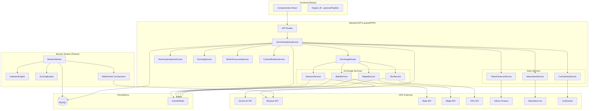
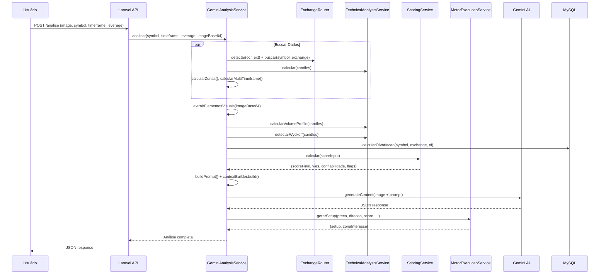

# Design — Genesis Cérebro Análise

## Visão Geral

O Genesis Cérebro Análise é um pipeline completo de análise de trading de criptomoedas que opera em duas camadas:

1. **Backend API (Laravel/PHP)**: Orquestra a análise sob demanda — recebe imagem de gráfico, extrai dados via OCR/Gemini, busca indicadores via APIs, calcula score, gera narrativa e entrega setup de execução.
2. **Monitor Worker (Python)**: Opera em tempo real via WebSocket, monitorando 15 pares, acumulando CVD, detectando anomalias e disparando alertas diretamente no MySQL.

O fluxo principal é:
```
Upload → OCR/Reconhecimento → APIs Multi-Exchange → Indicadores Técnicos → Scoring → Narrativa Gemini → Motor de Execução → Entrega
```

O Micro Radar opera independentemente:
```
WebSocket (aggTrade + depth5) → Acumulo CVD/Book → Detecção de Anomalias → Alerta no MySQL
```

---

## Arquitetura

### Diagrama de Componentes



### Diagrama de Fluxo de Dados — Pipeline de Análise



---

## Componentes e Interfaces

### 1. GeminiAnalysisService (PHP — Orquestrador Principal)

**Responsabilidade**: Orquestra todo o pipeline de análise sob demanda.

```php
interface GeminiAnalysisServiceInterface {
    public function analisar(string $symbol, string $timeframe, int $leverage, string $imageBase64, float $entryValue = 0): array;
}
```

**Fluxo interno**:
1. Buscar candles (Binance, 500 candles)
2. Buscar dados macro (VIX, DXY, S&P500 via Yahoo)
3. Extrair elementos visuais (suportes/resistências via Gemini OCR)
4. Detectar exchange e buscar derivativos via ExchangeRouter
5. Calcular OI variação (persiste no MySQL)
6. Calcular indicadores técnicos
7. Calcular Volume Profile, Wyckoff, padrão candle, divergência CVD
8. Calcular zonas estruturais (PDH/PDL, PWH/PWL)
9. Multi-timeframe bias
10. Buscar Fear & Greed + BTC Dominância
11. Scoring
12. Montar contexto e prompt
13. Chamar Gemini AI
14. Override com Motor de Execução matemático
15. Gerar narrativa final

### 2. ExchangeRouter (PHP — Roteador Multi-Exchange)

**Responsabilidade**: Buscar dados derivativos com fallback automático para Binance.

```php
interface ExchangeRouterInterface {
    public function detectar(?string $ocrText): string;
    public function buscar(string $symbol, string $exchange): array;
}
```

**Resposta normalizada**:
```php
[
    'oi' => float,
    'funding_rate' => string,
    'long_short_ratio' => float,
    'cvd' => ['delta' => float, 'imbalance' => float],
    'fonte_primaria' => string,
    'fonte_fallback' => ?string,
    'alerta_hibrido' => bool,
    'aviso_liquidez' => bool,
]
```

**Regras de fallback**:
- Cada endpoint (OI, funding, LSR, CVD) faz fallback independente para Binance
- Se OI=0 E funding=0 na exchange primária → `aviso_liquidez=true` → fallback total
- `alerta_hibrido=true` quando dados vêm de mais de uma fonte

### 3. ScoringEngine (Python — Monitor) / ScoringService (PHP — Backend)

**Responsabilidade**: Calcular score final composto por Técnico (55pts) + Derivativos (45pts).

```python
def calcular_score(dados: dict) -> dict:
    """
    Returns: {
        'score_final': int,       # 0-100, múltiplo de 5
        'vies': str,              # LONG_FORTE|LONG_MODERADO|...|SHORT_FORTE
        'bloco_tecnico': {...},
        'bloco_derivativos': {...},
        'flags': list[str],
        'confiabilidade': str     # ALTA|MEDIA|BAIXA
    }
    """
```

**Fórmula Score**:
```
score = 50 + (pontos_bullish - pontos_bearish) / 2
score = round(score / 5) * 5
score = clamp(score, 0, 100)
```

**Bloco Técnico (max 55pts)**:
| Componente | Max pts |
|---|---|
| EMA200 | 8 |
| RSI | 7 |
| Divergência RSI | 3 |
| ADX proporcional | 8 |
| MACD signal | 7 |
| MACD zero cross | 5 |
| Compressão/Volatilidade | 7 |

**Bloco Derivativos (max 45pts)**:
| Componente | Max pts |
|---|---|
| CVD slope | 10 |
| Book Imbalance | 5 |
| Divergência CVD | 10 |
| Funding | 8 |
| OI | 8 |
| L/S Ratio | 5 |
| Clusters Liquidação | 2+2 |

### 4. MotorExecucaoService (PHP — Motor de Execução)

**Responsabilidade**: Gerar setups matemáticos com dois planos operacionais.

```php
interface MotorExecucaoInterface {
    public static function gerarSetup(
        float $preco, string $direcao, int $score, int $confianca,
        float $atr, string $regime, array $hvn, array $lvn,
        array $liqClusters, float $poc, array $elementosVisuais = []
    ): array;
    
    public static function calcularLiquidacao(
        float $entrada, string $direcao, float $alavancagem, float $mm = 0.005
    ): float;
}
```

**Plano A (Antecipação)**: Entrada no preço atual, stop por ATR×multiplicador, TPs em HVN/clusters.
**Plano B (Técnico)**: Entrada em pullback a POC ou suporte.

**Limites de alavancagem por score**:
| Score | Alav. Máx |
|---|---|
| < 50 | 2x |
| 50-64 | 3x |
| 65-74 | 5x |
| ≥ 75 | 10x |

**Fórmula de Liquidação**:
- LONG: `entrada × (1 - 1/alavancagem + mm)`
- SHORT: `entrada × (1 + 1/alavancagem - mm)`

### 5. TechnicalAnalysisService (PHP — Indicadores + Wyckoff)

**Responsabilidade**: Calcular indicadores técnicos, Volume Profile, Wyckoff e padrões de candle.

**Indicadores**: EMA(21,50,200), RSI(14), ADX(14), MACD(12/26/9), ATR(14), Bollinger(20,2)

**Volume Profile**: 50 bins, POC = bin com maior volume, HVN > 150% média, LVN < 50% média

**Wyckoff**: Range detection (sliding window 60/40/20) → 7 eventos → 9 fases → narrativa + gatilho

### 6. MonitorWorker (Python — Micro Radar)

**Responsabilidade**: Monitoramento em tempo real de 15 pares via WebSocket.

```python
class MonitorWorker:
    def __init__(self): ...
    def _acumular_cvd(self, symbol, trade_msg): ...
    def _atualizar_orderbook(self, symbol, depth_msg): ...
    def detectar_spike_volume(self, dados_mercado): ...
    def detectar_movimento_brusco(self, variacao_1m, dados_mercado): ...
    def detectar_funding_extremo(self, funding_rate, dados_mercado): ...
    def detectar_oi_spike(self, oi_anterior, oi_atual, dados_mercado): ...
    def detectar_liquidation_cascade(self, candles_recentes, dados_mercado): ...
    def gravar_banco(self, alerta, enviado_telegram): ...
```

**WebSocket streams**:
- `aggTrade` → acumulo CVD (buffer circular 100, snapshot cada 60s)
- `depth5` → orderbook top 5 levels → book imbalance

**Alertas detectados**: SPIKE_VOLUME, MOVIMENTO_BRUSCO, FUNDING_EXTREMO, OI_SPIKE, LIQUIDATION_CASCADE, CVD_DIVERGENCIA, BOOK_IMBALANCE

**Deduplicação**: Chave `{ativo}_{tipo}_{corretora}`, bloqueio de 300 segundos.

### 7. IndicatorEngine (Python — Cálculos do Monitor)

**Responsabilidade**: Calcular indicadores técnicos para o monitor em tempo real.

```python
# Funções exportadas
calcular_ema(closes, periodo) -> float | None
calcular_rsi(closes, periodo=14) -> float | None
calcular_atr(candles, periodo=14) -> float | None
calcular_adx(candles, periodo=14) -> dict | None
calcular_macd(closes) -> dict | None
calcular_bollinger(closes, periodo=20, desvios=2) -> dict | None
calcular_vwap(candles) -> float | None
calcular_cvd_slope(cvd_values) -> float
detectar_compressao_volatilidade(candles) -> dict | None
detectar_divergencia_rsi(candles, valores_rsi) -> str
identificar_equal_highs(candles, tolerancia=0.0015) -> list
identificar_equal_lows(candles, tolerancia=0.0015) -> list
```

---

## Modelos de Dados

### Tabela: `oi_historico`

```sql
CREATE TABLE oi_historico (
    id BIGINT AUTO_INCREMENT PRIMARY KEY,
    symbol VARCHAR(20) NOT NULL,
    exchange VARCHAR(20) DEFAULT 'BINANCE',
    oi_valor DOUBLE NOT NULL,
    created_at DATETIME DEFAULT CURRENT_TIMESTAMP,
    INDEX idx_symbol_exchange_created (symbol, exchange, created_at DESC)
);
```

### Tabela: `genesis_alertas`

```sql
CREATE TABLE genesis_alertas (
    id BIGINT AUTO_INCREMENT PRIMARY KEY,
    ativo VARCHAR(20) NOT NULL,
    tipo VARCHAR(50) NOT NULL,
    mensagem TEXT,
    direcao VARCHAR(20),
    urgencia VARCHAR(20),
    corretora VARCHAR(20) DEFAULT 'BINANCE',
    timeframe VARCHAR(10) DEFAULT '1h',
    preco_atual DOUBLE,
    variacao_pct DOUBLE DEFAULT 0,
    score INT DEFAULT 0,
    enviado_sse TINYINT DEFAULT 0,
    enviado_telegram TINYINT DEFAULT 0,
    created_at DATETIME DEFAULT CURRENT_TIMESTAMP,
    updated_at DATETIME DEFAULT CURRENT_TIMESTAMP ON UPDATE CURRENT_TIMESTAMP,
    INDEX idx_ativo_tipo (ativo, tipo),
    INDEX idx_created (created_at DESC)
);
```

### Estrutura de Resposta — Análise Completa

```typescript
interface AnaliseResponse {
    pair: string;
    direcaoProvavel: 'LONG' | 'SHORT';
    scoreProbabilidade: number;        // 0-100
    confianca: number;                 // 0-100
    regime: 'BULLISH' | 'BEARISH' | 'NEUTRO';
    
    indicadores: {
        rsi: number;
        adx: number;
        plusDI: number;
        minusDI: number;
        macdHist: number;
        ema21: number;
        ema50: number;
        ema200: number;
        atr: number;
        cvd: number;
        fontes: Record<string, 'API' | 'GRAFICO' | 'INDISPONIVEL'>;
        compressaoDetectada: boolean;
        nivelCompressao: string;
        divergenciaRSI: string;
        bollinger: { banda_media: number; banda_superior: number; banda_inferior: number };
    };
    
    execucao: {
        acao: 'LONG' | 'SHORT';
        motivo: string;
        setup: {
            entrada: number;
            stop: number;
            tp1: number;
            tp2: number;
            tp3: number;
            alavancagem: number;
            liquidacao: number | string;
            riscoPct: number;
            rr1: number;
            verificacao: '✓ SEGURO' | '✗ INSEGURO';
            tamanhoSugerido: string;
        };
        zonaInteresse: {
            tipo: 'PULLBACK' | 'REPICO' | 'RANGE';
            zona: string;
            invalidacao: string | null;
        };
    };
    
    wyckoff: {
        fase: string;
        evento: string | null;
        narrativa: string;
        gatilho: string;
        range: { teto: number; suporte: number };
    };
    
    score: {
        scoreFinal: number;
        vies: string;
        confiabilidade: 'ALTA' | 'MEDIA' | 'BAIXA';
        blocoTecnico: { pontos: number; maximo: number; percentual: number };
        blocoDerivativos: { pontos: number; maximo: number; percentual: number };
        flags: string[];
        flagsVisuais: string[];
        sintese: string;
    };
    
    narrativa: string;
    alerta_hibrido?: boolean;
    aviso_liquidez?: string;
}
```

### Estrutura de Dados — Score Input

```typescript
interface ScoreInput {
    preco: number;
    ema200: number | null;
    ema200_subindo: boolean;
    rsi: number | null;
    divergencia_rsi: string;
    adx: number | null;
    preco_subindo: boolean;
    macd_acima_signal: boolean;
    histograma_subindo: boolean;
    macd_cruza_zero: 'BULLISH' | 'BEARISH' | null;
    compressao_detectada: boolean;
    nivel_compressao: string;
    cvd_slope: number | null;
    book_imbalance_ratio: number | null;
    divergencia_cvd: string;
    funding_medio: number | null;       // Python monitor
    funding_rate: number | null;        // PHP backend
    oi_subindo: boolean | null;
    ls_ratio_longs: number | null;
    cluster_liquidacao_acima: number | null;
    cluster_liquidacao_abaixo: number | null;
    fear_greed: number | null;
    vix: number | null;
    usdt_dominancia_variacao: number | null;
    correlacao_btc: object | null;
    geopolitica_score: number | null;
    sentimento_moeda_score: number | null;
}
```


---

## Propriedades de Corretude

*Uma propriedade é uma característica ou comportamento que deve ser verdadeiro em todas as execuções válidas de um sistema — essencialmente, uma declaração formal sobre o que o sistema deve fazer. Propriedades servem como ponte entre especificações legíveis por humanos e garantias de corretude verificáveis por máquina.*

### Property 1: Detecção de exchange via texto

*Para qualquer* string que contenha o nome de uma exchange suportada (binance, bybit, bitget, okx), o ExchangeRouter.detectar() deve retornar a chave correspondente àquela exchange. *Para qualquer* string que NÃO contenha nenhum nome de exchange suportada, deve retornar 'binance' como padrão.

**Validates: Requirements 1.3, 1.4**

### Property 2: Fallback para Binance em endpoints individuais

*Para qualquer* exchange não-Binance e qualquer símbolo, quando um endpoint (OI, funding, LSR, CVD) retorna null da exchange primária, o ExchangeRouter deve buscar o mesmo dado na Binance e o campo `alerta_hibrido` deve ser `true` na resposta final.

**Validates: Requirements 3.2, 3.3, 3.5**

### Property 3: Aviso de liquidez insuficiente

*Para qualquer* exchange não-Binance e qualquer símbolo, quando OI = 0 E funding_rate = 0 na exchange primária, o ExchangeRouter deve ativar `aviso_liquidez = true` e realizar fallback total para Binance em todos os endpoints.

**Validates: Requirements 3.4**

### Property 4: Normalização da resposta do ExchangeRouter

*Para qualquer* resultado retornado pelo ExchangeRouter.buscar(), a resposta deve conter exatamente os campos: oi (float), funding_rate (string), long_short_ratio (float), cvd (com delta e imbalance), fonte_primaria, fonte_fallback, alerta_hibrido, aviso_liquidez.

**Validates: Requirements 3.6**

### Property 5: Variação percentual de OI

*Para qualquer* par (symbol, exchange) com OI anterior > 0 e OI atual, a variação percentual calculada deve ser igual a ((oi_atual - oi_anterior) / oi_anterior) × 100, arredondado a 2 casas decimais.

**Validates: Requirements 4.3**

### Property 6: Indicadores dentro de limites válidos

*Para qualquer* série de preços válida com comprimento suficiente: EMA deve estar entre 10% e 1000% do preço atual (ou None), RSI deve estar entre 1 e 99 (ou None), ADX entre 0 e 100 (ou None), ATR deve ser positivo (ou None), e Bollinger deve satisfazer lower < middle < upper.

**Validates: Requirements 5.1, 5.2, 5.3, 5.5, 5.6**

### Property 7: MACD histogram é diferença de macd e signal

*Para qualquer* série de closes com comprimento ≥ 35, quando MACD retorna resultado não-null, histogram deve ser igual a macd - signal.

**Validates: Requirements 5.4**

### Property 8: VWAP entre extremos do dia

*Para qualquer* conjunto de candles do mesmo dia UTC com volume > 0, o VWAP calculado deve estar entre o menor low e o maior high do período.

**Validates: Requirements 5.7**

### Property 9: CVD slope via regressão linear

*Para qualquer* sequência monotonicamente crescente de 10+ valores CVD, o slope calculado deve ser positivo. *Para qualquer* sequência monotonicamente decrescente, o slope deve ser negativo.

**Validates: Requirements 5.10**

### Property 10: Indicadores retornam None sem exceção para inputs inválidos

*Para qualquer* input insuficiente ou inválido (lista vazia, comprimento < período mínimo, valores infinitos), cada função de indicador deve retornar None sem propagar exceção.

**Validates: Requirements 5.11**

### Property 11: preco_subindo determinado pela EMA21

*Para qualquer* série de closes onde EMA21 é calculável, `preco_subindo` deve ser True se e somente se EMA21 atual > EMA21 calculada na série sem o último elemento.

**Validates: Requirements 6.1**

### Property 12: ADX proporcional no scoring

*Para qualquer* input do ScoringEngine com um valor de ADX definido e uma direção de preço, os pontos atribuídos devem ser: 8 (ADX ≥ 30), 5 (25-29), 3 (20-24), ou 1 para ambos os lados com flag RANGING_SEM_TENDENCIA (ADX < 20).

**Validates: Requirements 7.1, 7.2, 7.3, 7.4**

### Property 13: MACD zero cross no scoring

*Para qualquer* input do ScoringEngine com macd_cruza_zero definido, quando valor é 'BULLISH' deve atribuir 5 pontos bullish com flag MACD_ZERO_CROSS_BULL, e quando 'BEARISH' deve atribuir 5 pontos bearish com flag MACD_ZERO_CROSS_BEAR.

**Validates: Requirements 8.1, 8.2**

### Property 14: Detecção de MACD zero cross

*Para qualquer* série de closes onde MACD do candle anterior é negativo e MACD do candle atual é positivo, a função _detectar_macd_zero_cross deve retornar 'BULLISH'. Inversamente, de positivo para negativo deve retornar 'BEARISH'.

**Validates: Requirements 8.3**

### Property 15: Caps dos blocos de scoring

*Para qualquer* input válido do ScoringEngine, o bloco técnico nunca deve exceder 55 pontos e o bloco derivativos nunca deve exceder 45 pontos.

**Validates: Requirements 9.1, 9.2**

### Property 16: Score final no range [0,100] e múltiplo de 5

*Para qualquer* input válido do ScoringEngine, o score_final deve ser um inteiro entre 0 e 100 (inclusive) E deve ser divisível por 5.

**Validates: Requirements 9.3, 9.4**

### Property 17: Classificação do viés corresponde ao score

*Para qualquer* score_final produzido pelo ScoringEngine, o viés deve ser: LONG_FORTE (>84), LONG_MODERADO (70-84), LONG_LEVE (55-69), NEUTRO (45-54), SHORT_LEVE (31-44), SHORT_MODERADO (16-30), SHORT_FORTE (<16).

**Validates: Requirements 9.5**

### Property 18: Macro e sentimento geram apenas flags sem afetar score

*Para qualquer* input do ScoringEngine, alterando valores de macro/sentimento (vix, fear_greed, usdt_dominancia_variacao, correlacao_btc) enquanto mantendo os outros campos iguais, o score_final deve permanecer inalterado (apenas as flags mudam).

**Validates: Requirements 9.6**

### Property 19: Cálculo de confiabilidade

*Para qualquer* resultado do ScoringEngine, confiabilidade deve ser 'ALTA' quando técnico e derivativos concordam na direção com diferença > 5 cada, 'BAIXA' quando discordam com diferença > 5 cada, e 'MEDIA' nos demais casos.

**Validates: Requirements 9.7**

### Property 20: None não pontua no ScoringEngine

*Para qualquer* campo de input definido como None, o ScoringEngine deve ignorar o componente correspondente (zero contribuição ao score) produzindo resultado idêntico a se o campo não existisse.

**Validates: Requirements 10.5**

### Property 21: Multiplicador de sessão correto por hora UTC

*Para qualquer* hora UTC, o multiplicador de sessão aplicado deve ser: 0.85 (00-07h), 0.95 (08-12h), 1.00 (13-20h), 0.90 (21-23h).

**Validates: Requirements 11.1, 11.2, 11.3, 11.4**

### Property 22: Range lateral detectado quando amplitude < 8%

*Para qualquer* conjunto de candles onde a amplitude (max_high - min_low) / min_low < 8% em uma janela de 20+, a função identificarRange deve retornar `valido = true`.

**Validates: Requirements 12.1**

### Property 23: Fase Wyckoff tem narrativa e gatilho não-vazios

*Para qualquer* resultado de detectarWyckoff com 20+ candles, a fase retornada deve ter narrativa não-vazia e gatilho não-vazio, e a narrativa deve conter informações de range quando disponível.

**Validates: Requirements 12.4, 12.5**

### Property 24: Conservação de volume no Volume Profile

*Para qualquer* conjunto de candles, a soma do volume distribuído em todos os bins deve ser aproximadamente igual à soma total do volume de todos os candles (tolerância de 0.01% por arredondamento).

**Validates: Requirements 13.1**

### Property 25: POC, HVN e LVN seguem thresholds definidos

*Para qualquer* resultado de calcularVolumeProfile, o POC deve corresponder ao bin com maior volume. Todos os preços em HVN devem ter volume > 150% da média. Todos os preços em LVN devem ter volume < 50% da média.

**Validates: Requirements 13.2, 13.3, 13.4**

### Property 26: Entrada do Plano A é o preço atual

*Para qualquer* chamada a gerarSetup com preço > 0, o campo `setup.entrada` deve ser igual ao preço fornecido.

**Validates: Requirements 14.1**

### Property 27: Alavancagem respeitando limites por score

*Para qualquer* resultado de gerarSetup, a alavancagem retornada nunca deve exceder: 2x (score < 50), 3x (score 50-64), 5x (score 65-74), 10x (score ≥ 75).

**Validates: Requirements 14.3**

### Property 28: Fórmula de liquidação

*Para qualquer* entrada > 0 e alavancagem > 1, o preço de liquidação LONG deve ser: entrada × (1 - 1/alavancagem + mm). Para SHORT: entrada × (1 + 1/alavancagem - mm).

**Validates: Requirements 14.4**

### Property 29: Segurança stop vs liquidação

*Para qualquer* setup marcado como '✓ SEGURO', o stop LONG deve estar abaixo de liquidação × (1 + margem_seguranca) e o stop SHORT deve estar acima de liquidação × (1 - margem_seguranca).

**Validates: Requirements 14.5**

### Property 30: Stop ajustado por suportes do usuário (LONG)

*Para qualquer* setup LONG com suportes fornecidos onde pelo menos um suporte é menor que o preço, o stop deve ser ≥ max(suportes_válidos) × 0.995.

**Validates: Requirements 14.6, 2.3**

### Property 31: Funding rate com 5 faixas no scoring

*Para qualquer* funding_rate no input do ScoringEngine, os pontos atribuídos devem seguir: [-0.01, 0.01] → 2 neutro, >0.05 → 8 bearish + flag, (0.03, 0.05] → 6 bearish, <-0.03 → 8 bullish + flag, [-0.03, -0.02] → 6 bullish.

**Validates: Requirements 21.1, 21.2, 21.3, 21.4, 21.5**

### Property 32: OI direcional com preço no scoring

*Para qualquer* combinação de oi_subindo e preco_subindo no ScoringEngine, os pontos devem seguir: (true,true) → 8 bull, (true,false) → 8 bear, (false,true) → 3 bull + RALLY_FRACO, (false,false) → 3 bear + CORRECAO_FRACA.

**Validates: Requirements 22.1, 22.2, 22.3, 22.4**

### Property 33: Divergência CVD no scoring

*Para qualquer* divergencia_cvd definida no input, 'BEARISH' deve gerar 10 pontos bearish + flag CVD_DIVERGENCIA_BEARISH, 'BULLISH' deve gerar 10 pontos bullish + flag CVD_DIVERGENCIA_BULLISH.

**Validates: Requirements 23.1, 23.2**

### Property 34: Detecção de divergência CVD por 3 pontos

*Para qualquer* sequência de 3 preços ascendentes com 3 valores CVD descendentes, a detecção deve retornar 'BEARISH'. *Para qualquer* sequência de 3 preços descendentes com 3 valores CVD ascendentes, deve retornar 'BULLISH'.

**Validates: Requirements 23.3**

### Property 35: Flags macro/sentimento geradas corretamente

*Para qualquer* input com VIX ∈ [25,30] → VIX_ELEVADO, VIX > 30 → VIX_CRITICO, usdt_dominancia > 0.2 → SAIDA_DO_MERCADO, fear_greed > 80 → EUFORIA_EXTREMA, fear_greed < 20 → PANICO_EXTREMO_OPORTUNIDADE.

**Validates: Requirements 16.1, 16.2, 16.5, 16.6**

### Property 36: Buffer CVD circular com tamanho máximo 100

*Para qualquer* número de snapshots CVD acumulados, o buffer nunca deve exceder 100 elementos.

**Validates: Requirements 17.2**

### Property 37: Orderbook cache limita a 5 níveis

*Para qualquer* atualização de depth processada, o cache deve conter no máximo 5 bids e 5 asks.

**Validates: Requirements 17.3**

### Property 38: Book imbalance entre -1 e 1

*Para qualquer* orderbook com bids e asks onde sum_bids + sum_asks > 0, o book imbalance calculado deve estar no intervalo [-1, 1] e deve ser igual a (sum_bids - sum_asks) / (sum_bids + sum_asks).

**Validates: Requirements 17.4**

### Property 39: Alerta SPIKE_VOLUME quando volume > 3× SMA20

*Para qualquer* dados de mercado onde volume_atual > 3 × sma20_volume, um alerta SPIKE_VOLUME com urgência ALTA deve ser disparado.

**Validates: Requirements 17.5**

### Property 40: Alerta MOVIMENTO_BRUSCO quando variação > 1.5%

*Para qualquer* variação de preço em 60 segundos onde |variacao| ≥ 1.5%, um alerta MOVIMENTO_BRUSCO com urgência ALTA deve ser disparado.

**Validates: Requirements 17.6**

### Property 41: Alerta FUNDING_EXTREMO por thresholds

*Para qualquer* funding_rate > 0.05, alerta FUNDING_EXTREMO bearish. *Para qualquer* funding_rate < -0.03, alerta FUNDING_EXTREMO bullish.

**Validates: Requirements 17.7, 17.8**

### Property 42: Alerta OI_SPIKE quando variação > 5%

*Para qualquer* variação de OI superior a 5% (com OI anterior > 0), alerta OI_SPIKE deve ser disparado.

**Validates: Requirements 17.9**

### Property 43: Deduplicação de alertas em 300 segundos

*Para qualquer* par (ativo, tipo, corretora), se um alerta foi disparado há menos de 300 segundos, um novo alerta idêntico NÃO deve ser processado.

**Validates: Requirements 17.12**

### Property 44: Filtro de volume mínimo diário

*Para qualquer* par com volume_24h < 50.000.000 USD, nenhum alerta deve ser disparado.

**Validates: Requirements 17.11**

### Property 45: Clusters de liquidação no scoring

*Para qualquer* cluster_liquidacao_acima a menos de 1% do preço, 2 pontos bearish + CLUSTER_ACIMA. *Para qualquer* cluster_liquidacao_abaixo a menos de 1% do preço, 2 pontos bullish + CLUSTER_ABAIXO.

**Validates: Requirements 18.1, 18.2**

### Property 46: Equal highs/lows detecção e unicidade

*Para qualquer* par de candles nos últimos 100 onde |high_i - high_j| / high_i < 0.0015, o nível deve aparecer nos equal_highs. Analogamente para lows. A lista retornada deve conter apenas valores únicos.

**Validates: Requirements 19.1, 19.2, 19.3**

### Property 47: Multi-timeframe bias classification

*Para qualquer* timeframe superior avaliado, o viés deve ser 'BULLISH' quando score ≥ 2, 'BEARISH' quando score ≤ -2, e 'NEUTRO' caso contrário, onde score é a soma de: +1/-1 (RSI vs 50), +1/-1 (preço vs EMA21), +1/-1 (preço vs EMA50).

**Validates: Requirements 20.4**

### Property 48: Cálculo de tamanho de posição

*Para qualquer* margem > 0, alavancagem ≥ 1 e preço > 0, valorTotal deve ser margem × alavancagem e quantidade deve ser valorTotal / preço.

**Validates: Requirements 28.1, 28.2**

### Property 49: Detecção de padrões de candle por geometria

*Para qualquer* candle onde |close - open| < 0.1 × (high - low), o padrão DOJI deve ser detectado. *Para qualquer* candle com sombra_inferior > 2× corpo E sombra_superior < 0.5× corpo, MARTELO deve ser detectado. *Para qualquer* candle com sombra_superior > 2× corpo E sombra_inferior < 0.5× corpo, ESTRELA_CADENTE deve ser detectado.

**Validates: Requirements 26.1, 26.4, 26.5**

### Property 50: Fonte de indicadores rastreada corretamente

*Para qualquer* indicador calculado, a fonte deve ser 'API' quando calculado via candles com sucesso, 'GRAFICO' quando obtido via OCR como fallback, e 'INDISPONIVEL' quando nenhum dado está disponível.

**Validates: Requirements 29.1, 29.2**

### Property 51: JSON parsing resiliente

*Para qualquer* string JSON válida envolta em code fences markdown (```json ... ``` ou ``` ... ```), a função de parsing deve extrair e retornar o JSON corretamente. *Para qualquer* JSON com trailing commas, a função deve tentar correção antes de falhar.

**Validates: Requirements 15.5, 15.7**

### Property 52: PDH/PDL e PWH/PWL baseados em boundaries UTC

*Para qualquer* conjunto de candles com timestamps cobrindo pelo menos 2 dias, PDH deve ser o maior high do dia anterior UTC e PDL o menor low do dia anterior UTC. Analogamente, PWH/PWL para a semana anterior ISO.

**Validates: Requirements 27.3, 27.4**

### Property 53: Alertas contêm todos os campos obrigatórios

*Para qualquer* alerta gerado pelo MonitorWorker, devem estar presentes: ativo, tipo, mensagem, direcao, urgencia, corretora, timeframe, preco_atual, variacao_pct, score, motivos e timeframes.

**Validates: Requirements 24.2**

### Property 54: Resiliência a falha de conexão DB

*Para qualquer* tentativa de gravar alerta quando a conexão MySQL falha, nenhuma exceção deve propagar ao loop principal e o processamento deve continuar.

**Validates: Requirements 24.3**

---

## Tratamento de Erros

### Estratégia Geral

O sistema adota uma abordagem de **fail-safe com degradação graceful**:

1. **Indicadores**: Retornam `None` em caso de erro — o ScoringEngine ignora componentes com None
2. **Exchange APIs**: Fallback automático para Binance via ExchangeRouter
3. **Gemini AI**: Cache de 5 min previne chamadas repetidas; fallback textual para contexto vazio
4. **MySQL**: Alertas com falha de gravação são logados mas não interrompem processamento
5. **WebSocket**: Reconexão automática com backoff exponencial

### Erros por Camada

| Camada | Erro | Ação |
|--------|------|------|
| Exchange API | HTTP timeout/error | Log + return null → fallback Binance |
| Exchange API | Rate limit | Cache com TTL previne; retry com backoff |
| Indicadores | Dados insuficientes | Return None, ScoringEngine ignora |
| Indicadores | Overflow/NaN | Validação de `math.isfinite()`, return None |
| Gemini API | Timeout (120s) | Exception propagada ao caller |
| Gemini API | JSON parse fail | Tentar fix (trailing commas, control chars) → RuntimeException |
| MySQL | Connection refused | Log error, continue processing |
| MySQL | Insert fail | Log error, não interrompe worker |
| WebSocket | Disconnect | Reconnect com backoff exponencial |
| Volume Profile | < 10 candles | Return `{poc: 0, hvn: [], lvn: []}` |
| Wyckoff | < 20 candles | Return INDETERMINADO |
| Motor Execução | Preço = 0 | Return setup INVÁLIDO |
| Scoring | Exception | Return score 50 NEUTRO BAIXA |

### Logging

- **PHP (Laravel)**: `Log::error()` / `Log::warning()` com contexto estruturado
- **Python (Monitor)**: `RotatingFileHandler` (10MB, 5 backups) + console + stderr para errors
- Todos os erros incluem: timestamp, componente, símbolo, mensagem de erro

---

## Estratégia de Testes

### Abordagem Dual: Unit Tests + Property-Based Tests

O projeto utiliza duas abordagens complementares:

1. **Unit Tests**: Exemplos específicos, edge cases, integrações
2. **Property-Based Tests (PBT)**: Propriedades universais verificadas com inputs gerados aleatoriamente

### Frameworks

| Camada | Unit Tests | Property Tests |
|--------|-----------|----------------|
| Python (Monitor/Indicator) | pytest | Hypothesis |
| PHP (Backend/Services) | PHPUnit | PHPUnit + custom generators |

### Configuração PBT

- **Mínimo 100 iterações** por property test (Hypothesis: `@settings(max_examples=200)`)
- Cada test referencia a propriedade do design: `# Feature: genesis-cerebro-analise, Property N: título`
- Generators customizados para:
  - Séries de preços (closes, candles OHLCV)
  - Inputs do ScoringEngine
  - Dados de exchanges
  - Alertas e dados de mercado

### Cobertura por Componente

**ScoringEngine (Python)** — Properties 12-21, 31-33, 35, 45:
- Gerador de `dados_score` com ranges válidos para cada campo
- Verificar caps, ranges, flags, multiplicadores, confiabilidade
- Testar isolamento macro/sentimento vs score

**IndicatorEngine (Python)** — Properties 6-11, 46, 52:
- Gerador de séries de preços com length e volatilidade variáveis
- Gerador de candles OHLCV consistentes (high ≥ close/open ≥ low)
- Verificar bounds, None-safety, monotonia de slope

**MotorExecucaoService (PHP)** — Properties 26-30:
- Gerador de preços, ATR, scores, HVN/LVN arrays
- Verificar fórmulas de liquidação, limites de alavancagem, segurança stop

**ExchangeRouter (PHP)** — Properties 1-4:
- Gerador de strings com/sem nomes de exchange
- Gerador de respostas simuladas de exchange (null, zero, valid)
- Verificar fallback, normalização, flags

**MonitorWorker (Python)** — Properties 36-44, 53-54:
- Gerador de trade messages para CVD
- Gerador de dados de mercado com volumes/variações
- Verificar buffer circular, deduplicação, thresholds de alerta

**Volume Profile / Wyckoff (PHP)** — Properties 22-25:
- Gerador de candle arrays com ranges controlados
- Verificar conservação de volume, POC correto, classificação HVN/LVN

### Unit Tests (Exemplos e Edge Cases)

- Exchange suportada: verificar as 4 exchanges por nome
- Wyckoff: cenários específicos para cada um dos 7 eventos
- Multi-timeframe: mapas 15m→[1h,4h,1d], 1h→[4h,1d,1w], 4h→[1d,1w,1M]
- Cache: TTLs corretos (300s API, 300s Gemini, 3600s Fear&Greed)
- Motor Execução: preço=0 retorna INVÁLIDO
- Wyckoff: <20 candles retorna INDETERMINADO
- Context vazio: fallback textual usado
- OI persistência: gravar e ler do MySQL
- Fallback OCR: quando API retorna null e OCR existe

### Estrutura de Diretórios de Testes

```
G-nesis-2.0-main/
├── tests/
│   ├── unit/
│   │   ├── test_scoring_engine.py
│   │   ├── test_indicator_engine.py
│   │   └── test_monitor_worker.py
│   └── property/
│       ├── test_scoring_properties.py
│       ├── test_indicator_properties.py
│       ├── test_monitor_properties.py
│       └── conftest.py  (generators)

genesis-api/
├── tests/
│   ├── Unit/
│   │   ├── ScoringServiceTest.php
│   │   ├── MotorExecucaoServiceTest.php
│   │   ├── ExchangeRouterTest.php
│   │   ├── TechnicalAnalysisServiceTest.php
│   │   └── VolumeProfileTest.php
│   └── Property/
│       ├── ScoringPropertyTest.php
│       ├── MotorExecucaoPropertyTest.php
│       └── ExchangeRouterPropertyTest.php
```

### Tags de Referência

Cada property test deve incluir comentário:
```python
# Feature: genesis-cerebro-analise, Property 16: Score final no range [0,100] e múltiplo de 5
```

```php
// Feature: genesis-cerebro-analise, Property 28: Fórmula de liquidação
```
