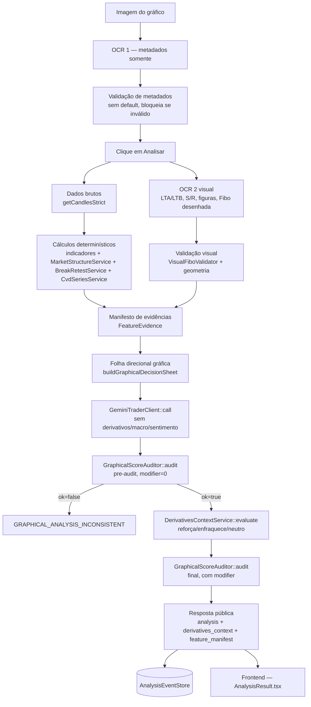

# Design — Gênesis V4.3-R3.2: Cérebro de Análise Gráfica

## Visão Geral

Este design fecha o gap entre o estado real do código (auditado em 2026-07-14 contra `genesis-api`) e o Adendo `GENESIS_V4_3_R3_2_ADENDO_FINAL_CEREBRO_GRAFICO_DEV_2026-07-14`. É um documento irmão de `genesis-r3-2-implementacao` — aquele spec cobriu o "Documento Mestre" de 2026-07-12 (crash fatal em `ExecucaoService`, remoção do cérebro Gemini duplicado, event store, geometria de figuras, migração de frontend). Este spec cobre uma correção mais específica e posterior: o **cérebro de análise gráfica** propriamente dito — famílias de score, motor canônico de pivôs, rompimento/reteste, CVD, Fibo validada, OCR 1/2 separados.

Onde o Adendo já contém código completo (`MarketStructureService`, `BreakRetestService`, `GraphicalScoreAuditor`, `DerivativesContextService`, `CvdSeriesService`, `VisualFiboValidator`, `SupplementalIndicatorsService`, `TextQualityGate`, `FeatureEvidence`), este design **não duplica o código-fonte** — a tarefa correspondente em `tasks.md` aponta a seção exata do Adendo a copiar literalmente.

## Estado Atual Auditado (2026-07-14)

Auditoria de código real contra `genesis-api` (branch `genesis2`), cruzada com o progresso já registrado em `genesis-r3-2-implementacao/tasks.md`:

| Item do Adendo | Estado real |
|---|---|
| `getCandlesStrict()` (sem fallback Futures→Spot) | ❌ Não existe. `getCandlesResiliente()` ainda mistura Futures/Spot silenciosamente (`BinanceService.php:128-144`) e ainda é chamado por `GeminiAnalysisService::analisar()`. |
| Fallback OCR em EMA/RSI/MACD/ATR/ADX | ❌ Ainda presente em `TechnicalAnalysisService::calcular($candles, $ocrData=[])` (linhas 28-82). Fonte rotulada `"API"`/`"OCR"`/`"GRAFICO"`, não o vocabulário do Adendo. |
| `MarketStructureService`, `BreakRetestService`, `GraphicalScoreAuditor`, `DerivativesContextService`, `CvdSeriesService`, `VisualFiboValidator`, `SupplementalIndicatorsService`, `TextQualityGate`, `FeatureEvidence` | ❌ Nenhuma dessas 9 classes existe em `app/Services` ou `app/Support`. |
| `config/genesis_graphical.php` | ❌ Não existe com esse nome. `config/genesis.php` já tem `shadow_mode`/`features` (mecanismo análogo, nome diferente, escopo do Documento Mestre anterior). |
| Cunhas (`GenesisVisualCatalog::VIES`) | ⚠️ Existe, mas com o mapeamento **oposto** ao pedido pelo Adendo — decisão de produto pendente antes de tocar (ver Requisito 11 de `requirements.md`). |
| `ScoringService` — família `derivativos` votando direção | ❌ Ainda vota: peso 28, soma bull/bear a partir de funding/OI, influencia score final. Distinto do "segundo cérebro Gemini" já removido pelo spec irmão — este é o motor PHP determinístico, não tocado por aquele trabalho. |
| `SinaisService::fib()` | ⚠️ Existe; nenhuma chamada ativa encontrada na auditoria (provável código órfão) — precisa de teste de call-graph antes de assumir removível. |
| Testes de regressão do Adendo (`LockedIndicatorsRegressionTest`, `DerivativesDirectionIsolationTest`, fixtures `locked-*.json`) | ❌ Não existem. |
| Frontend (`AnalysisResult.tsx`, `services/geminiService.ts`, `types.ts`) | ⚠️ Não está no repositório `genesis-api`; é o mesmo frontend já parcialmente migrado pelo spec `genesis-r3-2-implementacao` (Fase 4 daquele spec) — este spec estende esse contrato para os campos específicos do cérebro gráfico (`family_scores`, `score_context`, `derivatives_context`), não repete a migração inteira. |
| `DataFreshnessGate` | ❌ Não criado (também pendente em `genesis-r3-2-implementacao`, task 8.1). |
| `RegimeService`, `FeaturePolicy` | ✅ Criados e conectados (por `genesis-r3-2-implementacao`, tasks 8.2/8.4) — não recriar. |
| `DerivativesEnrichmentService`, `TradeFlowService` | ⚠️ Criados, **não conectados** ao call site real (faltam mark/index price e stream de trades, respectivamente) — mesmo gap já registrado no spec irmão. |
| `BinancePublicStreamService` | ❌ Não existe — bloqueado por decisão de infraestrutura (biblioteca WebSocket) pendente de decisão explícita do usuário, já registrado como tal em `genesis-r3-2-implementacao`, task 9.1. |
| Event store (`AnalysisEventStore`, migration `genesis_analysis_events`) | ✅ Existe e está conectado (spec irmão, task 11) — este spec reaproveita, só estende o payload persistido com `feature_manifest`. |

## Decisões Arquiteturais

| Decisão | Justificativa |
|---|---|
| Não recriar o que `genesis-r3-2-implementacao` já entregou (event store, `RegimeService`, `FeaturePolicy`, remoção do cérebro Gemini duplicado) | Evita trabalho duplicado e divergência entre os dois specs; este design referencia esse trabalho como pré-requisito satisfeito, não o reimplementa. |
| Remover a família `derivativos` do `ScoringService` **antes** de criar `GraphicalScoreAuditor` | Adicionar o auditor novo sobre um `ScoringService` que ainda vota derivativos manteria dois caminhos de influência direcional simultâneos — a mesma classe de bug que o Documento Mestre anterior já resolveu para o cérebro Gemini, agora precisa ser resolvida para o motor PHP determinístico. |
| `MarketStructureService` como fonte canônica única de pivôs | `PivoService`/`FiguraService`/`SinaisService` hoje recalculam pivôs com parâmetros próprios (2+2 e 5+5 concorrentes, conforme o organograma atual do Adendo Seção 4) — consolidar evita HH/HL divergentes entre módulos. |
| Cunhas: não decidir sozinho | O código atual e o Adendo discordam em qual convenção é a correta. Inverter sem confirmação published um viés potencialmente errado em produção — fica bloqueado até decisão explícita do responsável de produto (Requisito 11). |
| Seção 43 do Adendo (saneamento de legado) fica isolada no fim do spec, fora da ordem P0–P5 | Envolve migration em tabelas de produção e um comando de arquivamento em massa — por instrução explícita do usuário, avaliação futura, não implementação automática. |
| Indicadores suplementares e recursos visuais novos sempre em `shadow_mode`, peso zero | Já é a regra central do Adendo (Seção 1, Seção 6.3) — nenhuma promoção sem CONTROL vs CANDIDATE, ablação, golden cases. |

## Arquitetura Alvo

## Componentes e Interfaces

### P0 — Congelamento e correções objetivas (Requisitos 1–3)

**Arquivos:** `genesis-api/app/Services/TechnicalAnalysisService.php`, `BinanceService.php`, novos `app/Support/FeatureEvidence.php`, `config/genesis_graphical.php`.

1. Criar as fixtures `locked-candles.json`/`locked-indicators.json` **antes** de tocar em `TechnicalAnalysisService` — sem isso não há como provar que o congelamento (Adendo Seção 1.1) não regrediu.
2. Remover o parâmetro de fallback `$ocrData` do caminho de decisão de fonte (o parâmetro pode continuar existindo na assinatura por compatibilidade transitória, mas nunca é lido para EMA/RSI/MACD/ATR/ADX).
3. Criar `FeatureEvidence` e `config/genesis_graphical.php` **antes** de qualquer outro serviço novo do Adendo — todos os demais (`MarketStructureService`, `CvdSeriesService`, etc.) devem emitir evidências nesse formato desde o início, não ser retrofitados depois.
4. Criar `getCandlesStrict()` em `BinanceService.php` e trocar a chamada em `GeminiAnalysisService::analisar()` — manter `getCandlesResiliente()` intocado fora do cérebro gráfico até uma remoção seguida de prova de zero consumidores (mesma cautela já usada pelo spec irmão para código legado).

### P1 — Separação decisória (Requisitos 4–6)

**Arquivos:** `ScoringService.php`, novos `GraphicalScoreAuditor.php`, `DerivativesContextService.php`, `TraderSchema.php`.

1. Remover a família `derivativos` de `ScoringService` — este é o item que distingue este spec do trabalho já feito por `genesis-r3-2-implementacao` (aquele removeu o *segundo cérebro Gemini*, não este motor PHP).
2. Criar `GraphicalScoreAuditor` consumindo as 5 famílias do Adendo Seção 8.1 — este auditor se torna a única fonte pública do número de convicção (Requisito 5.5), substituindo qualquer leitura direta de `ScoringService::calcularScore()` ou equivalente no controller.
3. Criar `DerivativesContextService` e conectá-lo **depois** do pre-audit, nunca antes — a ordem de chamadas do Requisito 14 é o que impede o modificador de influenciar a direção declarada.

### P2 — Estrutura (Requisitos 7–8)

**Arquivos novos:** `MarketStructureService.php`, `BreakRetestService.php`.

Copiar literalmente das Seções 19 e 20 do Adendo. Migrar `PivoService`/`FiguraService`/`SinaisService` para consumir o resultado do motor canônico — não recalcular pivôs com parâmetros próprios. Esta migração de consumidores é o maior risco de regressão desta fase: qualquer lugar que hoje lê pivôs de uma fonte antiga precisa ser encontrado por grep antes da troca, não presumido.

### P3 — Visual (Requisitos 9–13)

**Arquivos novos:** `CvdSeriesService.php`, `VisualFiboValidator.php`. **Arquivos a corrigir:** `GenesisVisualCatalog.php` (bloqueado — Requisito 11), `IAGatewayController::scangraph()`, frontend `services/geminiService.ts`/`types.ts`/`AnalysisResult.tsx`.

O CVD (Requisito 9) e a Fibo (Requisito 10) são independentes entre si e podem ser feitos em paralelo. A separação de OCR 1/OCR 2 no frontend (Requisito 13) depende de qual checkout é o frontend real deste projeto — presumivelmente este mesmo repositório, já parcialmente adaptado pela Fase 4 de `genesis-r3-2-implementacao`; confirmar antes de iniciar para não duplicar uma migração de `types.ts` já em andamento em outro spec.

### P4 — Indicadores novos em shadow (Requisito 18)

**Arquivo novo:** `SupplementalIndicatorsService.php`, copiado literalmente da Seção 27 do Adendo. Toda a fase entra atrás de `config('genesis_graphical.features.*')`, todas `false` por padrão — nenhuma integração de UI é necessária até a promoção formal.

### P5 — Prova real (Requisitos 20–21)

Reanálise de POL, APT e MYX com o pacote completo de 14 artefatos por caso (Adendo Seção 38.4). Esta fase só começa depois que P0–P4 estiverem com testes verdes — reanalisar antes disso produziria evidência que não sobrevive à próxima mudança de contrato.

### Serviços incrementais já existentes (Requisito 19)

Não recriar `RegimeService`/`FeaturePolicy` (já entregues pelo spec irmão). Criar `DataFreshnessGate` (também pendente lá — se `genesis-r3-2-implementacao` implementar primeiro, este spec só referencia). Conectar `DerivativesEnrichmentService`/`TradeFlowService` fica bloqueado pelas mesmas dependências de dado já identificadas: coleta de mark/index price e stream de trades reais, nenhuma das duas resolvida ainda em nenhum dos dois specs.

## Modelos de Dados

### `feature_manifest` (novo campo dentro do payload já persistido por `AnalysisEventStore`)

Não requer nova migration — `genesis_analysis_events.facts_snapshot` (já existe, JSON) passa a incluir a chave `feature_manifest` com um `FeatureEvidence::make()` por feature, per Adendo Seção 16.1.

### Resposta pública (`analysis` + `derivatives_context` + `feature_manifest`)

Ver Adendo Seção 31 (bloco de código de `$result`). Não redefinido aqui para evitar divergência com a fonte.

## Propriedades de Corretude

*Uma propriedade é uma característica que deve ser verdadeira em todas as execuções válidas do sistema.*

### Propriedade 1: Indicadores congelados nunca mudam de valor com a troca de fonte

*Para qualquer* conjunto de candles fixo, o valor numérico de EMA21/50/200, RSI, MACD, ATR e Bollinger calculado antes e depois da remoção do fallback OCR deve ser idêntico (delta ≤ 1e-8).

**Valida: Requisito 1**

### Propriedade 2: OCR nunca substitui um indicador matemático congelado

*Para qualquer* `$ocrData` contendo `ema_21`/`rsi`/`macd`/`atr` com valores arbitrários, `TechnicalAnalysisService::calcular($candles, $ocrData)` deve retornar o mesmo valor (ou `null`) que `calcular($candles, [])`.

**Valida: Requisito 1.1, 1.3**

### Propriedade 3: Derivativos nunca invertem a direção declarada

*Para qualquer* `family_scores` cuja soma assinada seja positiva (LONG), nenhum `derivatives_modifier` dentro de `[-15, 15]` aplicado por `GraphicalScoreAuditor::audit()` deve produzir `direction=SHORT` na saída — o campo `direction` é fixado no pre-audit e nunca recalculado a partir do modificador.

**Valida: Requisito 4, 5, 6**

### Propriedade 4: Família indisponível nunca vota

*Para qualquer* família marcada `false` em `$familyAvailability`, um `family_scores[$familia]` diferente de zero deve produzir `ok=false` em `GraphicalScoreAuditor::audit()`.

**Valida: Requisito 5.2**

### Propriedade 5: Rompimento/reteste só confirma em candle fechado

*Para qualquer* candle com `close_time` no futuro (aberto), `BreakRetestService::horizontal()` não deve retornar um evento `*_CONFIRMED` derivado exclusivamente desse candle.

**Valida: Requisito 8.2**

### Propriedade 6: Fibo nunca existe sem duas âncoras válidas

*Para qualquer* entrada onde `anchors` tenha menos de 2 elementos, ou qualquer âncora não seja numérica, ou a âncora não corresponda a um extremo de candle dentro de `atr * 0.25`, `VisualFiboValidator::validate()` deve retornar `status != 'OK'`.

**Valida: Requisito 10**

### Propriedade 7: `getCandlesStrict` nunca mistura mercado

*Para qualquer* chamada com `$market='FUTURES'`, a URL requisitada deve conter `/fapi/v1/klines`; para `$market='SPOT'`, deve conter `/api/v3/klines`. Nunca a mistura das duas na mesma análise.

**Valida: Requisito 2**

## Tratamento de Erros

| Cenário | Comportamento | Requisito |
|---|---|---|
| `$market` fora de `FUTURES`/`SPOT` em `getCandlesStrict()` | `InvalidArgumentException` | Requisito 2.1 |
| `$exchange` diferente de `BINANCE` no fluxo gráfico | `RuntimeException('UNSUPPORTED_EXCHANGE')`, análise bloqueada | Requisito 2.3 |
| Pré-auditoria com `ok=false` | `LogicException('GRAPHICAL_ANALYSIS_INCONSISTENT')`, `DerivativesContextService` nunca é chamado | Requisito 14.2 |
| Direção declarada diverge da soma gráfica, após 2 reenvios | Publicar `BLOQUEADA_ANALISE_INCONSISTENTE` | Requisito 5.3 |
| `TextQualityGate::validate()` falha 2x seguidas | Publicar `TEXT_QUALITY_FAILED`, não substituir por outro campo | Requisito 17.2 |
| Histórico insuficiente (`< 30` candles fechados) em `MarketStructureService` | `status=INSUFFICIENT_HISTORY`, sem pivôs fabricados | Requisito 7.3 |

## Estratégia de Testes

Mesma convenção de `genesis-r3-2-implementacao`: testes unitários para exemplos/edge cases + testes de propriedade para invariantes universais, mínimo 100 iterações por propriedade quando aplicável (PHP: data providers; frontend: `fast-check`).

### Cobertura mínima por fase

| Fase | Testes obrigatórios antes de avançar |
|---|---|
| P0 | `LockedIndicatorsRegressionTest` completo + fixtures commitadas e revisadas |
| P1 | `DerivativesDirectionIsolationTest` (Adendo Seção 37.2) |
| P2 | Testes de estrutura (Adendo Seção 37.4) + rompimento/reteste (Seção 37.3) |
| P3 | Testes de Fibo (Seção 37.5) + texto/frontend (Seção 37.6) |
| P4 | Comparação CONTROL/CANDIDATE de cada indicador suplementar contra biblioteca independente |
| P5 | Todos os itens aplicáveis da matriz de aceite binário (Adendo Seção 40) avaliados sem veredito parcial |
