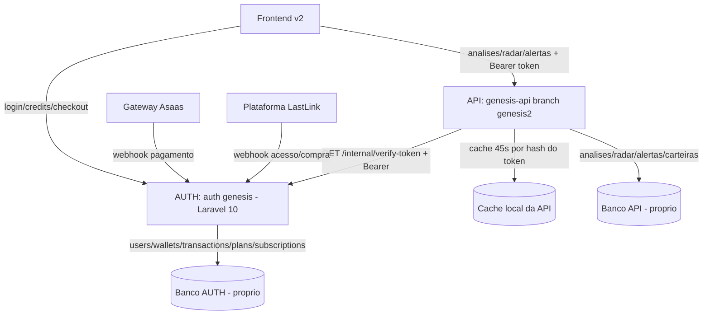

# Design — Microserviço de Autenticação e Créditos (Gênesis)

## Visão Geral

Extrai identidade (usuário/senha) e saldo de créditos — incluindo compra de pacotes — de `genesis-api` para um
novo serviço Laravel 10 (`[AUTH]`, hoje pasta vazia em `E:\Programas\wamp64\www\auth genesis`), com banco de dados
próprio. `genesis-api` (branch `genesis2`) e o frontend v2 (`[FE]`) passam a tratar `[AUTH]` como fonte única da
verdade para login/saldo; todo o restante (análises, radar, alertas, `CarteiraMae/Membro/Gemas`) continua em bancos
separados por sistema, sem mudança de comportamento.

Este design não toca na branch `master` de `genesis-api` nem no frontend antigo (Requisito 9) — o contrato de
`[AUTH]` é desenhado para ser consumido por qualquer geração, mas essa integração é um spec futuro.

## Estado Atual Auditado (2026-09-09)

| Item | Estado real |
|---|---|
| `auth genesis` | Pasta vazia — projeto novo, sem migração de código existente. |
| Saldo de créditos em `genesis-api` | ✅ Já é um ledger real: `User implements Wallet` (`bavix/laravel-wallet` ^10.1, `HasWallet`/`HasWalletFloat`/`HasWallets`), tabelas `wallets`/`transactions`. Não é uma coluna solta apesar de existir uma coluna legada `credits` em paralelo (`$user->credits = ...` e `$user->depositFloat(...)` são chamados juntos em alguns pontos — a coluna `credits` parece vestigial, o ledger é que é usado em `balanceFloat`/`withdrawFloat`/`depositFloat`). |
| Autenticação | `laravel/sanctum` ^3.3, token opaco em `personal_access_tokens`, `$user->tokens()->delete()` no login (single-session), `logout()` deleta o token atual. |
| `AuthController` | Concentra login/registro/`me`/`balance`/`history`/`updateProfile`/`changePassword` **e** checkout de créditos (`store()` = cartão, `pix()` = PIX), ambos via gateway Asaas com split de pagamento. Responsabilidade misturada (auth + billing) — este design as separa em módulos dentro do mesmo serviço, não em serviços diferentes (Requisito 4). |
| `CreditController::consume()` | Debita por tipo (`radar`/`liquidation`/`oiliq`/`figure`/`tendency`/`mindmetrics`/`micro_radar`), custo de cada tipo vem de `setting(...)` (config dinâmica), com idempotência via `idempotency_key` + janela de 20s por `meta->description`. |
| `Plan`/`Subscription` | Catálogo de pacotes (`name`, `credits`, `price`, `price_per_credit`) e vínculo de compra (`user_id`, `plan_id`, `reference` = id da cobrança no Asaas). `Admin\PlanController` existe mas está incompleto (métodos `store`/`update`/`destroy` vazios). |
| `LastLinkWebhookController` | Recebe eventos de uma plataforma externa (produto/comunidade), credita saldo automaticamente em `Product_Access_Started` e mantém `LastLinkAccess` (email + produto → status). Também é hoje a via que ativa `$user->status` no registro (`AuthController::register()` consulta `LastLinkWebhooks` por e-mail). |
| Webhook Asaas | `LastLinkWebhookController::asaas()` — trecho ativo hoje é o bloco de `Subscription`/`payment.object`, com `PAYMENT_RECEIVED`/`PAYMENT_CONFIRMED` creditando e `PAYMENT_REFUNDED` estornando. Existe um bloco antigo comentado (`SUBSCRIPTION_*`) que não roda. |
| Segurança de webhook | `VerifyAsaasToken`, `VerifyLastLinkSignature` (HMAC SHA-256), `WebhookIdempotency` — middlewares já existentes, a portar junto. |
| `[FE]` | Token único em `localStorage['genesis_token']`, chama `/v1/login`, `/v1/logout`, `/v1/credits`, `/v1/credits/consume/:type` direto em `genesis-api` (`services/api.ts`). |
| `CarteiraMae`/`CarteiraMembro`/`CarteiraGemas` | Domínio de portfólio/gamificação, sem relação com saldo de créditos de IA — confirmado por leitura das migrations (`add_ath_columns_to_carteiras`, `add_investimento_to_carteiras`, `alvo_saida`) — não é billing. Fora de escopo. |

## Decisões Arquiteturais

| Decisão | Justificativa |
|---|---|
| `[AUTH]` reusa `laravel/sanctum` + `bavix/laravel-wallet`, mesmos pacotes de hoje | Minimiza risco de migração — mesma forma de tabela (`wallets`/`transactions`), mesmo modelo mental de saldo (`balanceFloat`/`depositFloat`/`withdrawFloat`). Trocar de pacote agora seria risco não pedido. |
| Validação de token entre serviços via endpoint interno + cache curto (Requisito 2), **não** JWT stateless — **confirmado com o usuário em 2026-09-10** | JWT eliminaria a chamada de rede por request, mas perde revogação instantânea — hoje `login()` já invalida sessões anteriores (`tokens()->delete()`) e `status <> "active"` bloqueia login; um JWT assinado não reflete essas mudanças até expirar, a menos que se implemente uma blacklist — o que reintroduz o mesmo problema de estado compartilhado que a opção de endpoint+cache já resolve, com uma peça a mais (gestão de chave de assinatura entre dois repositórios). Trade-off documentado no Requisito 2.4: até o TTL do cache, uma inativação/logout pode não refletir imediatamente — aceito explicitamente como troca deliberada. |
| Coluna legada `credits` em `User` não é migrada — **confirmado 2026-09-10** | Saldo tem uma única fonte no `[AUTH]`: o ledger (`bavix/laravel-wallet`, `balanceFloat`). Evita os dois valores divergirem no serviço novo. |
| Modelo de pacote mantém o nome `Plan` — **confirmado 2026-09-10** | Menos churn de nome em relação ao que já existe hoje em `genesis-api`. |
| Saldo/compra de créditos tratados como **módulos separados** dentro do mesmo serviço `[AUTH]` (não dois microserviços) | O usuário confirmou que auth+créditos+compra devem ficar juntos num só serviço. Separar por módulo dentro dele (não por classe única tipo `AuthController` atual) evita repetir o problema de responsabilidade misturada já observado hoje. |
| Catálogo de pacotes parametrizável por versão/cliente, não hardcoded | Genesis2/frontend v2 pode ter pacotes diferentes de uma futura integração com `master`/frontend antigo, sem exigir mudança de código no `[AUTH]` (Requisito 4.3). |
| Dados de cartão nunca persistidos, sempre repassados direto ao Asaas | Mesma prática de hoje (`AuthController::store()` já não persiste cartão) — mantido explicitamente como requisito para não regredir em compliance. |
| Migração de dados de produção como etapa gated e auditável, com plano de rollback | [[feedback_db_authorization]] já registra um incidente real de comando destrutivo em banco de produção neste projeto — dados reais de usuário/saldo não são tocados sem autorização explícita e sem script auditável. |
| `master`/frontend antigo fora do escopo de código | Reduz superfície de risco deste spec — o contrato de `[AUTH]` é desenhado genérico o bastante para uma integração futura ser um spec de integração, não uma reescrita. |

## Contrato — `[AUTH]` (novo serviço)

### Auth (público, consumido por qualquer frontend)

```
POST /api/auth/register        { name, email, password, cpf }
POST /api/auth/login           { email, password } -> { access_token, token_type, user }
POST /api/auth/admin-login     { email, password } -> { access_token, token_type, user } (404 se role != admin)
POST /api/auth/logout          (Bearer)
GET  /api/auth/me              (Bearer) -> { id, name, email, credits, role, status }
POST /api/auth/forgot-password { email }
POST /api/auth/reset-password  { token, email, password }
PUT  /api/auth/profile         { name, email }
PUT  /api/auth/password        { current_password, new_password, new_password_confirmation }
```

### Créditos (público, consumido por qualquer frontend)

```
GET  /api/credits/balance                       (Bearer) -> { credits }
GET  /api/credits/history                       (Bearer) -> [{ id, type, amount, description, origin, created_at }]
POST /api/credits/consume/{type}                (Bearer) { idempotency_key? } -> { credits }
```

### Pacotes/compra (público, consumido por qualquer frontend)

```
GET  /api/packages?client=genesis2              -> [{ id, name, credits, price }]
POST /api/checkout/card                         (Bearer) { plan_id, card_*, cpf, phone, endereco... }
POST /api/checkout/pix                          (Bearer) { plan_id, cpf } -> { qr_code, qr_code_base64, expires_at }
POST /api/webhooks/asaas        (VerifyAsaasToken)
POST /api/webhooks/lastlink     (VerifyLastLinkSignature, WebhookIdempotency)
```

### Interno (consumido só por outras APIs do próprio sistema, nunca pelo frontend)

```
GET /api/internal/verify-token  (Bearer, repassado pela API chamadora)
    -> 200 { user_id, email, status, role }
    -> 401 { }
```

(`/api/` e não `/internal/` puro — `routes/api.php` do Laravel é prefixado automaticamente por
`RouteServiceProvider`; documentado aqui como implementado, não como `/internal/verify-token` puro.)

## Contrato — `[API]` (`genesis-api`, branch `genesis2`)

### Middleware novo: `VerifyGenesisAuthToken`

**Implementado e testado na Fase 5 (2026-09-10) — construído, não ativado em nenhuma rota real ainda (ver
tasks.md).** Achado real durante a construção que revisa o desenho original abaixo: 13 controllers deste
repositório chamam `auth()->user()`/`Auth::user()` diretamente (inclui o middleware `admin`/`EnsureAdmin`) — só
guardar o payload em `$request->attributes` (como a versão original deste bloco mostrava) deixaria
`Auth::user()` nulo e quebraria todos eles. A versão real materializa/atualiza uma linha local em `users`
(casada por email) e loga via `Auth::setUser()`, preservando `auth()->user()` em todo código existente:

```php
class VerifyGenesisAuthToken
{
    public function handle($request, Closure $next)
    {
        $token = $request->bearerToken();
        if (!$token) {
            return response()->json(['message' => 'Unauthenticated.'], 401);
        }

        $cacheKey = 'genesis_auth_token:' . hash('sha256', $token);
        $payload = Cache::remember($cacheKey, self::CACHE_TTL_SECONDS, function () use ($token) {
            try {
                $response = Http::withToken($token)->timeout(5)
                    ->get(rtrim(config('services.genesis_auth.url'), '/') . '/api/internal/verify-token');
            } catch (\Throwable $e) {
                return null;
            }
            return $response->successful() ? $response->json() : null;
        });

        if (!$payload || empty($payload['email'])) {
            Cache::forget($cacheKey);
            return response()->json(['message' => 'Unauthenticated.'], 401);
        }

        // Casa por email com uma conta local já existente (se houver) — preserva o `id` local e
        // tudo que está ligado a ele (analyses/radar/alertas), sem exigir migração de dados pra
        // continuar funcionando, desde que a pessoa se registre em [AUTH] com o mesmo email.
        $localUser = User::firstOrCreate(
            ['email' => $payload['email']],
            ['name' => $payload['email'], 'password' => Hash::make(Str::random(40))]
        );
        if ($localUser->role !== ($payload['role'] ?? null) || $localUser->status !== ($payload['status'] ?? null)) {
            $localUser->role = $payload['role'] ?? null;
            $localUser->status = $payload['status'] ?? null;
            $localUser->save();
        }

        Auth::setUser($localUser);
        $request->attributes->set('genesis_user', $payload);
        return $next($request);
    }
}
```

Código real completo em `app/Http/Middleware/VerifyGenesisAuthToken.php` (genesis-api).

`CreditController::consume()` (em `genesis-api`) ganhou um branch condicional atrás de
`config('services.genesis_auth.enabled')` (default `false`) — o código antigo (debitar `balanceFloat`
localmente) fica intocado enquanto a flag estiver desligada; ligada, repassa a chamada para `[AUTH]` via
`App\Services\GenesisAuthClient::consumeCredit()`, com o mesmo Bearer token:

```php
public function consume(string $type)
{
    if (config('services.genesis_auth.enabled')) {
        $result = app(GenesisAuthClient::class)->consumeCredit(
            request()->bearerToken(), $type, request()->input('idempotency_key')
        );
        return response()->json($result['body'], $result['status']);
    }

    // ... código original (debitar balanceFloat localmente), intocado ...
}
```

## Contrato — `[FE]` (`services/api.ts`)

```typescript
const AUTH_API_BASE = import.meta.env.VITE_AUTH_API_URL || 'http://localhost:8001/api';
// login/logout/getCredits/consumeCredits passam a apontar para AUTH_API_BASE
// todas as demais chamadas (análises, radar, alertas...) continuam em API_BASE (genesis-api)
// o token retornado por AUTH_API_BASE/auth/login continua salvo em localStorage['genesis_token']
// e enviado como Bearer tanto para AUTH_API_BASE quanto para API_BASE
```

## Fluxo de dados



## Migração de dados (Requisito 8 — gated)

1. Script de exportação (`[API]`, read-only): `users`, `wallets`, `transactions` (filtradas por `payable_type =
   User::class`), `plans`, `subscriptions`, `last_link_webhooks`, `last_link_access` → arquivos versionáveis
   (JSON/SQL dump), nunca comando ad-hoc direto em produção.
2. Script de importação (`[AUTH]`, idempotente — pode rodar mais de uma vez sem duplicar).
3. Período de validação com dupla checagem (comparar saldo/login em `[AUTH]` vs. o que `genesis-api` reportava
   antes do corte) antes de remover a autoridade local de `genesis-api`.
4. Só depois de confirmado: `genesis-api` para de aceitar login local; tabelas locais `users`/`wallets`/
   `transactions` são arquivadas (não removidas de imediato — mesmo padrão já usado em specs anteriores deste
   projeto para colunas/arquivos legados).

Este passo **não é executado neste spec** — fica registrado como Fase gated em `tasks.md`, que exige autorização
explícita do usuário antes de rodar contra dado real.

## Próximos passos — integração futura de `master`/frontend antigo (Fase 10, registrado, não implementado)

Levantamento real feito em 2026-09-10 (`git diff`/`git log` entre `master` e `genesis2`, sem alterar nenhum dos
dois) — para quando o usuário decidir priorizar essa integração:

**Relação real entre as branches**: `master` não tem nenhum commit próprio — `git merge-base master genesis2`
== tip de `master`. Ou seja, `master` é literalmente um ponto congelado de onde `genesis2` foi criada há 111
commits, não uma branch que evoluiu por conta própria. Isso simplifica a integração futura: não existem dois
códigos independentes divergindo, só um "genesis2 mais antigo".

**Domínio de auth/créditos especificamente (o que importa pra este spec)**:
- `app/Models/User.php`: **zero diferença** entre as branches — mesmo schema, mesmos campos. O `[AUTH]` já
  serve os dois sem nenhum trabalho de compatibilidade de dado adicional.
- Nenhuma das 58 migrations que `genesis2` tem e `master` não tem toca em `users`/`wallets`/`transactions`/
  `plans`/`subscriptions`/`last_link_webhooks`/`lastlink_accesses` — são todas do domínio de análise
  gráfica/radar, não relacionadas. O schema de auth/créditos de `master` é idêntico ao de `genesis2`.
- **Achado de segurança real, fora do escopo deste spec corrigir**: `master` não tem nenhum dos middlewares
  `webhook.lastlink`/`webhook.asaas`/`webhook.idempotency`/`admin`/`internal.service` registrados em
  `Kernel.php` — se a implantação de `master` ainda recebe tráfego real de webhook do Asaas/LastLink, esses
  endpoints estão **sem verificação de assinatura/token** lá (a correção "V6.8 CODE-P0-11" só chegou depois do
  ponto em que `master` parou de receber commits). Vale sinalizar ao usuário como um risco de segurança
  independente desta migração, não algo pra "resolver de graça" dentro deste spec.
- `CreditController::consume()` de `master` não tem proteção por `idempotency_key` (só a janela de 20s) nem o
  tipo `micro_radar`.
- `AuthController::store()/pix()` de `master` vaza a mensagem de erro crua do Asaas pro cliente (regex sobre
  `getMessage()`) em vez da mensagem genérica que `genesis2` já usa hoje.

**O que uma integração futura precisaria decidir/fazer** (não implementado aqui):
1. Confirmar se a implantação de `master` ainda está de fato recebendo tráfego real (produção) e, se sim,
   priorizar os middlewares de webhook ausentes como correção de segurança separada — antes ou independente da
   integração com `[AUTH]`.
2. Portar (não recriar) para `master` o mesmo par middleware+client que `genesis-api`/`genesis2` já tem
   (`VerifyGenesisAuthToken`/`GenesisAuthClient`, Fase 5) — como o `User` model é idêntico, o mesmo código deve
   funcionar em `master` sem adaptação, só copiar os arquivos e aplicar o mesmo padrão "construído, não
   ativado" até `master` também estar pronto pra cortar.
3. Decidir o catálogo de pacotes (`GET /api/packages?client=`) pra essa geração — usar `client=master` (ou
   nome equivalente) como o parâmetro já suportado desde a Fase 6, sem mudança de contrato no `[AUTH]`.
4. Frontend antigo: fora deste workspace, não inspecionado diretamente. Estruturalmente, deve ter o mesmo
   formato de `services/api.ts` que a v2 tinha antes da Fase 7 (chamadas diretas a `/v1/login` etc. em
   `genesis-api`) — o mesmo padrão de `authPath()`/env gated aplicado na Fase 7 deveria se aplicar igual, mas
   isso precisa de acesso real ao código pra confirmar antes de implementar.
5. Confirmar se a implantação real de `master` usa o mesmo banco (`genesisteste`) que `genesis2` neste ambiente
   de dev, ou um banco de produção separado. Neste working directory os dois branches compartilham o mesmo
   `.env` (não versionado, não muda ao trocar de branch) — mas isso não prova nada sobre a topologia real de
   produção, onde cada implantação pode ter seu próprio banco. Se for um banco diferente, a Fase 9 precisa
   rodar de novo apontando pra lá; se for o mesmo, a migração já feita cobre os dois.
