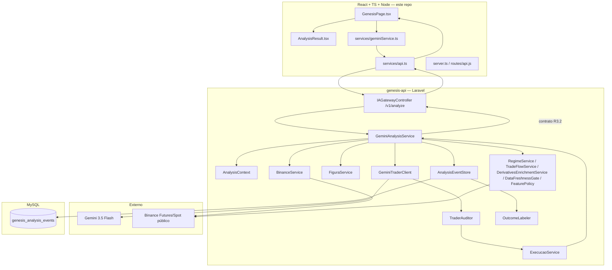

# Design — Gênesis V4.3-R3.2: Implementação e Correção

## Visão Geral

Este design cobre o fechamento do gap entre o estado real do código (auditado em 2026-07-13) e o Documento Mestre V4.3-R3.2, em dois repositórios:

1. **genesis-api** (`E:\Programas\wamp64\www\genesis-api`) — Laravel, contém `GeminiAnalysisService`, `ExecucaoService`, `TraderAuditor`, `GeminiTraderClient` e todos os serviços de cálculo.
2. **Frontend** (este repositório) — React/TypeScript + servidor Node (`server.ts`, `routes/api.js`).

O código já implementa corretamente boa parte do "cérebro" (schema, auditor, cliente Gemini, orçamento de IA, validação semântica de S/R, cache de OCR). O trabalho deste spec se concentra em três frentes:

- **Corrigir o que está quebrado** (Fase 0 — bug fatal e violações ativas de invariante).
- **Construir o que nunca foi criado** (Fase 1–2 — camada de enriquecimento, event store, geometria de figuras).
- **Migrar o frontend para o contrato novo** (Fase 3 — hoje ele fala majoritariamente o contrato legado por cima de um transporte já correto).

Onde o Documento Mestre já contém código completo e testado logicamente (ex.: `RegimeService`, `TradeFlowService`, `DerivativesEnrichmentService`, a geometria de `FiguraService`), este design **não duplica o código-fonte** — referencia a seção exata do Documento Mestre como fonte canônica a copiar literalmente. Código é duplicado aqui apenas quando (a) é a correção de um bug específico encontrado na auditoria, ou (b) o Documento Mestre não especifica a implementação exata (ex.: qual arquivo apagar).

## Estado Atual Auditado

Resumo da auditoria de código de 2026-07-13 (não é um requisito, é o ponto de partida factual deste design):

| Área | Estado |
|---|---|
| `TraderSchema`, `TraderAuditor`, `GeminiTraderClient` | ✅ Conformes ao Documento Mestre |
| `AnalysisContext` (orçamento de 5, por-requisição) + loop de 3 rodadas + quarentena por orçamento esgotado | ✅ Conformes |
| `validarNiveisSemanticos()` + cache de OCR com hash+modelo+prompt | ✅ Conformes |
| `ExecucaoService::indisponivel()`/`::inconsistente()` | ❌ **Não existem — crash fatal em produção** |
| `ExecucaoService::montar()` (contrato de status, RR líquido, shadow mode) | ❌ Motor R3.1 antigo, sem nenhum dos itens novos |
| `callGemini()`/`buildPrompt()`/`buildTradeSetup()`/`buscarGeopoliticaFresca()` | ❌ Vivos e chamados dentro de `analisar()` — segundo cérebro |
| `montarBarreiras()` | ⚠️ Ainda usa S/R bruto do OCR |
| `BinanceService::getOrderBookWalls()` | ❌ Contrato escalar antigo |
| `config/genesis.php` flags (`shadow_mode`, `features.*`, `book_scoring_enabled`, `custos_bps`) | ❌ Declaradas, nunca lidas |
| `AppServiceProvider::boot()` | ⚠️ Só loga, não bloqueia |
| `RegimeService`, `TradeFlowService`, `DerivativesEnrichmentService`, `DataFreshnessGate`, `FeaturePolicy`, `BinancePublicStreamService`, `AnalysisEventStore`, `OutcomeLabeler` | ❌ Não existem |
| Geometria de `FiguraService` (Seção 13.2) | ❌ Só existe um validador simplificado |
| Testes da Seção 18 | ⚠️ 3 de ~15 existem; `TraderAuditoriaTest.php` testa contrato obsoleto |
| `types.ts` (contrato R3.2) | ❌ 100% legado |
| `GenesisPage.tsx`, `AnalysisResult.tsx` | ❌ Leem campos legados, defaults falsos, sem gate de execução |
| `services/api.ts` | ❌ Não lança erro em HTTP não-OK |
| `server.ts`/`routes/api.js` (segurança) | ❌ Login admin fixo + segredo JWT fallback ainda presentes |
| Motor de decisão legado do Node (`/analisar`, `genesisPipeline.js`) | ❌ Não removido |
| Limpeza de artefatos soltos | ❌ Não feita |

## Decisões Arquiteturais

| Decisão | Justificativa |
|---|---|
| Fase 0 é bloqueadora de tudo o mais | O bug de `ExecucaoService::indisponivel/inconsistente` inexistentes derruba qualquer teste de ponta a ponta; sem corrigi-lo, nenhuma prova da Seção 19 é possível. |
| Remover o segundo cérebro Gemini antes de adicionar enriquecimento | Adicionar `RegimeService`/`TradeFlowService`/etc. sobre um pipeline que ainda roda `callGemini()` legado esconderia custo e comportamento duplicados nas métricas da Fase 2. |
| Camada de enriquecimento (Fase 2) entra inteira atrás de feature flag + shadow mode | Já é a decisão de produto do Documento Mestre (Seção 0.2, item 5); não há razão para desviar. |
| Migração de frontend tratada como fase própria, não intercalada | O transporte (`GenesisPage → geminiService → POST /v1/analyze`) já é correto; o risco está em quebrar consumidores do contrato antigo (`AnalysisHistoryDashboard.tsx` e outros não citados no Documento Mestre) se `types.ts` mudar sem varredura completa de importadores. |
| Testes de propriedade (`fast-check` no frontend, data providers no PHP) seguem o padrão já usado no repo (`genesis-critical-steps`) | Consistência entre specs; a base já está configurada em `vitest.config.ts`. |
| Não duplicar código-fonte de serviços já totalmente especificados no Documento Mestre | Evita transcrição divergente entre este spec e a fonte normativa; a tarefa aponta a seção exata a copiar. |

## Arquitetura

## Componentes e Interfaces

### Fase 0 — Correção do bug fatal (Requisito 1)

**Arquivo:** `genesis-api/app/Services/ExecucaoService.php`

Adicionar os dois métodos estáticos ausentes exatamente como especificado no Documento Mestre Seção 14.1 (bloco `public static function indisponivel(...)` e `public static function inconsistente(...)`, já com os campos `status`, `executable`, `action`, `direction_reference`, `reason_code`, `motivo`, `candidate_setup`, `executable_setup`, `planoB`, `zonaInteresse`, `avisos`, `stop_ancora`). Este é o menor diff possível que já destrava `GeminiAnalysisService.php:809,818`.

Ordem de implementação dentro da Fase 0: adicionar estes dois métodos **antes** de tocar em `montar()` (Requisito 2), para que o sistema pare de quebrar imediatamente enquanto o resto da reescrita está em andamento.

### Fase 0 — Reescrita de `ExecucaoService::montar()` (Requisito 2)

**Arquivo:** `genesis-api/app/Services/ExecucaoService.php`

Copiar a implementação completa da Seção 14.1 do Documento Mestre (classe inteira: construtor com `NivelService`/`AlvoService`/`PivoService`, `montar()`, `calcularRrLiquidoEstimado()`, `validarR8()`, `montarBarreiras()`). Pontos que exigem atenção específica além da cópia literal:

- O construtor atual do arquivo em produção pode ter uma assinatura diferente (verificar dependências injetadas antes de substituir — não presumir que `NivelService`/`AlvoService`/`PivoService` já são resolvidas do container do mesmo jeito).
- `calcularRrLiquidoEstimado()` depende de `config('genesis.custos_bps')` estar de fato populada em produção (não só no `.env.example`) — validar antes de mergear, senão todo RR líquido vira `null` silenciosamente.
- `montarBarreiras()` já deve nascer sem `$ev['suportes']`/`$ev['resistencias']` (ver Requisito 4) — não copiar o bug antigo por engano, o próprio bloco da Seção 14.1 já está correto (usa `$zonas['resistencias']`/`$zonas['suportes']`, não `$ev`).

### Fase 0 — Remoção do cérebro duplicado (Requisito 3)

**Arquivo:** `genesis-api/app/Services/GeminiAnalysisService.php`

1. Localizar as três chamadas em `analisar()` (linhas ~583, 597, 600 no código auditado) que disparam `buildPrompt()` → `callGemini()` → `buildTradeSetup()`.
2. Confirmar quais campos de saída pública dependem hoje desse caminho (`macroGeopolitica`, `dadosAtivo`, `sessao`, conforme a auditoria) — esses campos precisam ser realimentados por `gerarContextoInformativoUnico()` (Seção 10.4, já parcialmente implementado como narrativa informativa) antes de apagar o caminho antigo, para não quebrar o frontend em campos que ele ainda lê.
3. Apagar `buildPrompt()`, `callGemini()`, `buildTradeSetup()`, `buscarGeopoliticaFresca()` (se não usada por mais nada), `promptTrader()`, `schemaTrader()`, `callTraderIA()`, `callOpenAITrader()`, `callGeminiTrader()`, `viesDaFigura()`.
4. Apagar `FiguraService::identificar()` e seus helpers privados listados no Requisito 3.4 — confirmado código morto pela auditoria (comentário no próprio arquivo já admite isso).

**Risco a mitigar:** o passo 2 é o único que pode gerar regressão visível ao usuário (campos de narrativa somem do contrato público). Rodar o pacote de prova (Fase de aceite) com um `analysis_id` antes/depois da remoção e comparar as chaves de `contexto_informativo`/`analysis` no JSON de resposta.

### Fase 0 — Barreiras sem S/R bruto (Requisito 4)

Ver bloco `montarBarreiras()` já corrigido dentro da cópia da Seção 14.1 (Requisito 2). Adicionalmente, confirmar em `GeminiAnalysisService.php` que a variável passada para `montarBarreiras()` é sempre o retorno de `validarNiveisSemanticos()` (`$zonas`), nunca `$elementosVisuais` bruto — este é o "invariante de integridade" citado na Seção 14.1 do Documento Mestre.

### Fase 0 — Book estruturado (Requisito 5)

**Arquivo:** `genesis-api/app/Services/BinanceService.php`

Substituir `getOrderBookWalls()` pelo bloco completo da Seção 12.1 do Documento Mestre. Em seguida, localizar **todos** os consumidores (`MotorExecucaoService`, `montarBookFolha()` em `GeminiAnalysisService.php`, e qualquer outro ponto encontrado por `grep -RIn "getOrderBookWalls\|paredes_compra\|paredes_venda"`) e migrá-los no mesmo commit — a Seção 12.3 do Documento Mestre é explícita: produtor e consumidor têm que mudar atomicamente, sem compatibilidade temporária com float.

### Fase 1 — Flags aplicadas e boot fail-fast (Requisitos 6–7)

**Arquivos:** `genesis-api/app/Services/ExecucaoService.php` (já cobre `shadow_mode` via Requisito 2.8), `genesis-api/app/Services/BinanceService.php` (já cobre `book_scoring_enabled` via Requisito 5.2), `genesis-api/app/Services/FeaturePolicy.php` (novo, Requisito 9.5), `genesis-api/app/Providers/AppServiceProvider.php`.

Para o boot fail-fast (Requisito 7), a abordagem recomendada não é lançar exceção no `boot()` do provider (isso derrubaria o Laravel inteiro, incluindo rotas não relacionadas ao Gênesis) — é fazer `GeminiAnalysisService::analisar()` checar a config crítica no início e, se inválida, produzir diretamente `execution.status=NAO_RECOMENDADA_CONFIGURACAO` (reaproveitando o Requisito 2.4) em vez de prosseguir. O `boot()` continua logando `Log::critical` para observabilidade operacional.

### Fase 2 — Camada de enriquecimento (Requisito 9)

**Arquivos novos:** `genesis-api/app/Services/DataFreshnessGate.php`, `RegimeService.php`, `TradeFlowService.php`, `DerivativesEnrichmentService.php`, `FeaturePolicy.php`.

Copiar literalmente das Seções 12.7–12.11 do Documento Mestre — essas implementações já estão completas e não dependem de nenhuma decisão de produto em aberto. A única integração local é conectar as saídas desses serviços aos argumentos opcionais de `montarFolhaDecisao()` (Seção 12.13) e ao prompt (regras 11–18).

**Ordem interna sugerida:** `DataFreshnessGate` e `RegimeService` primeiro (não dependem de coleta nova), depois `TradeFlowService` (depende de `BinancePublicStreamService` do Requisito 10 para dados de `aggTrade` reais — pode ser stubado com array vazio até lá), depois `DerivativesEnrichmentService` (depende de campos que `BinanceService`/`ExchangeRouter` já coletam hoje, só precisa enriquecer).

### Fase 2 — Coleta do book (Requisito 10)

**Arquivo novo:** `genesis-api/app/Services/BinancePublicStreamService.php`, per Seção 12.12. Este é o item de maior esforço de infraestrutura (WebSocket persistente, snapshot+delta, validação de sequência) — vale isolar como sua própria sub-tarefa com tempo dedicado, não tentar encaixar junto com os outros serviços de enriquecimento que são puramente funções sobre dados já coletados.

### Fase 2 — Event store e shadow mode mensurável (Requisito 11)

**Arquivos novos:** migration `2026_XX_XX_create_genesis_analysis_events_table.php` (Seção 16.1), `app/Services/AnalysisEventStore.php` (Seção 16.2), `app/Services/OutcomeLabeler.php` (Seção 16.4).

Chamar `AnalysisEventStore::persist()` no fim de `GeminiAnalysisService::analisar()`, depois que `$result` já está montado e antes do `return`. Envolver em `try/catch` — falha de persistência vira `Log::critical`, nunca altera a resposta HTTP já decidida.

### Fase 3 — Geometria de figuras (Requisito 12)

**Arquivo:** `genesis-api/app/Services/FiguraService.php`. Copiar as funções privadas da Seção 13.2 do Documento Mestre e adicionar `string $timeframe` à assinatura de `validarReportada()`, atualizando o único call site em `GeminiAnalysisService.php` (Seção 13.3). Mover os mapas `VIES`/`CONFIRMACAO` para `GenesisVisualCatalog` conforme Seção 13.1.

### Fase 4 — Frontend: contrato (Requisitos 13–16)

**`types.ts`:** substituição direta pelo bloco da Seção 15.2. Como `types.ts` é importado por dezenas de componentes fora do escopo do Documento Mestre (`AnalysisHistoryDashboard.tsx`, `RiskCalculatorModal.tsx` etc.), a tarefa precisa incluir uma passada de `tsc --noEmit` para pegar todo import quebrado — não é seguro assumir que só os 2 arquivos citados no Documento Mestre (`GenesisPage.tsx`, `AnalysisResult.tsx`) usam os tipos antigos.

**`GenesisPage.tsx`:** aplicar `toNullableNumber` (Seção 15.3) e o gate de `handleSaveTrade()` (Seção 15.4) exatamente como especificado.

**`AnalysisResult.tsx`:** reler a partir de `execution`/`analysis` novos (Seção 15.5). Como o arquivo hoje também renderiza `data.ensemble` e outros blocos legados que não têm equivalente direto no contrato novo, essas seções da UI devem ser removidas, não adaptadas — o Documento Mestre proíbe `ensemble` no contrato público (Seção 17).

**`services/api.ts`:** aplicar o padrão de `throw` (Seção 15.6) a toda função exportada, não só às citadas no documento.

### Fase 5 — Frontend: segurança e limpeza (Requisitos 17–19)

**`server.ts`/`routes/api.js`:** remover bypass admin, remover fallback JWT, adicionar `if (!secret) throw`. Apagar rota `/analisar` e imports de `engine/*`. Apagar `genesisPipeline.js` e a cadeia de serviços órfãos.

**Limpeza de raiz:** apagar artefatos soltos listados no Requisito 19.1 — operação puramente de `git rm`, sem risco funcional, mas deve rodar `npm run build` depois para confirmar que nada importava um desses arquivos por engano.

**Verificação de LSR:** ler `services/advancedAnalytics.ts` por completo (a auditoria não confirmou nem descartou o risco) antes de declarar o Requisito 19 concluído.

## Modelos de Dados

### `genesis_analysis_events` (nova tabela)

Ver schema completo no Documento Mestre Seção 16.1 — reproduzido aqui apenas o resumo de colunas-chave para referência rápida durante implementação:

| Coluna | Tipo | Observação |
|---|---|---|
| `analysis_id` | UUID, unique | Chave de correlação entre logs, event store e resposta pública |
| `experiment_group_id` | UUID, nullable | Agrupa CONTROL/CANDIDATE da mesma folha |
| `brain_variant` | string, default `CONTROL` | `CONTROL` ou `CANDIDATE` |
| `direction`, `conviction`, `analysis_status`, `execution_status`, `executable` | — | Espelham o contrato público |
| `rr_gross`, `rr_net_estimated` | decimal | RR bruto e líquido |
| `facts_snapshot`, `trader_response`, `audit_snapshot`, `execution_snapshot`, `public_response` | json | Auditabilidade completa |
| `outcome_return_pct`, `outcome_net_pct`, `outcome_label`, `outcome_measured_at` | — | Preenchidos posteriormente por `OutcomeLabeler` |

### Contrato público (`GenesisAnalysisResult`)

Ver Documento Mestre Seção 15.1 (JSON canônico) e Seção 15.2 (`types.ts`). Não redefinido aqui para evitar divergência com a fonte.

## Propriedades de Corretude

*Uma propriedade é uma característica que deve ser verdadeira em todas as execuções válidas do sistema.*

### Propriedade 1: `ExecucaoService::indisponivel`/`::inconsistente` nunca lançam erro fatal

*Para qualquer* `reason_code` string não-vazio, chamar `ExecucaoService::indisponivel($reason)` ou `::inconsistente($reason)` deve retornar um array com `status`, `executable=false`, `action=null`, `candidate_setup=null`, sem lançar exceção.

**Valida: Requisito 1.1–1.4**

### Propriedade 2: RR líquido é sempre ≤ RR bruto quando custos > 0

*Para qualquer* combinação de `preco > 0`, `riscoPreco > 0`, `recompensaPreco > 0` e `custos_bps` somando um valor positivo, `rr_liquido_estimado` calculado deve ser menor ou igual ao RR bruto (`recompensaPreco / riscoPreco`), porque o mesmo custo de round-trip penaliza os dois lados da fração.

**Valida: Requisito 2.2**

### Propriedade 3: `action` só é não-nulo quando `executable=true`

*Para qualquer* saída de `ExecucaoService::montar()`, se `execution.action !== null` então `execution.executable === true` e `execution.status === 'EXECUTAVEL'`. A implicação contrária não vale (pode ser executable com shadow mode desligando a ação — não, na verdade `shadow_mode` já muda `status` para `SHADOW_MODE`, então `executable` fica false nesse caso; a propriedade testa a implicação `action !== null ⟹ status === EXECUTAVEL`).

**Valida: Requisitos 2.3, 2.8, 2.9**

### Propriedade 4: Barreiras de TP nunca incluem S/R bruto do OCR

*Para qualquer* folha em que `zonas['suportes']`/`zonas['resistencias']` (pós-validação semântica) difira de `elementosVisuais['suportes']`/`elementosVisuais['resistencias']` (OCR bruto), a lista retornada por `montarBarreiras()` deve conter apenas valores da primeira coleção.

**Valida: Requisito 4.1, 4.3**

### Propriedade 5: `DataFreshnessGate` nunca marca fonte sem timestamp como utilizável

*Para qualquer* fonte com `timestamp_ms=0` ou ausente, `avaliar()` deve retornar `status != 'OK'` e excluí-la de `usable_sources`, independentemente de `idade_maxima_ms`.

**Valida: Requisito 9.1**

### Propriedade 6: `RegimeService` nunca retorna direção

*Para qualquer* entrada válida de indicadores, o array retornado por `classificar()` não deve conter as chaves `direcao`, `LONG` ou `SHORT` — apenas `direcao_estrutura` como contexto.

**Valida: Requisito 9.2**

### Propriedade 7: `OutcomeLabeler` nunca resolve ambiguidade por suposição

*Para qualquer* candle onde `high >= tp1 AND low <= stop` (ou o inverso para SHORT) simultaneamente, o label retornado deve ser exatamente `AMBIGUOUS_SAME_CANDLE`, nunca `TP1_FIRST` ou `STOP_FIRST`.

**Valida: Requisito 11.5**

### Propriedade 8: `toNullableNumber` nunca produz `0` a partir de ausência

*Para qualquer* entrada `null`, `undefined`, ou string vazia, `toNullableNumber()` deve retornar `null`, nunca `0`. Para qualquer entrada numérica válida (incluindo `0` explícito), deve retornar o número exato.

**Valida: Requisito 14.1**

### Propriedade 9: `handleSaveTrade` nunca persiste quando `executable=false`

*Para qualquer* resultado de análise onde `execution.executable === false`, chamar `handleSaveTrade()` não deve produzir nenhuma chamada de rede de persistência de trade.

**Valida: Requisito 14.3**

### Propriedade 10: `api.ts` sempre lança em resposta não-OK

*Para qualquer* função exportada de `services/api.ts` e qualquer resposta HTTP com `res.ok === false`, a função deve rejeitar/lançar um erro contendo o status HTTP, nunca retornar um valor de sucesso implícito.

**Valida: Requisito 16.1, 16.2**

## Tratamento de Erros

| Cenário | Comportamento | Observação |
|---|---|---|
| `ExecucaoService::montar()` recebe direção fora de `LONG`/`SHORT` | `LogicException` (bug de programação, não falha técnica de IA) | Requisito 2.1 |
| `risco_por_analise` ausente/inválido | `status=NAO_RECOMENDADA_CONFIGURACAO`, sem dimensionamento | Requisito 2.4, 7.2 |
| `AnalysisEventStore::persist()` falha | `Log::critical`, resposta HTTP já decidida não é alterada | Requisito 11.2 |
| `services/api.ts` recebe HTTP não-OK | `throw new Error(status + body)` | Requisito 16.1 |
| `handleSaveTrade()` com `executable=false` | `alert(execution.motivo)`, sem persistência | Requisito 14.3 |
| Import quebrado após mudança de `types.ts` | Falha de build (`tsc --noEmit`) deve ser pega antes do commit, não em runtime | Requisito 13.4 |
| `JWT_SECRET` ausente no boot do Node | `throw` na inicialização do servidor, processo não sobe | Requisito 17.3 |

## Estratégia de Testes

### Abordagem Dual

Mesma convenção já usada no repositório (`genesis-critical-steps/design.md`): testes unitários para exemplos/edge cases + testes de propriedade para invariantes universais.

- **Backend (PHP)**: PHPUnit com data providers extensivos para as propriedades 1–7.
- **Frontend (TypeScript)**: `fast-check` (já configurado em `vitest.config.ts`) para as propriedades 8–10.

### Configuração

- Mínimo 100 iterações por teste de propriedade.
- Cada teste referencia a propriedade do design com a tag: **Feature: genesis-r3-2-implementacao, Property {N}: {título}**.

### Cobertura mínima por fase

| Fase | Testes obrigatórios antes de avançar |
|---|---|
| Fase 0 | `ExecucaoContratoTest` completo (Documento Mestre Seção 18.5) + `FolhaIntegridadeTest` (Seção 18.3) passando |
| Fase 1 | `TraderAuditoriaTest` reescrito + `AnalysisContextTest` passando |
| Fase 2 | `IncrementalBrainTest`, `ControlCompatibilityTest`, `StreamingBookShadowTest`, `AnalysisEventStoreTest` |
| Fase 3 | `FiguraServiceTest` cobrindo todos os casos da Seção 18.6 |
| Fase 4 | `tsc --noEmit` limpo + testes de propriedade 8–10 no frontend |
| Fase 5 | Greps da Seção 19.2 (adaptados a este repo) retornando vazio |
| Aceite | Todos os 50 itens da Seção 20 avaliados; pacote `GENESIS-V4.3-R3.2-PROVA.zip` completo |
