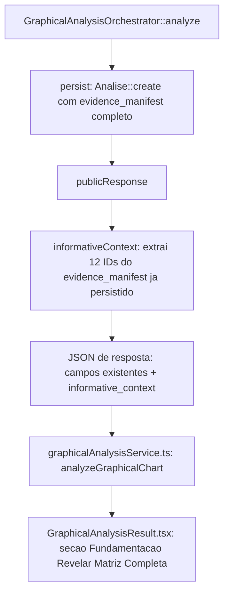

# Design — Gênesis V6.4: Restaurar Indicadores, Macro e Sentimento na Tela de Resultado

## Visão Geral

Este design fecha a lacuna encontrada durante a migração de `GenesisPage.tsx`/`AnalysisResult.tsx` (V4.3-R3.2)
para o fluxo V6.4 (`GenesisPage.tsx`/`GraphicalAnalysisResult.tsx`, Tarefa 9 do plano de implantação, sessão de
2026-07-25/26): a "CAMADA 4" do componente antigo — indicadores técnicos, macro/geopolítico e sentimento — nunca
foi recriada, nem pela versão escrita nesta sessão nem pela versão literal do documento normativo (Seção 22.63
do `Oficial Mestre.pdf`). Confirmado com o usuário (2026-07-26) que essa seção deveria continuar existindo, com o
mesmo estilo visual do componente antigo — só os blocos de **execução** (zona de entrada, TP, stop, tamanho de
posição) ficam de fora, por decisão já tomada e não revisitada aqui.

Este design não reabre nenhuma decisão de escopo já fechada no plano `genesis-v6-4-implantacao`. Ele estende o
contrato público (`publicResponse()`) e o componente de resultado, sem tocar em `GraphicalAnalysisOrchestrator`
além do necessário para expor dados já coletados, e sem adicionar nenhuma chamada nova a Gemini/Binance/Yahoo/
CoinGecko — todo o dado necessário já está em `evidence_manifest`.

## Estado Atual Auditado (2026-07-26)

| Item | Estado real |
|---|---|
| Coleta de RSI/ADX/ATR/EMAs/Wyckoff/sessão/multi-timeframe | ✅ `MarketSnapshotService::collect()` já calcula tudo; presente em `evidence_manifest` com os IDs `momentum.rsi14`, `momentum.adx14`, `volatility.atr14`, `trend.ema21/50/200`, `structure.wyckoff`, `market.session`, `timeframes.context`. |
| Coleta de macro (VIX/DXY/S&P500) | ✅ `MarketSnapshotService::macro()`; confirmado com chamada real (26/07, análise `71fa00f4-...`): VIX=18.58, DXY=-0.49%, S&P500=-1.16%, todos `AVAILABLE`. |
| Coleta de sentimento (Fear&Greed/dominância BTC) | ✅ `MarketSnapshotService::sentiment()`; confirmado na mesma chamada real: Fear&Greed=26, dominância BTC=56.46%, `AVAILABLE`. |
| Exposição desses dados em `publicResponse()` | ❌ Não existe nenhuma chave `informative_context`/similar — `grep -n "'macro'\|'sentiment'" GraphicalAnalysisOrchestrator.php` não retorna nada. |
| Narrativa de macro (resumo/eventos) e sentimento (narrativa/gatilhos) do componente antigo | ❌ Não existe mais fonte para isso — vinha de uma chamada Gemini dedicada a `contexto_informativo`, que a arquitetura V6.4 não tem (decisor único, Seção 4). Fora de escopo deste spec (ver `requirements.md`, "Decisão de escopo necessária"). |
| `GraphicalAnalysisResult.tsx` — estilo visual | ⚠️ Existe (escrito nesta sessão e também na Seção 22.63 do documento), mas usa paleta genérica (`bg-white/[0.03]`, cards neutros), não a paleta do `AnalysisResult.tsx` original (`#0a0a0f`/`#050505`, glow por direção, "CAMADA X"). |
| Blocos de execução (zona de entrada, TP, stop) | ✅ Corretamente ausentes — não recriar (Tarefa 0.1 do plano de implantação, confirmado novamente pelo usuário nesta conversa). |

## Decisões Arquiteturais

| Decisão | Justificativa |
|---|---|
| Extrair `informative_context` de `evidence_manifest`, nunca recalcular | O dado já existe, já foi coletado uma vez por análise, já está persistido. Recalcular duplicaria chamadas a APIs externas (Binance/Yahoo/Alternative.me/CoinGecko) sem necessidade. |
| Não recriar narrativa de macro/sentimento | Exigiria uma chamada de IA nova, contrariando o desenho de "decisor único" da Seção 4 do documento. Tratado como decisão de escopo explícita, não como omissão a corrigir silenciosamente. |
| Reusar a paleta/estrutura visual do `AnalysisResult.tsx` original, não inventar uma nova | Instrução explícita do usuário (2026-07-26): o estilo visual deveria ter ficado igual; a paleta escrita nesta sessão para `GraphicalAnalysisResult.tsx` foi um desvio não autorizado. |
| Não reintroduzir blocos de execução | Contradiria a Tarefa 0.1 (decisão já tomada, confirmada de novo nesta conversa) e exigiria desarquivar colunas do banco já removidas pela migration `archive_and_remove_legacy_analysis_columns`. |
| Novo campo é aditivo (`informative_context`), não altera nenhum campo existente do contrato público | Minimiza risco de regressão em `graphicalAnalysisService.ts` (que já valida `status`/`direction`/`score` do contrato) e nos testes já verdes. |

## Contrato — Backend

### `GraphicalAnalysisOrchestrator::publicResponse()` (novo campo)

```php
private function publicResponse(Analise $analysis): array
{
    // ... campos existentes, sem alteração ...
    return [
        // ... como já está ...
        'informative_context' => $this->informativeContext($analysis),
    ];
}

private function informativeContext(Analise $analysis): array
{
    return [
        'indicators' => [
            'rsi14' => $this->evidenceEntry($analysis, 'momentum.rsi14'),
            'adx14' => $this->evidenceEntry($analysis, 'momentum.adx14'),
            'atr14' => $this->evidenceEntry($analysis, 'volatility.atr14'),
            'ema21' => $this->evidenceEntry($analysis, 'trend.ema21'),
            'ema50' => $this->evidenceEntry($analysis, 'trend.ema50'),
            'ema200' => $this->evidenceEntry($analysis, 'trend.ema200'),
            'wyckoff' => $this->evidenceEntry($analysis, 'structure.wyckoff'),
            'session' => $this->evidenceEntry($analysis, 'market.session'),
            'multi_timeframe' => $this->evidenceEntry($analysis, 'timeframes.context'),
        ],
        'macro' => [
            'vix' => $this->evidenceEntry($analysis, 'macro.vix'),
            'dxy_change_pct' => $this->evidenceEntry($analysis, 'macro.dxy_change_pct'),
            'sp500_change_pct' => $this->evidenceEntry($analysis, 'macro.sp500_change_pct'),
        ],
        'sentiment' => [
            'fear_greed' => $this->evidenceEntry($analysis, 'sentiment.fear_greed'),
            'btc_dominance' => $this->evidenceEntry($analysis, 'sentiment.btc_dominance'),
        ],
    ];
}

private function evidenceEntry(Analise $analysis, string $evidenceId): array
{
    foreach ($analysis->evidence_manifest ?? [] as $item) {
        if (($item['id'] ?? null) === $evidenceId) {
            return [
                'value' => $item['value'] ?? null,
                'unit' => $item['unit'] ?? null,
                'status' => $item['status'] ?? 'UNAVAILABLE',
            ];
        }
    }
    return ['value' => null, 'unit' => null, 'status' => 'UNAVAILABLE'];
}
```

`evidenceEntry()` generaliza o `evidenceValue()` já existente (usado hoje só para `long_short_ratio`) — mesmo
padrão, mesma fonte de dados, sem lógica nova de coleta.

## Contrato — Tipos (frontend)

```typescript
// types/graphicalAnalysis.ts
export interface EvidenceValue<T = number> {
  value: T | null;
  unit: string | null;
  status: 'AVAILABLE' | 'UNAVAILABLE';
}

export interface MultiTimeframeEntry {
  timeframe: string;
  status: 'AVAILABLE' | 'UNAVAILABLE';
  price: number | null;
  ema21: number | null;
  ema50: number | null;
  rsi: number | null;
  macd: number | null;
  bias: 'BULLISH' | 'BEARISH' | 'MIXED' | null;
}

export interface InformativeContext {
  indicators: {
    rsi14: EvidenceValue;
    adx14: EvidenceValue;
    atr14: EvidenceValue;
    ema21: EvidenceValue;
    ema50: EvidenceValue;
    ema200: EvidenceValue;
    wyckoff: EvidenceValue<Record<string, unknown>>;
    session: EvidenceValue<{ name: string; utc_hour: number }>;
    multi_timeframe: EvidenceValue<MultiTimeframeEntry[]>;
  };
  macro: {
    vix: EvidenceValue;
    dxy_change_pct: EvidenceValue;
    sp500_change_pct: EvidenceValue;
  };
  sentiment: {
    fear_greed: EvidenceValue;
    btc_dominance: EvidenceValue;
  };
}

// adicionar a GraphicalAnalysisResult:
// informative_context: InformativeContext;
```

## Design visual — `GraphicalAnalysisResult.tsx`

Mapeamento explícito do que reusar do `AnalysisResult.tsx` original (não inventar classes novas):

| Elemento | Classe/padrão do componente antigo a reusar |
|---|---|
| Container principal | `bg-[#0a0a0f] rounded-3xl border border-white/[0.03] p-[16px]`, glow radial por direção (`bg-genesis-positive/5`/`bg-genesis-negative/5 blur-[100px]`) |
| Direção | `text-6xl font-bold ${badgeColor} tracking-tighter uppercase`, rótulo "Direção Provável" acima |
| Score | `text-4xl font-bold font-mono`, barra de progresso `bg-gray-900 rounded-full h-2` preenchida por `progressColor` |
| Análise Técnica | Card `bg-[#050505] rounded-[10px] p-[16px]`, título `text-xs font-bold text-gray-400 uppercase tracking-[0.2em]` |
| Seção avançada (indicadores/macro/sentimento) | Card `bg-black/40 rounded-[10px] p-[16px]`, cabeçalho com botão "Revelar Matriz Completa" (`showIndicators` state), grid `grid-cols-1 md:grid-cols-3 gap-[16px]` ao expandir |
| Cada indicador | Linha `flex justify-between items-center`, rótulo `text-[9px] text-gray-500 uppercase font-bold tracking-wider`, valor `text-[10px] text-white font-mono`; "N/D" quando `status !== 'AVAILABLE'` |
| Botão salvar imagem | Reusar `handleShare` (`html2canvas` sobre `#analysis-capture`) — mesma função, adaptado ao conteúdo novo |

**Fora de escopo, propositalmente não recriado:** "CAMADA 2: RISCO-RETORNO" e "CAMADA 3: PLANO DE AÇÃO" (RR,
risco%, liquidação, zona de entrada, TP1-3, stop, tamanho de posição, botão "Confirmar Posição") — dependem de
dados de execução que não existem mais no backend V6.4.

## Fluxo de dados



Nenhuma chamada nova a serviço externo; `evidence_manifest` já é gravado por `persist()` sem alteração.
