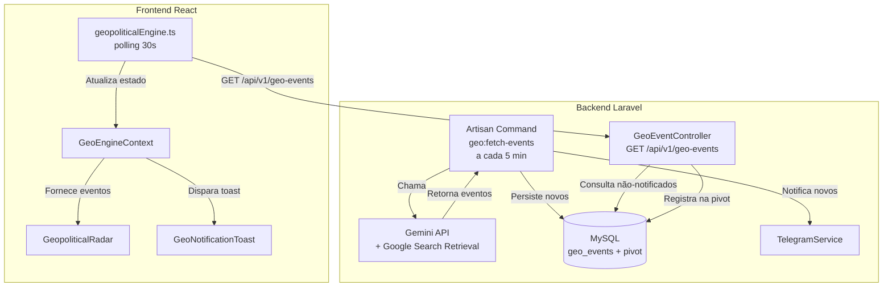

# Design: Centralização do Backend do Radar Geopolítico

## Visão Geral

Esta refatoração move a lógica de coleta de eventos geopolíticos do frontend (onde cada cliente faz chamadas independentes à API Gemini) para um cron job centralizado no backend Laravel. O backend passa a ser a única fonte de verdade: busca eventos a cada 5 minutos, persiste em banco de dados, controla notificações por usuário via tabela pivot, envia alertas via Telegram e expõe um endpoint REST para o frontend consumir via polling.

### Decisões Arquiteturais

1. **Cron centralizado vs WebSocket**: Optamos por polling (30s no frontend, 5min no backend) ao invés de WebSocket por simplicidade operacional e compatibilidade com a infraestrutura existente (Laravel Sanctum + API REST).
2. **Deduplicação por título**: Mantemos a mesma estratégia de deduplicação já usada no `geopoliticalEngine.ts` — comparação case-insensitive do título do evento.
3. **Expiração de 10 minutos**: Eventos são considerados "ativos" por 10 minutos após criação, alinhado com a natureza efêmera de alertas geopolíticos em tempo real.
4. **Reutilização do TelegramService existente**: O projeto já possui `App\Services\TelegramService` com integração completa via pacote `irazasyed/telegram-bot-sdk`.

## Arquitetura



### Fluxo de Dados

1. **Cron (5 min)**: `geo:fetch-events` → Gemini API → normaliza → deduplicação por título → INSERT `geo_events` → Telegram (apenas novos)
2. **Frontend (30s)**: Polling → `GET /api/v1/geo-events` → retorna eventos não-notificados dos últimos 10 min → registra na pivot → frontend adiciona ao contexto
3. **Notificação in-app**: Se o usuário não está na página do Radar, exibe toast com título/severidade/localização

## Componentes e Interfaces

### Backend

#### 1. Migration: `create_geo_events_table`

Cria a tabela `geo_events` e a tabela pivot `geo_event_user`.

#### 2. Model: `GeoEvent`

```php
namespace App\Models;

use Illuminate\Database\Eloquent\Model;
use Illuminate\Database\Eloquent\Relations\BelongsToMany;

class GeoEvent extends Model
{
    protected $fillable = [
        'title', 'summary', 'category', 'latitude', 'longitude',
        'location', 'region', 'severity', 'market_bias', 'asset',
        'impacted_assets', 'us_market_impact', 'crypto_impact',
        'source_url', 'market_weight', 'relevance', 'confidence',
        'status', 'expires_at'
    ];

    protected $casts = [
        'impacted_assets' => 'array',
        'latitude' => 'float',
        'longitude' => 'float',
        'market_weight' => 'integer',
        'relevance' => 'integer',
        'confidence' => 'float',
        'expires_at' => 'datetime',
    ];

    public function notifiedUsers(): BelongsToMany
    {
        return $this->belongsToMany(User::class, 'geo_event_user')
                    ->withPivot('notified_at')
                    ->withTimestamps();
    }
}
```

#### 3. Service: `GeoEventService`

Responsável pela lógica de negócio: chamar Gemini, normalizar, deduplicar, persistir.

```php
namespace App\Services;

class GeoEventService
{
    public function __construct(
        private TelegramService $telegram
    ) {}

    public function fetchAndStore(): array; // Retorna novos eventos criados
    public function getUnnotifiedForUser(int $userId): Collection;
    public function markAsNotified(int $userId, array $eventIds): void;
}
```

#### 4. Artisan Command: `FetchGeoEventsCommand`

```php
protected $signature = 'geo:fetch-events';
protected $description = 'Busca eventos geopolíticos via Gemini API e armazena no banco';
```

Registrado no `Kernel.php` com `->everyFiveMinutes()`.

#### 5. Controller: `GeoEventController`

```php
namespace App\Http\Controllers\Api;

class GeoEventController extends Controller
{
    public function index(Request $request): JsonResponse;
}
```

Rota: `GET /api/v1/geo-events` (autenticada via Sanctum).

### Frontend

#### 6. `geopoliticalEngine.ts` (refatorado)

Remove toda a lógica de chamada ao Gemini. Passa a fazer polling ao endpoint `/api/v1/geo-events` a cada 30 segundos. Mantém a interface `GeoEvent` e o sistema de subscribers.

#### 7. `GeoEngineContext.tsx` (atualizado)

Adiciona detecção de rota atual (se está na página do Radar) e disparo de notificações toast quando novos eventos chegam fora da página do Radar.

#### 8. `GeoNotificationToast.tsx` (novo)

Componente de notificação visual (toast) que aparece quando novos eventos são detectados e o usuário não está na página do Radar. Auto-dismiss em 10 segundos, clicável para navegar ao Radar.

## Modelos de Dados

### Tabela `geo_events`

| Campo | Tipo | Descrição |
|-------|------|-----------|
| id | BIGINT UNSIGNED PK | Auto-increment |
| title | VARCHAR(500) | Título do evento (usado para deduplicação) |
| summary | TEXT | Resumo do evento |
| category | VARCHAR(50) | WAR, ENERGY, SHIPPING, etc. |
| latitude | DECIMAL(10,6) | Coordenada latitude |
| longitude | DECIMAL(10,6) | Coordenada longitude |
| location | VARCHAR(255) | Nome do local |
| region | VARCHAR(100) | Região geopolítica |
| severity | VARCHAR(20) | LOW, MEDIUM, HIGH, CRITICAL |
| market_bias | VARCHAR(30) | BULLISH, BEARISH, RISK_OFF, etc. |
| asset | VARCHAR(50) | Ativo principal impactado |
| impacted_assets | JSON | Array de ativos impactados |
| us_market_impact | TEXT NULL | Impacto no mercado americano |
| crypto_impact | TEXT NULL | Impacto em criptomoedas |
| source_url | VARCHAR(500) NULL | URL da fonte |
| market_weight | TINYINT UNSIGNED | 1-100 |
| relevance | TINYINT UNSIGNED | 1-10 |
| confidence | DECIMAL(3,2) | 0.00-1.00 |
| status | VARCHAR(20) | ESCALATING, STABLE, COOLING |
| created_at | TIMESTAMP | Criação |
| updated_at | TIMESTAMP | Atualização |
| expires_at | TIMESTAMP | created_at + 10 minutos |

**Índices**: `idx_geo_events_created_at`, `idx_geo_events_expires_at`, `idx_geo_events_title` (para deduplicação).

### Tabela `geo_event_user` (pivot)

| Campo | Tipo | Descrição |
|-------|------|-----------|
| id | BIGINT UNSIGNED PK | Auto-increment |
| user_id | BIGINT UNSIGNED FK | Referência ao usuário |
| geo_event_id | BIGINT UNSIGNED FK | Referência ao evento |
| notified_at | TIMESTAMP | Quando o usuário foi notificado |
| created_at | TIMESTAMP | Criação do registro |
| updated_at | TIMESTAMP | Atualização |

**Índice composto**: `UNIQUE(user_id, geo_event_id)` para evitar duplicatas.

### Interface Frontend `GeoEvent` (mantida)

```typescript
export interface GeoEvent {
  id: string;
  title: string;
  summary: string;
  category: Category;
  coordinates: [number, number];
  location: string;
  region: string;
  severity: Severity;
  market_impact: {
    signal: MarketBias;
    asset: string;
    impacted_assets: string[];
    us_market_impact?: string;
    crypto_impact?: string;
  };
  timestamp: number;
  marketWeight: number;
  relevance: number;
  confidence: number;
  status: 'ESCALATING' | 'STABLE' | 'COOLING';
  sourceUrl: string;
  isNew?: boolean;
}
```

### Formato de Resposta do Endpoint

```json
{
  "data": [
    {
      "id": 1,
      "title": "Tensões no Estreito de Taiwan",
      "summary": "...",
      "category": "MILITARY",
      "coordinates": [25.0330, 121.5654],
      "location": "Taiwan",
      "region": "ASIA",
      "severity": "HIGH",
      "market_impact": {
        "signal": "RISK_OFF",
        "asset": "TSM",
        "impacted_assets": ["TSM", "NVDA", "BTC"],
        "us_market_impact": "...",
        "crypto_impact": "..."
      },
      "timestamp": 1719849600000,
      "marketWeight": 75,
      "relevance": 8,
      "confidence": 0.85,
      "status": "ESCALATING",
      "sourceUrl": "https://..."
    }
  ]
}
```


## Propriedades de Corretude

*Uma propriedade é uma característica ou comportamento que deve ser verdadeiro em todas as execuções válidas de um sistema — essencialmente, uma declaração formal sobre o que o sistema deve fazer. Propriedades servem como ponte entre especificações legíveis por humanos e garantias de corretude verificáveis por máquina.*

### Propriedade 1: Normalização e persistência completa

*Para qualquer* array de eventos raw válidos retornados pela Gemini API, após normalização e persistência pelo `GeoEventService`, cada evento deve existir na tabela `geo_events` com todos os campos obrigatórios preenchidos (title, summary, category, latitude, longitude, location, region, severity, market_bias, asset, impacted_assets, market_weight, relevance, confidence, status, expires_at).

**Valida: Requisitos 1.2, 2.1**

### Propriedade 2: Deduplicação por título

*Para qualquer* conjunto de eventos onde N títulos já existem na tabela `geo_events` (comparação case-insensitive), após processamento pelo cron job, a quantidade de novos registros criados deve ser igual ao número de títulos que NÃO existiam previamente.

**Valida: Requisito 1.5**

### Propriedade 3: Invariante de expiração

*Para qualquer* GeoEvent criado no sistema, o campo `expires_at` deve ser exatamente igual a `created_at + 10 minutos`.

**Valida: Requisito 2.2**

### Propriedade 4: Filtragem de eventos por usuário e tempo

*Para qualquer* usuário autenticado consultando o endpoint, todos os eventos retornados devem satisfazer simultaneamente: (a) não possuem registro na tabela `geo_event_user` para aquele usuário, E (b) foram criados nos últimos 10 minutos (`created_at >= now - 10 min`).

**Valida: Requisitos 3.3, 4.2**

### Propriedade 5: Registro na pivot após consulta

*Para qualquer* chamada ao endpoint `GET /api/v1/geo-events` que retorna N eventos, após a resposta, devem existir exatamente N novos registros na tabela `geo_event_user` vinculando o usuário autenticado a cada evento retornado, com `notified_at` preenchido.

**Valida: Requisitos 3.2, 4.3**

### Propriedade 6: Serialização compatível com interface frontend

*Para qualquer* GeoEvent persistido no banco de dados, o JSON retornado pelo endpoint deve conter os campos `id`, `title`, `summary`, `category`, `coordinates` (array [lat, lng]), `location`, `region`, `severity`, `market_impact` (objeto com signal, asset, impacted_assets), `timestamp`, `marketWeight`, `relevance`, `confidence`, `status`, `sourceUrl` — todos com tipos compatíveis com a interface TypeScript `GeoEvent`.

**Valida: Requisito 4.5**

### Propriedade 7: Eventos adicionados ao contexto frontend

*Para qualquer* array de novos eventos recebidos pelo poller do frontend, após processamento, todos os eventos devem estar presentes na lista de eventos do `GeoEngineContext` e o comprimento da lista deve ter aumentado pela quantidade de novos eventos.

**Valida: Requisito 5.3**

### Propriedade 8: Telegram enviado para eventos novos

*Para qualquer* evento que não existia previamente na tabela `geo_events`, quando o cron job o persiste com sucesso, o `TelegramService.sendMessage()` deve ser invocado exatamente uma vez para aquele evento.

**Valida: Requisito 6.1**

### Propriedade 9: Formato da mensagem Telegram

*Para qualquer* GeoEvent, a mensagem formatada enviada ao Telegram deve conter: o título do evento, a severidade, a localização, o impacto no mercado americano (se disponível), o impacto em criptomoedas (se disponível) e o viés de mercado (market_bias).

**Valida: Requisito 6.2**

### Propriedade 10: Notificação toast condicionada à página

*Para qualquer* novo evento recebido pelo frontend, a notificação toast é exibida se e somente se o usuário NÃO está na página do Radar Geopolítico. Se o usuário está na página do Radar, nenhum toast deve ser disparado.

**Valida: Requisitos 7.1, 7.4**

### Propriedade 11: Conteúdo do toast

*Para qualquer* evento que dispara uma notificação toast, o componente renderizado deve conter o título do evento, a severidade e a localização.

**Valida: Requisito 7.2**

## Tratamento de Erros

### Backend

| Cenário | Comportamento | Log |
|---------|---------------|-----|
| Gemini API timeout/erro | Registra em log, retorna sem lançar exceção, próxima execução tenta novamente | `Log::error` com detalhes |
| Gemini retorna JSON inválido | Registra em log, ignora a execução | `Log::error` com raw response |
| Telegram falha ao enviar | Registra em log, NÃO impede persistência do evento | `Log::error` com exception |
| Evento duplicado (título existente) | Silenciosamente ignorado | `Log::debug` opcional |
| Usuário não autenticado no endpoint | Retorna HTTP 401 | Nenhum log adicional |
| Banco de dados indisponível | Exceção propagada, Laravel trata | `Log::critical` |

### Frontend

| Cenário | Comportamento |
|---------|---------------|
| Endpoint retorna erro (4xx/5xx) | `console.error`, tenta novamente no próximo ciclo de 30s |
| Endpoint retorna array vazio | Nenhuma ação, aguarda próximo ciclo |
| Rede indisponível | `console.error`, tenta novamente no próximo ciclo |
| Token expirado (401) | Pode disparar logout ou refresh token (comportamento existente do app) |

## Estratégia de Testes

### Testes Unitários

- **GeoEventService**: Testar normalização de dados raw → modelo GeoEvent, deduplicação por título, cálculo de `expires_at`
- **GeoEventController**: Testar filtragem por usuário/tempo, registro na pivot, formato de resposta JSON
- **FetchGeoEventsCommand**: Testar que chama o service, trata erros da API, envia Telegram para novos
- **Frontend geopoliticalEngine.ts**: Testar start/stop do polling, adição de eventos ao estado, tratamento de erros
- **GeoNotificationToast**: Testar renderização com dados do evento, auto-dismiss, navegação ao clicar

### Testes Property-Based

Biblioteca: **PHPUnit** com gerador customizado para o backend (ou `spatie/phpunit-snapshot-assertions` para snapshots). Para o frontend: **fast-check** com Vitest.

Configuração: mínimo 100 iterações por teste de propriedade.

Cada teste deve ser tagueado com comentário referenciando a propriedade do design:

```
// Feature: geo-radar-backend-centralization, Property 1: Normalização e persistência completa
// Feature: geo-radar-backend-centralization, Property 2: Deduplicação por título
```

#### Propriedades a implementar:

| # | Propriedade | Camada | Biblioteca |
|---|-------------|--------|------------|
| 1 | Normalização e persistência | Backend | PHPUnit + Faker |
| 2 | Deduplicação por título | Backend | PHPUnit + Faker |
| 3 | Invariante expires_at | Backend | PHPUnit + Faker |
| 4 | Filtragem por usuário/tempo | Backend | PHPUnit + Faker |
| 5 | Registro na pivot | Backend | PHPUnit + Faker |
| 6 | Serialização frontend-compatível | Backend | PHPUnit + Faker |
| 7 | Eventos adicionados ao contexto | Frontend | fast-check + Vitest |
| 8 | Telegram para novos eventos | Backend | PHPUnit + Mockery |
| 9 | Formato mensagem Telegram | Backend | PHPUnit + Faker |
| 10 | Toast condicionado à página | Frontend | fast-check + Vitest |
| 11 | Conteúdo do toast | Frontend | fast-check + Vitest |

### Abordagem Complementar

- **Testes unitários** cobrem exemplos específicos, edge cases (array vazio, erro de API, token inválido) e integrações pontuais
- **Testes de propriedade** cobrem as invariantes universais listadas acima com inputs gerados aleatoriamente
- Ambos são necessários para cobertura completa: unit tests pegam bugs concretos, property tests verificam corretude geral
