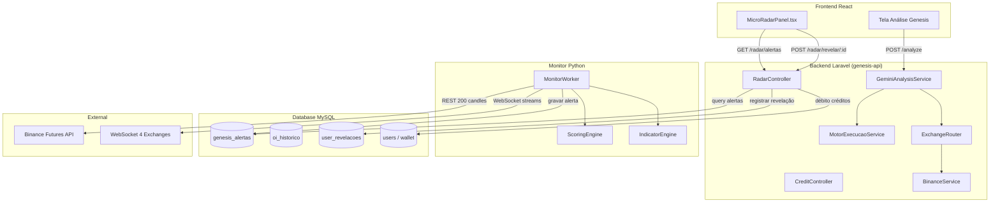

# Design — MotorExecução + Micro Radar

## Visão Geral

Este design cobre a reescrita completa do `MotorExecucaoService` (PHP/Laravel) para ancorar stops e TPs em níveis estruturais reais, correções críticas no `monitor_worker.py` (Python), e a implementação do sistema Micro Radar com API + Frontend.

O sistema é composto por três camadas:

1. **MotorExecução** (PHP): Cálculos matemáticos de execução de trades com hierarquia estrutural
2. **Monitor Worker** (Python): Detecção de oportunidades em tempo real via WebSocket
3. **Micro Radar** (Laravel API + React): Interface de revelação de alertas com débito de créditos

---

## Arquitetura



---

## Componentes e Interfaces

### 1. MotorExecucaoService (Reescrita)

**Arquivo:** `genesis-api/app/Services/MotorExecucaoService.php`

O serviço será reescrito para implementar hierarquia de stops baseada em níveis estruturais.

#### Assinaturas Principais

```php
class MotorExecucaoService
{
    const RISCO_MAX_CONTA = 0.02;
    const ALAV_MAX = 10.0;
    const MARGEM_SEG_LIQ = 0.05;
    const RR_MINIMO = 1.5;
    const MARGEM_WICK = 0.003; // 0.3%

    public static function gerarSetup(
        float $preco,
        string $direcao,
        int $score,
        int $confianca,
        float $atr,
        string $regime,
        array $hvn,
        array $lvn,
        array $liqClusters,
        float $poc,
        array $elementosVisuais = [],
        string $scoreVies = 'NEUTRO'
    ): array;

    private static function setupLong(
        float $preco, float $atr, array $hvn, array $lvn,
        array $liqClusters, float $poc, array $elementosVisuais,
        float $atrMult, float $alavMax
    ): array;

    private static function setupShort(
        float $preco, float $atr, array $hvn, array $lvn,
        array $liqClusters, float $poc, array $elementosVisuais,
        float $atrMult, float $alavMax
    ): array;

    private static function gerarPlanoB(
        float $preco, string $direcao, float $atr,
        array $hvn, array $lvn, array $liqClusters, float $poc,
        array $elementosVisuais, float $atrMult, float $alavMax
    ): array;

    private static function calcularStopLong(
        float $preco, array $lvn, array $elementosVisuais,
        float $pdl, float $poc, float $atr, float $atrMult
    ): float;

    private static function calcularStopShort(
        float $preco, array $hvn, array $elementosVisuais,
        float $pdh, float $poc, float $atr, float $atrMult
    ): float;

    private static function calcularTPs(
        float $entrada, string $direcao, array $hvn,
        array $liqClusters, float $poc, float $pdh, float $pdl
    ): array;

    private static function validarDirecao(
        string $direcao, int $score, string $scoreVies
    ): array;

    private static function validarGeometria(
        float $entrada, float $stop, string $direcao
    ): array;

    private static function calcularRR(
        float $entrada, float $stop, float $tp1
    ): float;

    private static function recalcularPorAlavancagem(
        array $setup, float $alavancagem, string $direcao
    ): array;

    public static function calcularLiquidacao(
        float $entrada, string $direcao, float $alavancagem, float $mm = 0.005
    ): float;

    private static function limitarAlavancagemPorScore(int $score): float;
}
```

#### Algoritmo — Hierarquia de Stop LONG (Req 1)

```
1. Buscar LVN do LuxAlgo (elementosVisuais['lvn_luxalgo']) abaixo do preço
   → Se existir: stop = LVN mais próximo abaixo * (1 - 0.003)
2. Senão buscar suportes visuais (elementosVisuais['suportes']) abaixo do preço
   → Se existir: stop = suporte mais próximo abaixo * (1 - 0.003)
3. Senão usar PDL (Previous Day Low)
   → Se PDL > 0 e PDL < preco: stop = PDL * (1 - 0.003)
4. Senão usar POC
   → Se POC > 0 e POC < preco: stop = POC * (1 - 0.003)
5. Fallback: stop = preco - (ATR * atrMult)
```

#### Algoritmo — Hierarquia de Stop SHORT (Req 2)

```
1. Buscar HVN do LuxAlgo (elementosVisuais['hvn_luxalgo']) acima do preço
   → Se existir: stop = HVN mais próximo acima * (1 + 0.003)
2. Senão buscar resistências visuais (elementosVisuais['resistencias']) acima do preço
   → Se existir: stop = resistência mais próxima acima * (1 + 0.003)
3. Senão usar PDH (Previous Day High)
   → Se PDH > 0 e PDH > preco: stop = PDH * (1 + 0.003)
4. Senão usar Fibonacci 0.618 da última perna
   → stop = preco + (ATR * 1.618) * (1 + 0.003)
5. Fallback: stop = preco + (ATR * atrMult)
```

#### Algoritmo — Take-Profits (Req 3)

```
LONG:
  TP1 = primeiro HVN acima da entrada (fallback: POC se POC > entrada)
  TP2 = primeiro cluster de liquidação acima (fallback: PDH)
  TP3 = TP2 * 1.08

SHORT:
  TP1 = primeiro HVN abaixo da entrada (fallback: POC se POC < entrada)
  TP2 = primeiro cluster de liquidação abaixo (fallback: PDL)
  TP3 = TP2 * 0.92
```

#### Algoritmo — Plano B (Req 4)

```
LONG:
  entrada_B = primeiro HVN abaixo do preço (fallback: POC)
  stop_B = calcularStopLong(entrada_B, ...) com multiplicador ATR * 0.8
  TPs = calcularTPs(entrada_B, 'LONG', ...)
  descricao = narrativa técnica (Wyckoff, CVD, orderbook)

SHORT:
  entrada_B = primeiro HVN acima do preço (fallback: POC)
  stop_B = calcularStopShort(entrada_B, ...) com multiplicador ATR * 0.8
  TPs = calcularTPs(entrada_B, 'SHORT', ...)
  descricao = narrativa técnica
```

#### Algoritmo — Validação de Direção e RR (Req 5)

```
validarGeometria(entrada, stop, direcao):
  LONG: entrada > stop → OK | entrada <= stop → REJEITAR
  SHORT: entrada < stop → OK | entrada >= stop → REJEITAR

calcularRR(entrada, stop, tp1):
  LONG: rr = (tp1 - entrada) / (entrada - stop)
  SHORT: rr = (entrada - tp1) / (stop - entrada)

Se RR < 1.5:
  Buscar próximo HVN na direção do trade como novo TP1
  Recalcular RR
  Se ainda < 1.5: informar risco sem bloquear
```

#### Algoritmo — Alavancagem Dinâmica (Req 6)

```
limitarAlavancagemPorScore(score):
  score < 50  → max 2x
  score 50-64 → max 3x
  score 65-74 → max 5x
  score >= 75 → max 10x

recalcularPorAlavancagem(setup, alavancagem, direcao):
  liquidacao = calcularLiquidacao(entrada, direcao, alavancagem)
  risco_pct = |entrada - stop| / entrada
  rr = (|entrada - tp1|) / (|entrada - stop|)

  Se alavancagem == 1: liquidacao = "próxima de zero — sem risco prático"

  Enquanto stop próximo de liquidação (margem < 5%):
    alavancagem -= 0.5

  tamanhoSugerido = "$margem (Nx) = $total → quantidade | Risco: $USD"
```

---

### 2. Monitor Worker (Correções)

**Arquivo:** `G-nesis-2.0-main/monitor/monitor_worker.py`

#### 2.1 Carga Histórico Inicial (Req 7)

Já implementado no método `_carregar_historico_inicial()`. A correção garante:
- 200 candles via REST API Binance Futures para cada par
- Warning no log se falhar para um par específico
- Log final com quantidade de pares carregados

#### 2.2 Bloqueio Consecutivo (Req 8)

Atributo `_ultimo_par_oportunidade` já existe. A lógica no fluxo de processamento:

```python
def _disparar_oportunidade(self, symbol, score, vies, preco, corretora):
    # Bloqueio consecutivo
    if self._ultimo_par_oportunidade == symbol:
        logger.debug(f"Bloqueio consecutivo: {symbol} já foi o último alerta")
        return

    self._ultimo_par_oportunidade = symbol
    self.processar_alerta(
        ativo=symbol,
        tipo='OPORTUNIDADE',
        mensagem=f"Oportunidade detectada. Score {score}/100.",
        direcao=vies,
        urgencia='ALTA',
        corretora=corretora,
        preco_atual=preco,
        score=score
    )
```

#### 2.3 Disparo OPORTUNIDADE com Score >= 65 (Req 9 + 10)

No método `processar_candle()` ou loop principal, após calcular score:

```python
resultado = self.calcular_indicadores_e_score(candles, dados_extras)
if resultado and self.filtrar_score(resultado['score_final']):
    self._disparar_oportunidade(
        symbol=symbol,
        score=resultado['score_final'],
        vies=resultado['vies'],
        preco=candles[-1]['close'],
        corretora='BINANCE'
    )
```

Constante `SCORE_MINIMO = 65` — o `filtrar_score()` usa `>=` para incluir exatamente 65.

#### 2.4 Chamada detectar_book_imbalance (Req 11)

Dentro do processamento de cada candle:

```python
# No loop de processamento de candle
book_imbalance = self._calcular_book_imbalance(symbol)
if book_imbalance is not None:
    dados_mercado = {'ativo': symbol, 'close': candles[-1]['close'], 'corretora': 'BINANCE'}
    self.detectar_book_imbalance(book_imbalance, dados_mercado)
```

---

### 3. Micro Radar API (Laravel)

**Arquivo:** `genesis-api/app/Http/Controllers/Api/RadarController.php`

#### 3.1 GET /api/v1/radar/alertas (Req 12)

Retorna último alerta OPORTUNIDADE não revelado pelo membro autenticado. Omite `ativo`, `corretora`, `timeframe`.

```php
public function alertas(Request $request): JsonResponse
{
    $user = $request->user();
    $revelados = UserRevelacao::where('user_id', $user->id)->pluck('alerta_id');

    $alerta = Alerta::where('tipo', 'OPORTUNIDADE')
        ->where('score', '>=', 65)
        ->whereNotIn('id', $revelados)
        ->orderByDesc('created_at')
        ->first(['id', 'tipo', 'urgencia', 'created_at']);

    if (!$alerta) {
        return response()->json(['success' => true, 'data' => null]);
    }

    return response()->json([
        'success' => true,
        'data' => [
            'id' => $alerta->id,
            'tipo' => $alerta->tipo,
            'urgencia' => $alerta->urgencia,
            'criado_em' => $alerta->created_at,
            'status' => 'pendente',
        ],
    ]);
}
```

#### 3.2 POST /api/v1/radar/revelar/{id} (Req 13)

Debita 50 créditos via Bavix Wallet e revela campos.

```php
public function revelar(string $id, Request $request): JsonResponse
{
    $user = $request->user();
    $alerta = Alerta::findOrFail($id);

    // Verificar se já revelado
    $existente = UserRevelacao::where('user_id', $user->id)
        ->where('alerta_id', $id)->first();
    if ($existente) {
        return response()->json([
            'success' => true,
            'data' => [
                'ativo' => $alerta->ativo,
                'corretora' => $alerta->corretora,
                'timeframe' => $alerta->timeframe,
            ],
        ]);
    }

    // Verificar saldo
    $custo = (float) setting('cost_micro_radar_credits', 50);
    if ($user->balanceFloat < $custo) {
        return response()->json([
            'success' => false,
            'message' => 'Créditos insuficientes',
        ], 402);
    }

    // Debitar
    $user->withdrawFloat($custo, ['description' => 'Micro Radar - Revelação']);

    // Registrar revelação
    UserRevelacao::create([
        'user_id' => $user->id,
        'alerta_id' => $id,
        'revelado_em' => now(),
    ]);

    return response()->json([
        'success' => true,
        'data' => [
            'ativo' => $alerta->ativo,
            'corretora' => $alerta->corretora,
            'timeframe' => $alerta->timeframe,
        ],
    ]);
}
```

#### 3.3 GET /api/v1/radar/historico (Req 14)

```php
public function historico(Request $request): JsonResponse
{
    $user = $request->user();

    $historico = UserRevelacao::where('user_id', $user->id)
        ->with('alerta:id,ativo,corretora,timeframe,created_at')
        ->orderByDesc('revelado_em')
        ->limit(50)
        ->get()
        ->map(fn($r) => [
            'id' => $r->alerta_id,
            'ativo' => $r->alerta->ativo,
            'corretora' => $r->alerta->corretora,
            'timeframe' => $r->alerta->timeframe,
            'criado_em' => $r->alerta->created_at,
            'revelado_em' => $r->revelado_em,
        ]);

    return response()->json(['success' => true, 'data' => $historico]);
}
```

---

### 4. Frontend — MicroRadarPanel

**Arquivo:** `G-nesis-2.0-main/components/MicroRadarPanel.tsx`

Componente React com polling a cada 30 segundos.

```typescript
interface RadarAlerta {
  id: number;
  tipo: string;
  urgencia: string;
  criado_em: string;
  status: string;
}

interface RevealResponse {
  ativo: string;
  corretora: string;
  timeframe: string;
}

const MicroRadarPanel: React.FC = () => {
  const [alerta, setAlerta] = useState<RadarAlerta | null>(null);
  const [loading, setLoading] = useState(false);
  const [erro, setErro] = useState<string | null>(null);

  // Polling a cada 30s
  useEffect(() => {
    const poll = async () => { /* GET /api/v1/radar/alertas */ };
    poll();
    const interval = setInterval(poll, 30000);
    return () => clearInterval(interval);
  }, []);

  const handleAnalisar = async () => {
    // POST /api/v1/radar/revelar/{id}
    // Se sucesso: redirecionar para tela análise com par preenchido
    // Se 402: exibir "Créditos insuficientes"
  };

  // Render: "Oportunidade detectada" + botão ANALISAR pulsante
};
```

---

## Modelos de Dados

### Tabela: user_revelacoes (nova)

```sql
CREATE TABLE user_revelacoes (
    id BIGINT AUTO_INCREMENT PRIMARY KEY,
    user_id BIGINT UNSIGNED NOT NULL,
    alerta_id BIGINT UNSIGNED NOT NULL,
    revelado_em DATETIME NOT NULL DEFAULT CURRENT_TIMESTAMP,
    created_at TIMESTAMP DEFAULT CURRENT_TIMESTAMP,
    updated_at TIMESTAMP DEFAULT CURRENT_TIMESTAMP ON UPDATE CURRENT_TIMESTAMP,
    UNIQUE KEY uk_user_alerta (user_id, alerta_id),
    INDEX idx_user_revelado (user_id, revelado_em DESC),
    FOREIGN KEY (user_id) REFERENCES users(id) ON DELETE CASCADE,
    FOREIGN KEY (alerta_id) REFERENCES genesis_alertas(id) ON DELETE CASCADE
);
```

### Model: UserRevelacao

```php
class UserRevelacao extends Model
{
    protected $table = 'user_revelacoes';
    protected $fillable = ['user_id', 'alerta_id', 'revelado_em'];
    protected $casts = ['revelado_em' => 'datetime'];

    public function user() { return $this->belongsTo(User::class); }
    public function alerta() { return $this->belongsTo(Alerta::class); }
}
```

### Tabela existente: genesis_alertas (sem alteração)

| Campo | Tipo | Descrição |
|-------|------|-----------|
| id | BIGINT | PK |
| ativo | VARCHAR(20) | Par (BTCUSDT) |
| tipo | VARCHAR(50) | OPORTUNIDADE, SPIKE_VOLUME, etc. |
| mensagem | TEXT | Descrição do alerta |
| direcao | VARCHAR(10) | LONG/SHORT/NEUTRO |
| urgencia | VARCHAR(10) | ALTA/MEDIA/BAIXA |
| corretora | VARCHAR(20) | BINANCE/BYBIT/etc. |
| timeframe | VARCHAR(10) | 1h |
| preco_atual | DOUBLE | Preço no momento |
| variacao_pct | DOUBLE | Variação % |
| motivos | JSON | Lista de motivos |
| timeframes | JSON | Lista de timeframes |
| score | INT | Score 0-100 |
| enviado_sse | TINYINT | Flag SSE |
| enviado_telegram | TINYINT | Flag Telegram |
| criado_em | DATETIME | Timestamp criação |

### Estrutura de Retorno — gerarSetup()

```php
[
    'acao' => 'LONG',
    'motivo' => 'Setup confirmado. Score 72/100.',
    'setup' => [
        'entrada' => 67500.0000,
        'stop' => 66200.0000,     // Ancorado em LVN - 0.3%
        'tp1' => 69100.0000,      // Primeiro HVN acima
        'tp2' => 71000.0000,      // Cluster liquidação acima
        'tp3' => 76680.0000,      // TP2 * 1.08
        'alavancagem' => 5.0,
        'liquidacao' => 54300.0000,
        'riscoPct' => 1.93,
        'rr1' => 1.23,
        'verificacao' => '✓ SEGURO',
        'hierarquiaStop' => 'LVN_LUXALGO',  // Novo campo
        'tamanhoSugerido' => '$100 (5x) = $500.00 → 0.007407 BTCUSDT | Risco: $9.63',
    ],
    'planoB' => [
        'entrada' => 66800.0000,  // Primeiro HVN abaixo
        'stop' => 65800.0000,     // ATR * 0.8
        'tp1' => 69100.0000,
        'tp2' => 71000.0000,
        'tp3' => 76680.0000,
        'alavancagem' => 5.0,
        'liquidacao' => 53800.0000,
        'riscoPct' => 1.50,
        'rr1' => 2.30,
        'verificacao' => '✓ SEGURO',
        'tipo' => 'PULLBACK',
        'descricao' => 'Aguardar pullback ao HVN 66800 com...',
    ],
    'zonaInteresse' => [...],
    'validacaoDirecao' => [
        'consistente' => true,
        'direcaoSetup' => 'LONG',
        'scoreVies' => 'LONG_MODERADO',
        'motivo' => 'Direção alinhada com o score.',
        'alertaContradicao' => null,  // Ou mensagem de contradição
    ],
]
```

---


## Correctness Properties

*Uma propriedade é uma característica ou comportamento que deve ser verdadeiro em todas as execuções válidas de um sistema — essencialmente, uma declaração formal sobre o que o sistema deve fazer. Propriedades servem como ponte entre especificações legíveis por humanos e garantias de correção verificáveis por máquina.*

### Property 1: Hierarquia de Stop LONG respeita prioridade estrutural

*Para qualquer* preço de entrada LONG e qualquer combinação de níveis estruturais disponíveis (LVN, suportes visuais, PDL, POC), o stop selecionado deve corresponder ao nível de maior prioridade disponível na hierarquia: LVN > suporte visual > PDL > POC > ATR fallback. Se o nível de prioridade N está disponível abaixo do preço, os níveis N+1 não devem ser consultados.

**Validates: Requirements 1.1, 1.2, 1.3, 1.4, 1.5**

### Property 2: Hierarquia de Stop SHORT respeita prioridade estrutural

*Para qualquer* preço de entrada SHORT e qualquer combinação de níveis estruturais disponíveis (HVN, resistências visuais, PDH, Fibonacci 0.618), o stop selecionado deve corresponder ao nível de maior prioridade disponível na hierarquia: HVN > resistência visual > PDH > Fibonacci > ATR fallback. Se o nível de prioridade N está disponível acima do preço, os níveis N+1 não devem ser consultados.

**Validates: Requirements 2.1, 2.2, 2.3, 2.4, 2.5**

### Property 3: Margem de 0.3% aplicada a stops estruturais

*Para qualquer* setup (LONG ou SHORT) cujo stop é ancorado em nível estrutural (não ATR fallback), o stop final deve ser: nível * (1 - 0.003) para LONG, ou nível * (1 + 0.003) para SHORT. A diferença entre stop e nível estrutural deve ser exatamente 0.3% do nível.

**Validates: Requirements 1.6, 2.6**

### Property 4: Take-Profits LONG ancorados em estrutura

*Para qualquer* setup LONG com HVN disponíveis acima da entrada, TP1 deve ser o menor HVN acima da entrada. Se clusters de liquidação existem acima, TP2 deve ser o menor cluster acima. Se não existem HVN acima, TP1 = POC (se POC > entrada) e TP2 = PDH.

**Validates: Requirements 3.1, 3.2, 3.3**

### Property 5: Take-Profits SHORT ancorados em estrutura

*Para qualquer* setup SHORT com HVN disponíveis abaixo da entrada, TP1 deve ser o maior HVN abaixo da entrada. Se clusters de liquidação existem abaixo, TP2 deve ser o maior cluster abaixo. Se não existem HVN abaixo, TP1 = POC (se POC < entrada) e TP2 = PDL.

**Validates: Requirements 3.4, 3.5, 3.6**

### Property 6: TP3 é extensão de 8% além de TP2

*Para qualquer* setup válido, TP3 deve ser: TP2 * 1.08 para LONG, ou TP2 * 0.92 para SHORT. A relação TP3/TP2 (LONG) ou TP2/TP3 (SHORT) deve ser sempre 1.08.

**Validates: Requirements 3.7**

### Property 7: Plano B entrada no HVN correto com fallback POC

*Para qualquer* setup LONG com HVN abaixo do preço, a entrada do Plano B deve ser o primeiro HVN abaixo do preço atual. Para SHORT, o primeiro HVN acima. Se nenhum HVN válido existe, a entrada deve ser o POC.

**Validates: Requirements 4.1, 4.2, 4.3**

### Property 8: Plano B stop usa multiplicador ATR 0.8x

*Para qualquer* Plano B gerado, o fator ATR utilizado para calcular o stop deve ser 80% do fator usado no Plano A. Dado o mesmo ATR e mesma direção, |stop_B - entrada_B| < |stop_A - entrada_A| (o Plano B tem stop mais curto).

**Validates: Requirements 4.4**

### Property 9: Plano B TPs calculados a partir da entrada B

*Para qualquer* Plano B, os TPs devem ser recalculados usando a entrada do Plano B como referência, não o preço atual. Para LONG, todos os TPs devem ser > entrada_B. Para SHORT, todos os TPs devem ser < entrada_B.

**Validates: Requirements 4.5**

### Property 10: Plano B inclui descrição técnica não-vazia

*Para qualquer* setup com Plano B válido (entrada_B > 0), o campo 'descricao' deve ser uma string não-vazia com pelo menos 20 caracteres.

**Validates: Requirements 4.6**

### Property 11: Consistência geométrica entrada/stop/direção

*Para qualquer* setup retornado pelo MotorExecucao: se direcao='LONG' então entrada > stop; se direcao='SHORT' então entrada < stop. Setups que violam esta regra devem ser rejeitados com mensagem de contradição geométrica.

**Validates: Requirements 5.1, 5.2**

### Property 12: Recálculo de TPs quando RR < 1.5

*Para qualquer* setup onde o RR inicial (TP1 vs stop) é menor que 1.5 e existem HVN adicionais na direção do trade, o sistema deve tentar usar o próximo HVN como TP1. O RR final pode ser < 1.5 apenas se não existem mais HVN disponíveis.

**Validates: Requirements 5.5**

### Property 13: Alerta de contradição direcional

*Para qualquer* setup onde a direção (LONG/SHORT) contradiz o viés do score (score > 54 + SHORT ou score < 45 + LONG), o campo validacaoDirecao.consistente deve ser false e o campo motivo deve conter aviso de contradição.

**Validates: Requirements 5.7**

### Property 14: Invariante de segurança stop/liquidação

*Para qualquer* setup com alavancagem > 1x, o stop deve manter margem mínima de 5% em relação ao preço de liquidação. Se a alavancagem inicial coloca o stop dentro da zona de perigo, o sistema deve reduzir em decrementos de 0.5 até atingir margem segura.

**Validates: Requirements 6.1, 6.3**

### Property 15: Alavancagem 1x implica liquidação nula

*Para qualquer* setup com alavancagem = 1x, o campo liquidacao deve indicar ausência de risco de liquidação (valor 0 para LONG ou "N/A (1x)").

**Validates: Requirements 6.2**

### Property 16: Limite de alavancagem por faixa de score

*Para qualquer* score e setup gerado, a alavancagem final deve respeitar: score < 50 → max 2x; score 50-64 → max 3x; score 65-74 → max 5x; score >= 75 → max 10x.

**Validates: Requirements 6.4**

### Property 17: Formato do tamanho sugerido

*Para qualquer* setup válido com preço de entrada > 0, o campo tamanhoSugerido deve conter: margem em USD, alavancagem Nx, total calculado, quantidade de contratos e risco em USD. Os valores numéricos devem ser matematicamente consistentes: total = margem * alavancagem; quantidade = total / entrada; risco = (|entrada - stop| / entrada) * total.

**Validates: Requirements 6.5**

### Property 18: Bloqueio de par consecutivo em OPORTUNIDADE

*Para qualquer* sequência de alertas OPORTUNIDADE disparados, nunca dois alertas consecutivos devem ter o mesmo par. Após um alerta para par X, o próximo alerta deve ser para par Y ≠ X. Após o alerta para Y, o par X é permitido novamente.

**Validates: Requirements 8.1, 8.2, 8.3, 9.3**

### Property 19: Estrutura do alerta OPORTUNIDADE

*Para qualquer* alerta do tipo OPORTUNIDADE gerado pelo monitor, os campos obrigatórios devem estar presentes: ativo (não-vazio), tipo="OPORTUNIDADE", direcao ∈ {LONG*, SHORT*, NEUTRO}, urgencia="ALTA", corretora (não-vazia), preco_atual > 0, score >= 65.

**Validates: Requirements 9.1, 9.2**

### Property 20: Alerta de book imbalance por threshold

*Para qualquer* ratio de book imbalance com |ratio| > 0.6, o monitor deve disparar alerta do tipo BOOK_IMBALANCE. Para |ratio| <= 0.6, nenhum alerta BOOK_IMBALANCE deve ser gerado.

**Validates: Requirements 11.2**

### Property 21: Listagem do radar omite campos sensíveis

*Para qualquer* resposta do endpoint GET /radar/alertas, os campos retornados devem ser exclusivamente: id, tipo, urgencia, criado_em, status. Os campos ativo, corretora, timeframe e direcao não devem estar presentes na resposta.

**Validates: Requirements 12.1, 12.2, 12.3**

### Property 22: Débito de créditos na revelação

*Para qualquer* revelação bem-sucedida (saldo >= 50), o saldo do membro após a operação deve ser exatamente saldo_anterior - 50. Para saldo < 50, a resposta deve ser 402 e o saldo não deve ser alterado.

**Validates: Requirements 13.1, 13.2, 13.3, 13.4**

### Property 23: Idempotência da revelação

*Para qualquer* alerta já revelado pelo mesmo membro, uma segunda chamada POST /radar/revelar/{id} deve retornar os mesmos dados (ativo, corretora, timeframe) sem alterar o saldo do membro. O saldo após a segunda chamada deve ser igual ao saldo após a primeira chamada.

**Validates: Requirements 13.5**

### Property 24: Histórico ordenado e limitado a 50

*Para qualquer* membro com N revelações, GET /radar/historico deve retornar min(N, 50) registros ordenados por revelado_em DESC. Cada registro deve conter: id, ativo, corretora, timeframe, criado_em, revelado_em. O campo direcao não deve estar presente.

**Validates: Requirements 14.1, 14.2, 14.3, 14.4**

### Property 25: Verificações de saldo independentes por operação

*Para qualquer* membro, o débito de revelação (50 créditos) e o débito de análise (100 créditos) são verificações independentes. Um membro com saldo X pode: revelar se X >= 50; analisar se saldo_atual >= 100 (após eventual débito anterior). As duas operações nunca são atômicas entre si.

**Validates: Requirements 16.2, 16.3**

---

## Error Handling

### MotorExecucaoService

| Cenário | Tratamento |
|---------|-----------|
| Preço = 0 ou inválido | Retornar setup com todos campos zerados + mensagem "Preço inválido" |
| ATR = 0 | Usar fallback ATR = preço * 0.02 (2% do preço como proxy de volatilidade) |
| Arrays HVN/LVN vazios | Seguir hierarquia de fallback normalmente |
| Contradição geométrica | Retornar setup com verificacao="✗ INVÁLIDO" + motivo descritivo |
| RR incalculável (stop = entrada) | Retornar RR = 0 com aviso |
| Alavancagem reduzida a < 1.0 | Forçar alavancagem = 1.0 |

### Monitor Worker

| Cenário | Tratamento |
|---------|-----------|
| Falha REST API na carga inicial | Log warning, continuar com próximo par |
| WebSocket desconectado | Reconexão automática com backoff exponencial |
| Erro ao gravar no MySQL | Log error, nunca propagar exceção ao loop principal |
| candles_cache < 50 candles | Retornar None no cálculo de score (skip do par) |
| Score None | Não disparar alerta |

### API Micro Radar

| Cenário | HTTP Status | Resposta |
|---------|-------------|----------|
| Alerta não encontrado | 404 | `{"message": "Alerta não encontrado"}` |
| Créditos insuficientes | 402 | `{"message": "Créditos insuficientes"}` |
| Usuário não autenticado | 401 | `{"message": "Unauthenticated"}` |
| Nenhum alerta pendente | 200 | `{"success": true, "data": null}` |
| Erro interno | 500 | `{"message": "Erro interno"}` + log |

---

## Testing Strategy

### Abordagem Dual: Unit Tests + Property-Based Tests

O projeto utiliza:
- **PHP (Laravel)**: PHPUnit para unit tests + [phpunit-quickcheck](https://github.com/steos/php-quickcheck) para PBT
- **Python (Monitor)**: pytest para unit tests + [Hypothesis](https://hypothesis.readthedocs.io/) para PBT
- **TypeScript (Frontend)**: Vitest para unit tests + [fast-check](https://github.com/dubzzz/fast-check) para PBT

### Unit Tests (Exemplos e Edge Cases)

**MotorExecucaoService (PHPUnit):**
- Setup com preço = 0 retorna campos zerados
- ATR = 0 usa fallback de 2%
- Contradição geométrica (LONG com entrada < stop) retorna erro
- Score exatamente 65 permite alavancagem até 5x
- Alavancagem 1x retorna "N/A (1x)" como liquidação

**Monitor Worker (pytest):**
- `_carregar_historico_inicial()` com mock API retornando 200 candles
- `_carregar_historico_inicial()` com falha em um par não interrompe outros
- `filtrar_score(65)` retorna True (>= e não >)
- `filtrar_score(64)` retorna False
- `_disparar_oportunidade()` com mesmo par consecutivo não gera alerta

**API Micro Radar (PHPUnit Feature Tests):**
- GET /radar/alertas retorna 200 com data=null quando sem alertas
- POST /radar/revelar/{id} com saldo 50 debita e retorna campos
- POST /radar/revelar/{id} com saldo 30 retorna 402
- POST /radar/revelar/{id} repetido não debita novamente
- GET /radar/historico retorna max 50 registros ordenados

**Frontend (Vitest):**
- MicroRadarPanel renderiza "Oportunidade detectada" quando alerta disponível
- MicroRadarPanel não exibe par/exchange/direção
- Botão ANALISAR chama endpoint revelar
- Mensagem de erro quando 402

### Property-Based Tests

Cada property-based test deve:
- Executar mínimo 100 iterações
- Referenciar a propriedade do design via comentário de tag
- Usar geradores específicos para dados de mercado (preços, arrays de níveis, scores)

**Geradores (PHP - php-quickcheck):**
```php
// Gerador de preço positivo
$precoGen = Gen::choose(100, 100000)->fmap(fn($x) => $x / 100.0);

// Gerador de array de níveis (HVN/LVN)
$niveisGen = Gen::listOf(Gen::choose(1, 100000)->fmap(fn($x) => $x / 100.0));

// Gerador de score
$scoreGen = Gen::choose(0, 100);

// Gerador de direção
$direcaoGen = Gen::elements(['LONG', 'SHORT']);
```

**Geradores (Python - Hypothesis):**
```python
from hypothesis import strategies as st

preco_st = st.floats(min_value=1.0, max_value=100000.0, allow_nan=False)
niveis_st = st.lists(st.floats(min_value=0.1, max_value=100000.0, allow_nan=False), min_size=0, max_size=20)
score_st = st.integers(min_value=0, max_value=100)
direcao_st = st.sampled_from(['LONG', 'SHORT'])
```

**Tags de referência (formato):**
```
// Feature: motor-execucao-micro-radar, Property 1: Hierarquia de Stop LONG respeita prioridade estrutural
```

### Mapeamento Properties → Testes

| Property | Componente | Framework | Iterações |
|----------|-----------|-----------|-----------|
| P1-P6 | MotorExecucaoService | php-quickcheck | 200 |
| P7-P10 | MotorExecucaoService (Plano B) | php-quickcheck | 200 |
| P11-P17 | MotorExecucaoService (validação) | php-quickcheck | 200 |
| P18-P20 | monitor_worker.py | Hypothesis | 100 |
| P21-P25 | RadarController + API | PHPUnit Feature + fast-check | 100 |

### Cobertura de Edge Cases nos Generators

Os geradores PBT devem incluir naturalmente:
- Preços muito baixos (< 1.0) e muito altos (> 90000)
- Arrays vazios de HVN/LVN
- Score nos limites (0, 49, 50, 64, 65, 74, 75, 100)
- ATR = 0 ou muito pequeno
- Saldo de créditos = 0, 49, 50, 51
