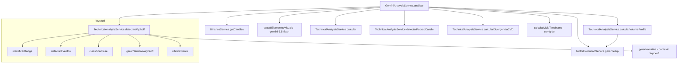

# Design — OCR Visual, TechnicalAnalysis e Wyckoff Completo

## Visão Geral

Este design aborda três áreas do sistema Genesis que precisam de refatoração e implementação:

1. **OCR Visual (Etapa 2)**: Simplificação do pipeline OCR — remoção do método legado `extrairIndicadoresOCR()`, expansão do `extrairElementosVisuais()` para incluir `padroes_graficos` e `indicadores_visiveis`, migração para modelo `gemini-3.5-flash`, e aplicação de regras de linguagem.

2. **TechnicalAnalysisService (Etapa 5a)**: Implementação de três novos métodos de cálculo (`calcularVolumeProfile`, `detectarPadraoCandle`, `calcularDivergenciaCVD`) e correção do `calcularMultiTimeframe` para usar sistema de scoring com RSI + EMA21 + EMA50.

3. **Wyckoff Completo (Etapa 5b)**: Substituição da detecção primitiva (3 estados baseados em EMA) por implementação completa com 9 fases, 7 eventos, range detection via sliding window, e narrativa em português.

O fluxo geral permanece: `GeminiAnalysisService.analisar()` orquestra tudo — busca candles, chama `TechnicalAnalysisService.calcular()`, invoca OCR visual, calcula Volume Profile/Wyckoff, e passa POC/HVN/LVN ao `MotorExecucaoService.gerarSetup()`.

## Arquitetura



### Mudanças na Orquestração

O método `GeminiAnalysisService.analisar()` será modificado:

1. **Remover** bloco de chamada a `extrairIndicadoresOCR()` (linhas 57-67 atuais)
2. **Remover** o método `extrairIndicadoresOCR()` inteiro
3. **Atualizar** `extrairElementosVisuais()` — novo prompt, novo modelo
4. **Adicionar** chamada a `calcularVolumeProfile()` após candles carregados
5. **Adicionar** chamada a `detectarPadraoCandle()` 
6. **Adicionar** chamada a `calcularDivergenciaCVD()`
7. **Substituir** chamada ao Wyckoff primitivo pela nova assinatura `detectarWyckoff(array $candles)`
8. **Corrigir** `calcularMultiTimeframe()` com sistema de scoring
9. **Incluir** contexto Wyckoff no prompt de `gerarNarrativa()`

## Componentes e Interfaces

### 1. OCR Visual — `extrairElementosVisuais()`

**Arquivo:** `GeminiAnalysisService.php`

**Assinatura (mantida):**
```php
private function extrairElementosVisuais(string $imageBase64): array
```

**Mudanças:**
- Modelo: `gemini-2.0-flash` → `gemini-3.5-flash`
- Prompt expandido para incluir `padroes_graficos` e `indicadores_visiveis`
- Regras de linguagem embutidas no prompt

**Novo Prompt:**
```
Voce e um scanner visual especializado em graficos de trading. Extraia APENAS elementos visuais/graficos desenhados ou plotados na imagem.

EXTRAIA em JSON:
{
  "suportes": [float],
  "resistencias": [float],
  "linhas_tendencia": [{"tipo": "LTA|LTB|HORIZONTAL", "pontos": [[x1,y1],[x2,y2]]}],
  "fibonacci": [float],
  "anotacoes": [{"texto": "string"}],
  "padroes_graficos": ["TRIANGULO_SIMETRICO", "BANDEIRA", "CUNHA", "OCO", "FUNDO_DUPLO", ...],
  "indicadores_visiveis": ["VRVP", "ORDER_BLOCKS_SMC", "CMF", "ESTOCASTICO", ...]
}

REGRAS DE LINGUAGEM:
- NAO use hifens em termos compostos (use underscore ou palavras separadas)
- NAO use o termo "resistencia superior"
- NAO use o termo "suporte inferior"
- Se nao houver elementos desenhados, retorne: {"suportes": [], "resistencias": []}
```

**Retorno expandido:**
```php
[
    'suportes' => [float, ...],
    'resistencias' => [float, ...],
    'linhas_tendencia' => [...],
    'fibonacci' => [float, ...],
    'anotacoes' => [...],
    'padroes_graficos' => [string, ...],   // NOVO
    'indicadores_visiveis' => [string, ...] // NOVO
]
```

### 2. Volume Profile — `calcularVolumeProfile()`

**Arquivo:** `TechnicalAnalysisService.php`

**Assinatura:**
```php
public function calcularVolumeProfile(array $candles, int $bins = 50): array
```

**Algoritmo:**
```php
public function calcularVolumeProfile(array $candles, int $bins = 50): array
{
    if (count($candles) < 10) {
        return ['poc' => 0, 'hvn' => [], 'lvn' => []];
    }

    $highs = array_map(fn($c) => (float)$c[2], $candles);
    $lows = array_map(fn($c) => (float)$c[3], $candles);
    $volumes = array_map(fn($c) => (float)$c[5], $candles);

    $priceMax = max($highs);
    $priceMin = min($lows);
    $range = $priceMax - $priceMin;

    if ($range <= 0) {
        return ['poc' => 0, 'hvn' => [], 'lvn' => []];
    }

    $binSize = $range / $bins;
    $volumeByBin = array_fill(0, $bins, 0.0);

    // Distribui volume de cada candle proporcionalmente nos bins que ele cobre
    foreach ($candles as $c) {
        $low = (float)$c[3];
        $high = (float)$c[2];
        $vol = (float)$c[5];
        $startBin = (int)floor(($low - $priceMin) / $binSize);
        $endBin = (int)floor(($high - $priceMin) / $binSize);
        $startBin = max(0, min($startBin, $bins - 1));
        $endBin = max(0, min($endBin, $bins - 1));
        $numBins = $endBin - $startBin + 1;
        $volPerBin = $vol / max($numBins, 1);
        for ($i = $startBin; $i <= $endBin; $i++) {
            $volumeByBin[$i] += $volPerBin;
        }
    }

    // POC = bin com maior volume
    $pocBin = array_keys($volumeByBin, max($volumeByBin))[0];
    $poc = $priceMin + ($pocBin + 0.5) * $binSize;

    // HVN e LVN
    $avgVolume = array_sum($volumeByBin) / $bins;
    $hvn = [];
    $lvn = [];

    for ($i = 0; $i < $bins; $i++) {
        $binPrice = $priceMin + ($i + 0.5) * $binSize;
        if ($volumeByBin[$i] > $avgVolume * 1.5) {
            $hvn[] = round($binPrice, 8);
        }
        if ($volumeByBin[$i] < $avgVolume * 0.5) {
            $lvn[] = round($binPrice, 8);
        }
    }

    return [
        'poc' => round($poc, 8),
        'hvn' => $hvn,
        'lvn' => $lvn,
    ];
}
```

### 3. Detecção de Padrões de Candle — `detectarPadraoCandle()`

**Arquivo:** `TechnicalAnalysisService.php`

**Assinatura:**
```php
public function detectarPadraoCandle(array $candles): string
```

**Algoritmo:**
```php
public function detectarPadraoCandle(array $candles): string
{
    if (count($candles) < 2) return "NENHUM";

    $ultimo = end($candles);
    $penultimo = $candles[count($candles) - 2];

    $open = (float)$ultimo[1];
    $high = (float)$ultimo[2];
    $low = (float)$ultimo[3];
    $close = (float)$ultimo[4];

    $body = abs($close - $open);
    $range = $high - $low;
    $upperShadow = $high - max($open, $close);
    $lowerShadow = min($open, $close) - $low;

    if ($range <= 0) return "NENHUM";

    // DOJI: corpo < 10% do range
    if ($body < $range * 0.10) return "DOJI";

    // ENGOLFO ALTISTA: candle atual bullish engolfa o anterior bearish
    $prevOpen = (float)$penultimo[1];
    $prevClose = (float)$penultimo[4];
    $prevBody = abs($prevClose - $prevOpen);
    if ($close > $open && $prevClose < $prevOpen && $body > $prevBody
        && $close > $prevOpen && $open < $prevClose) {
        return "ENGOLFO_ALTISTA";
    }

    // ENGOLFO BAIXISTA: candle atual bearish engolfa o anterior bullish
    if ($close < $open && $prevClose > $prevOpen && $body > $prevBody
        && $open > $prevClose && $close < $prevOpen) {
        return "ENGOLFO_BAIXISTA";
    }

    // MARTELO: sombra inferior > 2x corpo, sombra superior pequena
    if ($lowerShadow > $body * 2 && $upperShadow < $body * 0.5) {
        return "MARTELO";
    }

    // ESTRELA CADENTE: sombra superior > 2x corpo, sombra inferior pequena
    if ($upperShadow > $body * 2 && $lowerShadow < $body * 0.5) {
        return "ESTRELA_CADENTE";
    }

    // PIN BAR: sombra longa (qualquer direção) > 2.5x corpo
    if ($lowerShadow > $body * 2.5 || $upperShadow > $body * 2.5) {
        return "PIN_BAR";
    }

    return "NENHUM";
}
```

### 4. Divergência CVD — `calcularDivergenciaCVD()`

**Arquivo:** `TechnicalAnalysisService.php`

**Assinatura:**
```php
public function calcularDivergenciaCVD(array $candles, array $cvdData): string
```

**Algoritmo:**
```php
public function calcularDivergenciaCVD(array $candles, array $cvdData): string
{
    if (count($candles) < 14 || count($cvdData) < 14) return "NENHUMA";

    $recentCandles = array_slice($candles, -14);
    $recentCVD = array_slice($cvdData, -14);

    $closes = array_map(fn($c) => (float)$c[4], $recentCandles);
    $cvdDeltas = array_map(fn($d) => (float)($d['delta'] ?? $d), $recentCVD);

    // Verifica se closes fazem nova mínima vs período anterior
    $prevCandles = array_slice($candles, -28, 14);
    if (count($prevCandles) < 14) return "NENHUMA";
    $prevCloses = array_map(fn($c) => (float)$c[4], $prevCandles);

    $prevCVD = array_slice($cvdData, -28, 14);
    if (count($prevCVD) < 14) return "NENHUMA";
    $prevCvdDeltas = array_map(fn($d) => (float)($d['delta'] ?? $d), $prevCVD);

    $recentLow = min($closes);
    $prevLow = min($prevCloses);
    $recentHigh = max($closes);
    $prevHigh = max($prevCloses);

    $recentCVDLow = min($cvdDeltas);
    $prevCVDLow = min($prevCvdDeltas);
    $recentCVDHigh = max($cvdDeltas);
    $prevCVDHigh = max($prevCvdDeltas);

    // BULLISH: preço faz nova mínima, CVD faz mínima mais alta
    if ($recentLow < $prevLow && $recentCVDLow > $prevCVDLow) {
        return "BULLISH";
    }

    // BEARISH: preço faz nova máxima, CVD faz máxima mais baixa
    if ($recentHigh > $prevHigh && $recentCVDHigh < $prevCVDHigh) {
        return "BEARISH";
    }

    return "NENHUMA";
}
```

### 5. Multi-Timeframe Corrigido — `calcularMultiTimeframe()`

**Arquivo:** `GeminiAnalysisService.php`

**Assinatura (mantida):**
```php
private function calcularMultiTimeframe(string $symbol, string $currentTf): array
```

**Novo Algoritmo (scoring):**
```php
private function calcularMultiTimeframe(string $symbol, string $currentTf): array
{
    $map = [
        "15m" => ["1h", "4h", "1d"], "15M" => ["1h", "4h", "1d"],
        "1h" => ["4h", "1d", "1w"], "1H" => ["4h", "1d", "1w"],
        "4h" => ["1d", "1w", "1M"], "4H" => ["1d", "1w", "1M"],
        "1d" => ["1w", "1M"], "1D" => ["1w", "1M"],
    ];

    $hTfs = $map[$currentTf] ?? ["1d", "1w"];
    $result = [];

    foreach ($hTfs as $tf) {
        try {
            $data = $this->binance->getCandles($symbol, $tf, 50);
            if (!is_array($data) || count($data) < 50) {
                $result[] = ["timeframe" => $tf, "bias" => "N/D"];
                continue;
            }

            $closes = array_map(fn($k) => (float)$k[4], $data);
            $lastClose = end($closes);

            $rsi = $this->techAnalysis->rsi($closes, 14);
            $ema21 = $this->techAnalysis->ema($closes, 21);
            $ema50 = $this->techAnalysis->ema($closes, 50);

            if ($rsi === null || $ema21 === null || $ema50 === null) {
                $result[] = ["timeframe" => $tf, "bias" => "N/D"];
                continue;
            }

            $score = 0;
            // RSI contribui ±1
            if ($rsi > 50) $score += 1;
            elseif ($rsi < 50) $score -= 1;

            // EMA21 contribui ±1
            if ($lastClose > $ema21) $score += 1;
            elseif ($lastClose < $ema21) $score -= 1;

            // EMA50 contribui ±1
            if ($lastClose > $ema50) $score += 1;
            elseif ($lastClose < $ema50) $score -= 1;

            // Bias: score >= 2 BULLISH, <= -2 BEARISH, else NEUTRO
            if ($score >= 2) $bias = "BULLISH";
            elseif ($score <= -2) $bias = "BEARISH";
            else $bias = "NEUTRO";

            $result[] = ["timeframe" => $tf, "bias" => $bias];
        } catch (\Throwable $e) {
            $result[] = ["timeframe" => $tf, "bias" => "N/D"];
        }
    }

    return $result;
}
```

**Nota:** Os métodos `ema()` e `rsi()` do TechnicalAnalysisService precisarão ser alterados de `private` para `public` para serem acessíveis pelo GeminiAnalysisService no contexto do multi-timeframe.

### 6. Wyckoff Completo

**Arquivo:** `TechnicalAnalysisService.php`

#### 6.1 Método Principal — `detectarWyckoff()`

**Nova Assinatura:**
```php
public function detectarWyckoff(array $candles): array
```

**Retorno:**
```php
[
    'fase' => string,       // Uma das 9 fases
    'evento' => ?string,    // Um dos 7 eventos ou null
    'narrativa' => string,  // Texto em português
    'gatilho' => string,    // Condição de disparo
    'range' => [
        'teto' => float,
        'suporte' => float
    ]
]
```

**Fases (9):**
- `ACUMULACAO_SC` — Selling Climax identificado
- `ACUMULACAO_AR` — Automatic Rally após SC
- `ACUMULACAO_ST` — Secondary Test
- `ACUMULACAO_RANGE` — Range lateral de acumulação
- `ACUMULACAO_SPRING` — Spring detectado
- `DISTRIBUICAO_RANGE` — Range lateral de distribuição
- `DISTRIBUICAO_UAT` — Upthrust After Distribution
- `MARKUP` — Tendência de alta saindo de acumulação
- `MARKDOWN` — Tendência de baixa saindo de distribuição

**Eventos (7):**
- `SC` — Selling Climax
- `AR` — Automatic Rally
- `ST` — Secondary Test
- `SPRING` — Spring
- `UAT` — Upthrust After Distribution
- `SOS` — Sign of Strength
- `SOB` — Sign of Weakness

#### 6.2 Método Auxiliar — `identificarRange()`

```php
private function identificarRange(array $candles): array
```

**Algoritmo:**
- Usa sliding window de 20-60 candles
- Calcula high/low do período
- Range válido: (high - low) / low < 8% (lateralização)
- Retorna `['teto' => float, 'suporte' => float, 'inicio' => int, 'valido' => bool]`

```php
private function identificarRange(array $candles): array
{
    $count = count($candles);
    if ($count < 20) {
        return ['teto' => 0, 'suporte' => 0, 'inicio' => 0, 'valido' => false];
    }

    // Tenta janelas de 60, 40, 20 candles
    foreach ([60, 40, 20] as $window) {
        if ($count < $window) continue;
        $slice = array_slice($candles, -$window);
        $highs = array_map(fn($c) => (float)$c[2], $slice);
        $lows = array_map(fn($c) => (float)$c[3], $slice);
        $teto = max($highs);
        $suporte = min($lows);
        if ($suporte <= 0) continue;
        $amplitude = ($teto - $suporte) / $suporte;
        if ($amplitude < 0.08) {
            return [
                'teto' => $teto,
                'suporte' => $suporte,
                'inicio' => $count - $window,
                'valido' => true
            ];
        }
    }

    // Fallback: últimos 20 candles mesmo se >8%
    $slice = array_slice($candles, -20);
    $highs = array_map(fn($c) => (float)$c[2], $slice);
    $lows = array_map(fn($c) => (float)$c[3], $slice);
    return [
        'teto' => max($highs),
        'suporte' => min($lows),
        'inicio' => $count - 20,
        'valido' => false
    ];
}
```

#### 6.3 Método Auxiliar — `detectarEventos()`

```php
private function detectarEventos(array $candles, array $range): array
```

**Algoritmo:**
```php
private function detectarEventos(array $candles, array $range): array
{
    $eventos = [];
    $count = count($candles);
    if ($count < 20 || !$range['valido']) return $eventos;

    $teto = $range['teto'];
    $suporte = $range['suporte'];
    $inicio = $range['inicio'];

    // Volume médio dos últimos 20
    $volumes = array_map(fn($c) => (float)$c[5], array_slice($candles, -20));
    $volMedio = array_sum($volumes) / count($volumes);

    for ($i = max($inicio, 1); $i < $count; $i++) {
        $c = $candles[$i];
        $close = (float)$c[4];
        $low = (float)$c[3];
        $high = (float)$c[2];
        $vol = (float)$c[5];
        $prevClose = (float)$candles[$i-1][4];

        // SC: Volume > 2x média + queda brusca (close < suporte * 1.01)
        if ($vol > $volMedio * 2 && $close < $suporte * 1.01 && $close < $prevClose) {
            $eventos[] = ['tipo' => 'SC', 'indice' => $i, 'preco' => $close, 'volume' => $vol];
        }

        // AR: Após SC, subida rápida com volume decrescente
        $lastSC = $this->buscarUltimoEvento($eventos, 'SC');
        if ($lastSC && $i > $lastSC['indice'] && $i <= $lastSC['indice'] + 5) {
            if ($close > $prevClose && $vol < $volMedio) {
                $eventos[] = ['tipo' => 'AR', 'indice' => $i, 'preco' => $close, 'volume' => $vol];
            }
        }

        // ST: Retorno ao nível do SC com volume menor
        if ($lastSC && $i > $lastSC['indice'] + 5) {
            $scPreco = $lastSC['preco'];
            if (abs($close - $scPreco) / max($scPreco, 1) < 0.02 && $vol < $lastSC['volume']) {
                $eventos[] = ['tipo' => 'ST', 'indice' => $i, 'preco' => $close, 'volume' => $vol];
            }
        }

        // Spring: Rompe suporte brevemente com volume baixo e retorna
        if ($low < $suporte && $close > $suporte && $vol < $volMedio) {
            $eventos[] = ['tipo' => 'SPRING', 'indice' => $i, 'preco' => $close, 'volume' => $vol];
        }

        // UAT: Rompe teto brevemente com volume baixo e retorna
        if ($high > $teto && $close < $teto && $vol < $volMedio) {
            $eventos[] = ['tipo' => 'UAT', 'indice' => $i, 'preco' => $close, 'volume' => $vol];
        }

        // SOS: Rompe teto com volume alto (sinal de força)
        if ($close > $teto && $vol > $volMedio * 1.5) {
            $eventos[] = ['tipo' => 'SOS', 'indice' => $i, 'preco' => $close, 'volume' => $vol];
        }

        // SOB: Rompe suporte com volume alto (sinal de fraqueza)
        if ($close < $suporte && $vol > $volMedio * 1.5) {
            $eventos[] = ['tipo' => 'SOB', 'indice' => $i, 'preco' => $close, 'volume' => $vol];
        }
    }

    return $eventos;
}

private function buscarUltimoEvento(array $eventos, string $tipo): ?array
{
    $filtrados = array_filter($eventos, fn($e) => $e['tipo'] === $tipo);
    return !empty($filtrados) ? end($filtrados) : null;
}
```

#### 6.4 Método Auxiliar — `classificarFase()`

```php
private function classificarFase(array $eventos, array $range, float $precoAtual): string
```

**Algoritmo:**
```php
private function classificarFase(array $eventos, array $range, float $precoAtual): string
{
    if (empty($eventos)) {
        if ($precoAtual > $range['teto']) return 'MARKUP';
        if ($precoAtual < $range['suporte']) return 'MARKDOWN';
        return 'ACUMULACAO_RANGE';
    }

    $ultimo = end($eventos);
    $tiposPresentes = array_unique(array_column($eventos, 'tipo'));

    // Se último evento é SOS e preço acima do teto → MARKUP
    if ($ultimo['tipo'] === 'SOS' && $precoAtual > $range['teto']) return 'MARKUP';

    // Se último evento é SOB e preço abaixo do suporte → MARKDOWN
    if ($ultimo['tipo'] === 'SOB' && $precoAtual < $range['suporte']) return 'MARKDOWN';

    // Spring detectado
    if (in_array('SPRING', $tiposPresentes)) return 'ACUMULACAO_SPRING';

    // UAT detectado
    if (in_array('UAT', $tiposPresentes)) return 'DISTRIBUICAO_UAT';

    // ST detectado
    if (in_array('ST', $tiposPresentes)) return 'ACUMULACAO_ST';

    // AR detectado
    if (in_array('AR', $tiposPresentes)) return 'ACUMULACAO_AR';

    // SC detectado
    if (in_array('SC', $tiposPresentes)) return 'ACUMULACAO_SC';

    // Se preço está acima do teto sem eventos claros → distribuição range
    if ($precoAtual > ($range['teto'] + $range['suporte']) / 2) return 'DISTRIBUICAO_RANGE';

    return 'ACUMULACAO_RANGE';
}
```

#### 6.5 Método Auxiliar — `gerarNarrativaWyckoff()`

```php
private function gerarNarrativaWyckoff(string $fase, ?string $evento, array $range): string
```

**Mapa de Narrativas:**
```php
private function gerarNarrativaWyckoff(string $fase, ?string $evento, array $range): string
{
    $narrativas = [
        'ACUMULACAO_SC' => 'Selling Climax identificado. Volume extremo com queda abrupta sugere capitulacao vendedora. Possivel inicio de acumulacao institucional.',
        'ACUMULACAO_AR' => 'Automatic Rally apos climax. Recuperacao natural com volume decrescente. Aguardar Secondary Test para confirmar fundo.',
        'ACUMULACAO_ST' => 'Secondary Test confirmado. Preco retornou ao nivel do climax com volume reduzido. Suporte validado.',
        'ACUMULACAO_RANGE' => 'Ativo em range de acumulacao. Institucionais possivelmente absorvendo oferta. Aguardar Spring ou SOS.',
        'ACUMULACAO_SPRING' => 'Spring detectado. Falso rompimento do suporte com volume baixo. Sinal classico de absorção institucional. Gatilho de compra proximo.',
        'DISTRIBUICAO_RANGE' => 'Ativo em range de distribuicao. Institucionais possivelmente distribuindo posicoes. Aguardar UAT ou SOB.',
        'DISTRIBUICAO_UAT' => 'Upthrust After Distribution detectado. Falso rompimento do teto com volume baixo. Sinal de distribuicao institucional. Gatilho de venda proximo.',
        'MARKUP' => 'Fase de markup ativa. Preco rompeu range de acumulacao com forca. Tendencia de alta em desenvolvimento.',
        'MARKDOWN' => 'Fase de markdown ativa. Preco rompeu range de distribuicao. Tendencia de baixa em desenvolvimento.',
    ];

    $narrativa = $narrativas[$fase] ?? 'Fase Wyckoff indeterminada.';

    if ($range['teto'] > 0 && $range['suporte'] > 0) {
        $narrativa .= sprintf(' Range: %.4f (suporte) a %.4f (teto).', $range['suporte'], $range['teto']);
    }

    return $narrativa;
}
```

#### 6.6 Método Auxiliar — `ultimoEvento()`

```php
public function ultimoEvento(array $eventos): ?string
```

```php
public function ultimoEvento(array $eventos): ?string
{
    if (empty($eventos)) return null;
    return end($eventos)['tipo'];
}
```

#### 6.7 Método Principal Completo — `detectarWyckoff()`

```php
public function detectarWyckoff(array $candles): array
{
    if (count($candles) < 20) {
        return [
            'fase' => 'INDETERMINADO',
            'evento' => null,
            'narrativa' => 'Dados insuficientes para analise Wyckoff.',
            'gatilho' => 'N/A',
            'range' => ['teto' => 0, 'suporte' => 0]
        ];
    }

    $range = $this->identificarRange($candles);
    $eventos = $this->detectarEventos($candles, $range);

    $closes = array_map(fn($c) => (float)$c[4], $candles);
    $precoAtual = end($closes);

    $fase = $this->classificarFase($eventos, $range, $precoAtual);
    $evento = $this->ultimoEvento($eventos);
    $narrativa = $this->gerarNarrativaWyckoff($fase, $evento, $range);

    // Gatilho baseado na fase
    $gatilhos = [
        'ACUMULACAO_SPRING' => 'Compra no reteste do suporte do range',
        'DISTRIBUICAO_UAT' => 'Venda no reteste do teto do range',
        'MARKUP' => 'Compra em pullback ao teto do range anterior',
        'MARKDOWN' => 'Venda em repique ao suporte do range anterior',
        'ACUMULACAO_SC' => 'Aguardar AR e ST antes de posicionar',
        'ACUMULACAO_AR' => 'Aguardar ST para confirmar',
        'ACUMULACAO_ST' => 'Aguardar Spring para gatilho de compra',
        'ACUMULACAO_RANGE' => 'Aguardar evento direcional (Spring/SOS)',
        'DISTRIBUICAO_RANGE' => 'Aguardar evento direcional (UAT/SOB)',
    ];

    return [
        'fase' => $fase,
        'evento' => $evento,
        'narrativa' => $narrativa,
        'gatilho' => $gatilhos[$fase] ?? 'Monitorar',
        'range' => ['teto' => $range['teto'], 'suporte' => $range['suporte']]
    ];
}
```

## Modelos de Dados

### Candle (formato Binance)
```
[timestamp, open, high, low, close, volume, ...]
// Índices: 0=ts, 1=open, 2=high, 3=low, 4=close, 5=volume
```

### Volume Profile Output
```php
[
    'poc' => float,    // Preço central do bin com maior volume
    'hvn' => float[],  // Preços dos bins com volume > 1.5x média
    'lvn' => float[],  // Preços dos bins com volume < 0.5x média
]
```

### Wyckoff Output
```php
[
    'fase' => string,           // 9 fases possíveis
    'evento' => ?string,        // 7 eventos possíveis ou null
    'narrativa' => string,      // Texto em português
    'gatilho' => string,        // Condição de disparo
    'range' => [
        'teto' => float,
        'suporte' => float
    ]
]
```

### Multi-Timeframe Output (corrigido)
```php
[
    ['timeframe' => '4h', 'bias' => 'BULLISH|BEARISH|NEUTRO|N/D'],
    ['timeframe' => '1d', 'bias' => '...'],
    ...
]
```

### OCR Visual Output (expandido)
```php
[
    'suportes' => float[],
    'resistencias' => float[],
    'linhas_tendencia' => array[],
    'fibonacci' => float[],
    'anotacoes' => array[],
    'padroes_graficos' => string[],      // NOVO
    'indicadores_visiveis' => string[],   // NOVO
]
```


## Propriedades de Corretude

*Uma propriedade é uma característica ou comportamento que deve ser verdadeiro em todas as execuções válidas de um sistema — essencialmente, uma declaração formal sobre o que o sistema deve fazer. Propriedades servem como a ponte entre especificações legíveis por humanos e garantias de corretude verificáveis por máquina.*

### Propriedade 1: Volume Profile — POC dentro do range de preço

*Para qualquer* conjunto válido de candles (≥10 candles), o POC retornado por `calcularVolumeProfile()` deve estar dentro do intervalo [min(lows), max(highs)] dos candles fornecidos, e o retorno deve conter as chaves `poc` (float), `hvn` (array) e `lvn` (array).

**Valida: Requisitos 4.1, 4.2**

### Propriedade 2: Volume Profile — classificação correta de HVN e LVN

*Para qualquer* conjunto válido de candles, todos os valores em `hvn` devem corresponder a bins com volume acumulado acima de 1.5x a média por bin, e todos os valores em `lvn` devem corresponder a bins com volume acumulado abaixo de 0.5x a média por bin. Adicionalmente, os conjuntos HVN e LVN devem ser disjuntos.

**Valida: Requisitos 4.3, 4.4**

### Propriedade 3: Detecção de padrões de candle — retorno válido

*Para qualquer* array de candles (≥2 candles), `detectarPadraoCandle()` deve retornar exatamente uma string do conjunto {DOJI, ENGOLFO_ALTISTA, ENGOLFO_BAIXISTA, MARTELO, ESTRELA_CADENTE, PIN_BAR, NENHUM}. Para candles onde `abs(close - open) < 0.10 * (high - low)`, o retorno deve ser "DOJI". Para candles onde `lowerShadow > 2 * body` e `upperShadow < 0.5 * body`, o retorno deve ser "MARTELO". Para candles onde `upperShadow > 2 * body` e `lowerShadow < 0.5 * body`, o retorno deve ser "ESTRELA_CADENTE".

**Valida: Requisitos 5.1, 5.2, 5.5, 5.6**

### Propriedade 4: Detecção de padrões de candle — engolfo

*Para qualquer* par de candles consecutivos onde o candle atual é bullish (close > open), o anterior é bearish (prevClose < prevOpen), o corpo atual é maior que o anterior, close > prevOpen e open < prevClose, `detectarPadraoCandle()` deve retornar "ENGOLFO_ALTISTA". Simetricamente para ENGOLFO_BAIXISTA.

**Valida: Requisitos 5.3, 5.4**

### Propriedade 5: Divergência CVD — detecção correta de divergência bullish e bearish

*Para qualquer* conjunto de candles (≥28) e dados CVD (≥28), se as mínimas dos últimos 14 closes são inferiores às mínimas dos 14 anteriores E as mínimas dos últimos 14 CVD deltas são superiores às dos 14 anteriores, o retorno deve ser "BULLISH". Se as máximas dos últimos 14 closes são superiores E as máximas dos últimos 14 CVD são inferiores, o retorno deve ser "BEARISH". Caso contrário, "NENHUMA".

**Valida: Requisitos 6.1, 6.2, 6.3**

### Propriedade 6: Multi-timeframe — scoring correto

*Para qualquer* conjunto de closes suficiente para calcular RSI(14), EMA(21) e EMA(50), o bias calculado deve obedecer: se score (somatório de ±1 para RSI>50, close>EMA21, close>EMA50) ≥ 2, bias = "BULLISH"; se score ≤ -2, bias = "BEARISH"; caso contrário, bias = "NEUTRO".

**Valida: Requisitos 7.2, 7.3, 7.4**

### Propriedade 7: Wyckoff — estrutura de saída válida

*Para qualquer* array de candles, `detectarWyckoff()` deve retornar um array com as chaves `fase`, `evento`, `narrativa`, `gatilho`, `range` onde: `fase` pertence ao conjunto das 9 fases válidas ou "INDETERMINADO"; `evento` é null ou pertence ao conjunto dos 7 eventos válidos; `narrativa` é string não-vazia; `range` contém `teto` e `suporte` onde teto ≥ suporte.

**Valida: Requisitos 8.2, 8.3, 8.4, 8.5**

### Propriedade 8: Wyckoff — detecção de Spring e UAT

*Para qualquer* candle dentro de um range válido, se `low < suporte` E `close > suporte` E `volume < volMedio`, o evento "SPRING" deve ser detectado. Simetricamente, se `high > teto` E `close < teto` E `volume < volMedio`, o evento "UAT" deve ser detectado.

**Valida: Requisitos 8.9, 8.10**

### Propriedade 9: Wyckoff — narrativa sempre presente para fase válida

*Para qualquer* fase válida do conjunto das 9 fases, `gerarNarrativaWyckoff()` deve retornar uma string não-vazia em português descrevendo a situação.

**Valida: Requisito 9.4**

### Propriedade 10: Wyckoff — ultimoEvento retorna último evento

*Para qualquer* array não-vazio de eventos, `ultimoEvento()` deve retornar o campo `tipo` do último elemento do array. Para array vazio, deve retornar null.

**Valida: Requisito 9.5**

### Propriedade 11: TechnicalAnalysisService calcula indicadores sem OCR

*Para qualquer* conjunto de candles válidos (≥ 50 candles com dados OHLCV completos), `calcular($candles, [])` (sem dados OCR) deve retornar indicadores não-nulos para EMA21, EMA50, RSI e MACD.

**Valida: Requisito 1.4**

### Propriedade 12: Wyckoff — Selling Climax detectado em alta volatilidade

*Para qualquer* candle dentro de um range válido onde `volume > 2 * volMedio` E `close < suporte * 1.01` E `close < prevClose`, o evento "SC" deve ser detectado.

**Valida: Requisito 8.6**

## Tratamento de Erros

### OCR Visual
- Se a API Gemini retornar erro HTTP ou timeout (30s), retorna array vazio `[]`
- Se o JSON retornado for inválido ou não-parseável, retorna array vazio
- Log de warning em ambos os casos (não interrompe fluxo)

### Volume Profile
- Se `count($candles) < 10`, retorna `['poc' => 0, 'hvn' => [], 'lvn' => []]`
- Se `priceMax - priceMin <= 0` (todos preços iguais), retorna valores padrão
- Nunca lança exceção — sempre retorna array válido

### Padrão de Candle
- Se `count($candles) < 2`, retorna `"NENHUM"`
- Se range do candle é 0 (high == low), retorna `"NENHUM"`
- Nunca lança exceção — sempre retorna string válida

### Divergência CVD
- Se `count($candles) < 28` ou `count($cvdData) < 28`, retorna `"NENHUMA"`
- Se dados CVD contêm formato inesperado, tenta extrair via `$d['delta'] ?? $d`
- Nunca lança exceção — sempre retorna string válida

### Multi-Timeframe
- Se API Binance falha para um timeframe, registra `"N/D"` e continua
- Se `count($data) < 50` para calcular indicadores, registra `"N/D"`
- Cada timeframe é independente — falha em um não afeta outros

### Wyckoff
- Se `count($candles) < 20`, retorna fase `"INDETERMINADO"` com narrativa explicativa
- Se range não for válido (amplitude > 8%), usa fallback dos últimos 20 candles
- Se `detectarEventos()` retorna array vazio, classifica como range simples
- Envolvido em try/catch no GeminiAnalysisService — em caso de exceção inesperada retorna `['fase' => 'INDETERMINADO', ...]`

### Integração (GeminiAnalysisService)
- Cada etapa (OCR, Volume Profile, Wyckoff, etc.) é envolvida em try/catch independente
- Falha em qualquer componente não interrompe a análise completa
- Valores padrão são usados quando componentes falham

## Estratégia de Testes

### Abordagem Dual

O teste será dividido em:
1. **Testes unitários**: Exemplos específicos, edge cases, integração entre componentes
2. **Testes de propriedade (PBT)**: Propriedades universais validadas com inputs aleatórios

### Biblioteca de PBT

**Ferramenta:** [PHPUnit com phpunit/phpunit](https://phpunit.de/) + [hedgehog-php](https://github.com/hedgehogqa/php-hedgehog) ou alternativamente data providers com inputs gerados programaticamente.

Como PHP não tem uma biblioteca PBT madura amplamente adotada, usaremos **PHPUnit com Data Providers que geram inputs aleatórios** (100+ iterações por propriedade), seguindo o padrão:

```php
/**
 * @dataProvider randomCandlesProvider
 * Feature: ocr-technical-wyckoff, Property 1: Volume Profile POC dentro do range
 */
public function testVolumeProfilePocInRange(array $candles): void
{
    $result = $this->service->calcularVolumeProfile($candles);
    $lows = array_map(fn($c) => (float)$c[3], $candles);
    $highs = array_map(fn($c) => (float)$c[2], $candles);
    $this->assertGreaterThanOrEqual(min($lows), $result['poc']);
    $this->assertLessThanOrEqual(max($highs), $result['poc']);
}
```

### Configuração PBT
- Mínimo **100 iterações** por teste de propriedade
- Cada teste de propriedade referencia a propriedade do design via comentário
- Formato do tag: `Feature: ocr-technical-wyckoff, Property {N}: {título}`
- Cada propriedade de corretude é implementada por um **ÚNICO** teste de propriedade

### Testes Unitários

- Verificar remoção de `extrairIndicadoresOCR()` (código não existe)
- Verificar modelo `gemini-3.5-flash` nas configurações do prompt
- Verificar edge cases: candles vazio, candles com 1 elemento, preços iguais
- Verificar que resultado final inclui campo `wyckoff`
- Verificar sequência de eventos Wyckoff (SC → AR → ST) com dados construídos manualmente

### Cobertura por Área

| Área | Testes de Propriedade | Testes Unitários |
|------|----------------------|-----------------|
| Volume Profile | Props 1, 2 | Edge cases (< 10 candles, range 0) |
| Padrão Candle | Props 3, 4 | Cada padrão com exemplo concreto |
| Divergência CVD | Prop 5 | Dados insuficientes, formato CVD |
| Multi-Timeframe | Prop 6 | API failure, dados insuficientes |
| Wyckoff | Props 7, 8, 9, 10, 12 | Sequência completa SC→AR→ST→Spring |
| Indicadores sem OCR | Prop 11 | Validação com dados reais |
