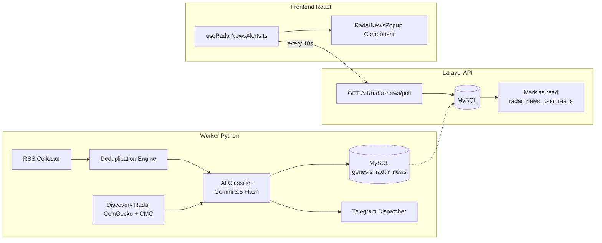

# Design Document: Radar News

## Overview

Radar News is a multi-layer system for real-time crypto news monitoring, AI classification, and alerting. The architecture follows the same patterns already established in the Gênesis platform:

- **Worker Python** (`worker_radar_news.py`) — runs continuously under PM2, collects RSS feeds every 3 minutes, classifies via Gemini 2.5 Flash, persists to MySQL, dispatches to Telegram. Runs Discovery Radar every 20 minutes.
- **MySQL** — central persistence layer (`genesis_radar_news` + `radar_news_user_reads` tables)
- **Laravel API** — polling endpoint (`/v1/radar-news/poll`) following the same pattern as `AlertaController::poll()`
- **Frontend React Hook** — `useRadarNewsAlerts.ts` singleton polling hook (same pattern as `useAlertas.ts`)

No SSE, no Redis, no WebSockets. Pure MySQL-backed polling, consistent with the existing architecture.

## Architecture



### Data Flow

1. Worker Python fetches RSS feeds every 3 minutes
2. New entries are deduplicated against MySQL (title hash + source within 24h)
3. Non-duplicate entries are sent to Gemini 2.5 Flash for classification
4. Classified entries are persisted to `genesis_radar_news`
5. CRITICAL/HIGH entries are dispatched to Telegram
6. Frontend polls `/v1/radar-news/poll` every 10 seconds
7. Backend returns unread entries for authenticated user, marks them as read

## Components and Interfaces

### 1. Worker Python (`worker_radar_news.py`)

Location: `G-nesis-2.0-main/monitor/worker_radar_news.py`

Follows the same structure as `monitor_worker.py`:
- Class-based architecture (`RadarNewsWorker`)
- Signal handling (SIGINT, SIGTERM)
- Direct MySQL connection via `pymysql`
- Environment variables via `dotenv`
- Logging to stdout/stderr for PM2 capture

**Modules:**

| Module | Responsibility | Cycle |
|--------|---------------|-------|
| `RSSCollector` | Fetch and parse RSS feeds | Every 3 min |
| `AIClassifier` | Send to Gemini, parse response | On new entries |
| `TelegramDispatcher` | Format and send to Telegram | On CRITICAL/HIGH |
| `DiscoveryRadar` | CoinGecko trending + CMC gainers | Every 20 min |

**RSS Sources:**
- Reuters Crypto/Markets
- Bloomberg Crypto
- CoinDesk
- The Block
- Decrypt
- FT Markets

### 2. Laravel Backend

**Controller:** `App\Http\Controllers\Api\RadarNewsController`

```php
// GET /v1/radar-news/poll (auth:sanctum)
public function poll(Request $request): JsonResponse
```

**Service:** `App\Services\RadarNewsService`

```php
public function getUnreadForUser(int $userId): Collection
public function markAsRead(int $userId, array $newsIds): void
```

**Model:** `App\Models\RadarNews`

```php
protected $table = 'genesis_radar_news';
protected $casts = [
    'affected_assets' => 'array',
    'is_discovery' => 'boolean',
    'telegram_sent' => 'boolean',
    'discovery_score' => 'integer',
];
```

**Route registration** (in `routes/api.php`):
```php
Route::get('/radar-news/poll', [RadarNewsController::class, 'poll']);
```
Inside the existing `auth:sanctum` middleware group.

### 3. Frontend Hook (`useRadarNewsAlerts.ts`)

Location: `G-nesis-2.0-main/hooks/useRadarNewsAlerts.ts`

Singleton polling pattern (identical to `useAlertas.ts`):
- Module-level `pollInterval`, `pollListeners`, `lastNewsId`
- `startPolling()` / `stopPolling()` / `subscribePolling()`
- Hook returns `{ news, fecharNews }`
- Auto-dismiss after 15 seconds
- Max 5 simultaneous popups

### 4. Frontend Component (`RadarNewsPopup.tsx`)

Location: `G-nesis-2.0-main/components/RadarNewsPopup.tsx`

Toast/popup component displaying:
- Severity emoji + badge
- Title (bold)
- Impact summary (truncated)
- Affected assets tags
- Source link
- Auto-dismiss progress bar (15s)

## Data Models

### Table: `genesis_radar_news`

```sql
CREATE TABLE genesis_radar_news (
    id BIGINT UNSIGNED AUTO_INCREMENT PRIMARY KEY,
    title VARCHAR(500) NOT NULL,
    title_hash VARCHAR(64) NOT NULL COMMENT 'SHA-256 of lowercase title for dedup',
    source VARCHAR(50) NOT NULL,
    source_url VARCHAR(1000) DEFAULT NULL,
    severity ENUM('CRITICAL', 'HIGH', 'MEDIUM', 'LOW') NOT NULL DEFAULT 'MEDIUM',
    category VARCHAR(50) DEFAULT NULL,
    affected_assets JSON DEFAULT NULL,
    market_bias ENUM('BULLISH', 'BEARISH', 'NEUTRAL') NOT NULL DEFAULT 'NEUTRAL',
    impact_summary TEXT DEFAULT NULL,
    discovery_score TINYINT UNSIGNED DEFAULT NULL COMMENT '1-10, only for discovery entries',
    is_discovery TINYINT(1) NOT NULL DEFAULT 0,
    telegram_sent TINYINT(1) NOT NULL DEFAULT 0,
    created_at TIMESTAMP NULL DEFAULT CURRENT_TIMESTAMP,
    updated_at TIMESTAMP NULL DEFAULT CURRENT_TIMESTAMP ON UPDATE CURRENT_TIMESTAMP,
    INDEX idx_created_at (created_at),
    INDEX idx_severity (severity),
    UNIQUE INDEX idx_title_hash_source (title_hash, source)
) ENGINE=InnoDB DEFAULT CHARSET=utf8mb4 COLLATE=utf8mb4_unicode_ci;
```

### Table: `radar_news_user_reads`

```sql
CREATE TABLE radar_news_user_reads (
    id BIGINT UNSIGNED AUTO_INCREMENT PRIMARY KEY,
    user_id BIGINT UNSIGNED NOT NULL,
    radar_news_id BIGINT UNSIGNED NOT NULL,
    created_at TIMESTAMP NULL DEFAULT CURRENT_TIMESTAMP,
    INDEX idx_user_news (user_id, radar_news_id),
    UNIQUE INDEX idx_unique_read (user_id, radar_news_id),
    FOREIGN KEY (user_id) REFERENCES users(id) ON DELETE CASCADE,
    FOREIGN KEY (radar_news_id) REFERENCES genesis_radar_news(id) ON DELETE CASCADE
) ENGINE=InnoDB DEFAULT CHARSET=utf8mb4 COLLATE=utf8mb4_unicode_ci;
```

### Telegram Message Format (News Alert)

```
🔴 <b>Fed Raises Rates by 50bps Amid Crypto Sell-Off</b>

📊 <b>Impacto:</b> Massive risk-off movement expected across crypto markets
💰 <b>Ativos:</b> BTC, ETH, SOL
📈 <b>Viés:</b> BEARISH
🔗 <a href="https://...">Fonte</a>

-- @cripto.ico
```

### Telegram Message Format (Discovery Alert)

```
🔍 <b>PEPE — Discovery Score: 8/10</b>

📊 <b>Volume 24h:</b> $45M
🏦 <b>Exchanges:</b> Binance, Bybit, OKX
📝 <b>Contexto:</b> Multiple whale accumulations detected across...
🔗 <a href="https://...">CoinGecko</a>

-- @cripto.ico
```


## Correctness Properties

*A property is a characteristic or behavior that should hold true across all valid executions of a system — essentially, a formal statement about what the system should do. Properties serve as the bridge between human-readable specifications and machine-verifiable correctness guarantees.*

### Property 1: Feed fault tolerance

*For any* subset of RSS feeds that return errors or are unreachable, the RSS Collector should still successfully process all remaining reachable feeds and return their entries.

**Validates: Requirements 1.2**

### Property 2: RSS entry parsing completeness

*For any* valid RSS feed entry, the parsed result should contain a non-empty title, a publication date, a source URL, and a content summary.

**Validates: Requirements 1.3**

### Property 3: Deduplication by title hash

*For any* two news entries with the same case-insensitive title and same source submitted within 24 hours, the second entry should be rejected (not persisted) and only the first should exist in the database.

**Validates: Requirements 1.4, 7.3**

### Property 4: Classification output validation

*For any* classified news entry returned from the AI classifier, it must have: a valid severity (one of CRITICAL, HIGH, MEDIUM, LOW), a valid market_bias (one of BULLISH, BEARISH, NEUTRAL), a non-empty affected_assets array, and a non-empty impact_summary.

**Validates: Requirements 2.2, 2.3**

### Property 5: Classification persistence round-trip

*For any* classified news entry, persisting to the database then reading back should produce an entry with equivalent title, severity, market_bias, affected_assets, and impact_summary.

**Validates: Requirements 2.5**

### Property 6: Telegram dispatch decision by severity

*For any* classified news entry, the dispatch decision should be: send immediately if CRITICAL, send with 3-minute delay if HIGH, do not send if MEDIUM or LOW.

**Validates: Requirements 3.1, 3.2, 3.3**

### Property 7: News Telegram message format

*For any* news entry dispatched to Telegram, the formatted message must contain: the severity emoji (🔴 for CRITICAL, 🟠 for HIGH), the title in bold HTML tags, the impact summary, the affected assets, and the signature "-- @cripto.ico".

**Validates: Requirements 3.4, 9.1**

### Property 8: Discovery filtering

*For any* token from CoinGecko/CMC results, it should pass the discovery filter if and only if: its 24h volume > $5M, it is listed on at least one of (Binance, Bybit, OKX, Coinbase), AND it is NOT in the Monitored_Tokens_List.

**Validates: Requirements 4.2, 4.3, 4.4**

### Property 9: Discovery multi-source confirmation

*For any* token to qualify as a discovery candidate, it must have at least 2 independent sources confirming relevance within a 2-hour window.

**Validates: Requirements 4.5**

### Property 10: Discovery notification routing by score

*For any* discovery token with an assigned score: if score >= 7, dispatch to Telegram immediately; if score is 5 or 6, make available via polling only (no Telegram); if score < 5, log only (no notification of any kind).

**Validates: Requirements 4.7, 4.8, 4.9**

### Property 11: Discovery alert suppression

*For any* token that already has a discovery alert dispatched within the last 6 hours, any new discovery alert for that same token should be suppressed (not dispatched, not shown in frontend).

**Validates: Requirements 4.10**

### Property 12: Poll returns unread then marks read (idempotence)

*For any* authenticated user, polling should return entries created within 5 minutes that the user hasn't received yet. After returning those entries, a subsequent poll should NOT return the same entries again.

**Validates: Requirements 5.2, 5.3**

### Property 13: Poll response ordering and limit

*For any* set of unread entries for a user, the poll response should contain at most 10 entries, ordered by creation date ascending, with the JSON structure `{"success": true, "data": [...]}`.

**Validates: Requirements 5.4, 5.5**

### Property 14: Popup state management

*For any* sequence of news entries received by the frontend hook, the visible popup list should contain at most 5 items, with the oldest dismissed first when a new one arrives and the list is full.

**Validates: Requirements 6.2, 6.3**

### Property 15: Polling lifecycle (subscribe/unsubscribe)

*For any* sequence of subscribe and unsubscribe calls to the polling hook, polling should be active if and only if the count of active subscribers is greater than zero.

**Validates: Requirements 6.5**

### Property 16: Discovery Telegram message format

*For any* discovery entry dispatched to Telegram, the formatted message must contain: 🔍 emoji, token symbol, Discovery_Score value, volume data, listing exchanges, context summary, and the signature "-- @cripto.ico".

**Validates: Requirements 9.2**

### Property 17: Impact summary truncation

*For any* impact summary string exceeding 500 characters, the output in formatted messages should be exactly 500 characters followed by "...".

**Validates: Requirements 9.4**

## Error Handling

| Scenario | Behavior | Recovery |
|----------|----------|----------|
| RSS feed unreachable | Log error, skip feed, continue others | Next cycle retries |
| Gemini API timeout (30s) | Retry once after 5s | Log failure on 2nd fail, entry skipped |
| Gemini API invalid response | Log raw response, skip classification | Next cycle picks up new entries |
| Telegram API error | Retry once after 10s | Log failure, `telegram_sent` stays false |
| MySQL connection lost | Worker exits with non-zero code | PM2 auto-restarts |
| CoinGecko/CMC API rate limit | Log warning, skip discovery cycle | Next 20-min cycle retries |
| Duplicate DB insert (race condition) | MySQL UNIQUE constraint rejects | Caught via IntegrityError, logged |
| Frontend poll 401/403 | Hook stops polling | User re-authenticates, hook restarts |
| Frontend poll network error | Silent catch, retry on next 10s tick | No UI impact |

### Worker Fatal vs Non-Fatal

- **Fatal:** MySQL connection failure, missing critical env vars → `sys.exit(1)` for PM2 restart
- **Non-fatal:** Feed errors, API timeouts, Telegram failures → log and continue

## Testing Strategy

### Property-Based Testing

Library: **Hypothesis** (Python worker) + **fast-check** (frontend TypeScript)

Each property test runs minimum 100 iterations with randomized inputs.

**Python Worker Properties (Hypothesis):**
- RSS parsing completeness (Property 2)
- Deduplication logic (Property 3)
- Classification output validation (Property 4)
- Telegram dispatch decision (Property 6)
- News message format (Property 7)
- Discovery filtering (Property 8)
- Discovery notification routing (Property 10)
- Discovery suppression (Property 11)
- Impact summary truncation (Property 17)

**Frontend Properties (fast-check):**
- Popup state management max 5 (Property 14)
- Polling lifecycle subscribe/unsubscribe (Property 15)

**Laravel/PHP Properties (PHPUnit with data providers):**
- Poll returns unread then marks read (Property 12)
- Poll response ordering and limit (Property 13)

### Unit Tests

- RSS feed error handling (feed fails gracefully)
- Gemini retry logic (mock timeout → retry → success/fail)
- Telegram retry logic
- Discovery score thresholds (boundary: 4→no notify, 5→popup, 7→telegram)
- Auto-dismiss timer (15s)
- Environment variable validation

### Integration Tests

- End-to-end: Worker persists → API returns → Frontend displays
- Deduplication at DB level (unique constraint)
- User read state isolation (user A reads don't affect user B)

### Test Tagging Convention

Each property-based test must include a comment referencing the design property:

```python
# Feature: radar-news, Property 6: Telegram dispatch decision by severity
@given(severity=st.sampled_from(['CRITICAL', 'HIGH', 'MEDIUM', 'LOW']))
def test_dispatch_decision(severity):
    ...
```

```typescript
// Feature: radar-news, Property 14: Popup state management
fc.assert(fc.property(fc.array(fc.record({...})), (entries) => { ... }))
```
