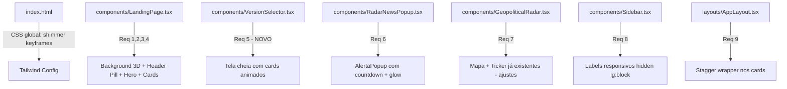

# Design — Visual Polish

## Visão Geral

Este documento descreve a implementação das melhorias visuais para alinhar o frontend 2.0-main com a versão oficial (0012-oficial-gemini-3.1). Todas as alterações são puramente cosméticas — animações, efeitos CSS, componentes de apresentação e responsividade — sem modificação de lógica de negócio.

A stack existente já contempla as dependências necessárias:
- `framer-motion` v12.38 (animações declarativas)
- `react-leaflet` v5.0 + `leaflet` v1.9 (mapa interativo)
- `lucide-react` v0.555 (ícones)
- Tailwind CSS via CDN com tema customizado `genesis` (variáveis CSS)

## Arquitetura

A abordagem é de modificação incremental nos componentes existentes, com criação mínima de novos arquivos:



### Estratégia de Modificação

| Arquivo | Tipo | Requisitos |
|---------|------|-----------|
| `index.html` | Modificar | Req 10 (keyframes shimmer global) |
| `components/LandingPage.tsx` | Modificar | Req 1, 2, 3, 4 |
| `components/VersionSelector.tsx` | **Criar** | Req 5 |
| `components/RadarNewsPopup.tsx` | Modificar | Req 6 |
| `components/GeopoliticalRadar.tsx` | Modificar (leve) | Req 7 |
| `components/Sidebar.tsx` | Modificar | Req 8 |
| `layouts/AppLayout.tsx` | Modificar (leve) | Req 9 |

## Componentes e Interfaces

### 1. Background Animado 3D (LandingPage — Req 1)

Substituir os `div` estáticos do background por `motion.div` com animação contínua:

```tsx
// Dentro de LandingPage, seção "BACKGROUND DECORATION"
<div className="fixed inset-0 pointer-events-none overflow-hidden">
  <motion.div
    className="absolute top-[-10%] left-[-10%] w-[60%] h-[70%] rounded-full blur-[120px]"
    style={{ background: 'radial-gradient(circle, rgba(176,38,255,0.06) 0%, transparent 70%)' }}
    animate={{ x: [0, 30, -20, 0], y: [0, -40, 20, 0], scale: [1, 1.1, 0.95, 1] }}
    transition={{ duration: 22, repeat: Infinity, ease: 'easeInOut' }}
  />
  <motion.div
    className="absolute bottom-[-10%] right-[-10%] w-[50%] h-[70%] rounded-full blur-[120px]"
    style={{ background: 'radial-gradient(circle, rgba(57,255,20,0.05) 0%, transparent 70%)' }}
    animate={{ x: [0, -25, 35, 0], y: [0, 30, -25, 0], scale: [1, 0.95, 1.08, 1] }}
    transition={{ duration: 25, repeat: Infinity, ease: 'easeInOut' }}
  />
</div>
```

O `translate3d` é ativado automaticamente pelo Framer Motion ao animar `x`, `y` e `scale` simultaneamente (GPU-accelerated).

### 2. Header com Pill de Navegação (LandingPage — Req 2)

Envolver o header `<nav>` em container pill com glassmorphism:

```tsx
<nav className="fixed top-6 left-1/2 -translate-x-1/2 z-[999999] w-[90%] max-w-4xl">
  <div className="bg-[#0c0c0e]/80 backdrop-blur-xl border border-white/5 rounded-2xl shadow-[0_10px_30px_rgba(0,0,0,0.5)] px-8 h-16 flex items-center justify-between">
    {/* Logo com w-10 h-10 rounded-xl */}
    {/* Links com underline animado via span + group-hover:w-full */}
    {/* Botão Acessar com shimmer + ArrowRight hover:translate-x-1 */}
  </div>
</nav>
```

Underline animado nos links:
```tsx
<button className="relative group">
  <span className="text-[10px] font-bold uppercase tracking-widest">Sobre</span>
  <span className="absolute -bottom-1 left-0 h-px w-0 group-hover:w-full transition-all duration-300 bg-gradient-to-r from-genesis-accent to-genesis-positive" />
</button>
```

### 3. Hero Section com Motion (LandingPage — Req 3)

Envolver conteúdo do hero em `motion.div`:
```tsx
<motion.div
  initial={{ opacity: 0, y: 20 }}
  animate={{ opacity: 1, y: 0 }}
  transition={{ duration: 0.8, ease: 'easeOut' }}
>
  {/* Substituir drop-shadow por gradient text */}
  <span className="font-bold bg-clip-text text-transparent bg-gradient-to-r from-white via-genesis-accent to-genesis-positive">
    Fronteira
  </span>
</motion.div>
```

Botão principal com glassmorphism:
```tsx
<a className="relative overflow-hidden bg-white/[0.02] border border-white/10 px-8 py-4 rounded-xl ... hover:shadow-[0_0_30px_rgba(176,38,255,0.3)]">
  <span className="shimmer-effect" /> {/* classe global */}
  Acessar o Gênesis
</a>
```

### 4. Cards de Filosofia com Stagger + Neon (LandingPage — Req 4)

```tsx
{cards.map((card, i) => (
  <motion.div
    key={i}
    initial={{ opacity: 0, y: 20 }}
    whileInView={{ opacity: 1, y: 0 }}
    viewport={{ once: true }}
    transition={{ duration: 0.5, delay: i * 0.15, ease: 'easeOut' }}
    className="relative group p-10 rounded-2xl bg-genesis-card overflow-hidden"
  >
    {/* Borda neon com blur */}
    <div className="absolute inset-0 rounded-2xl opacity-0 group-hover:opacity-100 transition-opacity duration-500">
      <div className="absolute inset-0 rounded-2xl bg-gradient-to-r from-genesis-accent/0 via-genesis-accent/20 to-genesis-accent/0 blur-[6px]" />
    </div>
    {/* Shimmer interno */}
    <div className="absolute inset-0 shimmer-effect opacity-0 group-hover:opacity-100 transition-opacity" />
    {/* Conteúdo do card */}
  </motion.div>
))}
```

### 5. VersionSelector — Novo Componente (Req 5)

```tsx
// components/VersionSelector.tsx
interface VersionSelectorProps {
  onSelectVersion?: (version: 1 | 2) => void;
}
```

Estrutura:
- Tela cheia (`fixed inset-0`) com background 3D (mesmos orbs animados do Req 1)
- Grid `grid-cols-1 md:grid-cols-2 gap-8` centralizado
- Cada card: `min-h-[420px]`, borda dupla neon (camada blur + camada sólida)
- Hover: `shadow-[0_0_60px_rgba(176,38,255,0.3)]` + linha `h-px` que expande `w-0 group-hover:w-full`
- Botão com shimmer + logo placeholder com shimmer horizontal

**Fluxo de navegação:**
- Versão 1 selecionada → `window.location.href = import.meta.env.VITE_V1_URL`
- Versão 2 selecionada → `navigate('/login')` via `useNavigate` do react-router-dom

```tsx
const navigate = useNavigate();
const v1Url = import.meta.env.VITE_V1_URL;

const handleSelect = (version: 1 | 2) => {
  onSelectVersion?.(version);
  if (version === 1) {
    window.location.href = v1Url;
  } else {
    navigate('/login');
  }
};
```

**Posicionamento na rota:** O `VersionSelector` deve ser montado na rota raiz `/` do router, antes do fluxo de autenticação. A LandingPage atual (`/landing` ou equivalente) fica acessível apenas após a seleção da v2.

**Variável de ambiente:**
- `.env`: `VITE_V1_URL=https://url-da-versao-1.com`
- `.env.example`: `VITE_V1_URL=` (sem valor, para documentar a variável)

### 6. AlertaPopup com Countdown (RadarNewsPopup — Req 6)

Modificações no `RadarNewsPopup.tsx` existente:

- Substituir keyframe `radarProgress` por duração de 12s (atualmente 15s)
- Ajustar largura para `w-[350px]` (atualmente `w-[370px]`)
- Adicionar lógica de glow por direção:
  ```tsx
  const glowClass = item.market_bias === 'BULLISH'
    ? 'shadow-[0_0_15px_rgba(16,185,129,0.2)]'
    : item.market_bias === 'BEARISH'
    ? 'shadow-[0_0_15px_rgba(239,68,68,0.2)]'
    : '';
  ```
- Manter `animate-in slide-in-from-right fade-in duration-500`
- Adicionar `border-t border-white/5` entre seções (já presente parcialmente)

### 7. RadarNews — Mapa e Ticker (GeopoliticalRadar — Req 7)

O componente `GeopoliticalRadar.tsx` já implementa:
- ✅ `MapContainer`, `TileLayer`, `Marker` via `react-leaflet`
- ✅ Ticker "Monitoramento Ativo" com marquee
- ✅ Status dot com `animate-pulse`

Ajustes necessários:
- Adicionar glow (`shadow-[0_0_10px_rgba(57,255,20,0.3)]`) no pill de status quando ativo
- Garantir que o pill tenha estilo visual de glassmorphism

### 8. Sidebar Labels Responsivos (Req 8)

No `Sidebar.tsx`, dentro de `SidebarContent`:

```tsx
// Títulos de seção
<div className="text-[9px] font-bold text-gray-700 uppercase tracking-[0.14em] px-2 mb-1 hidden lg:block">
  {section.title}
</div>

// Labels dos itens de menu
<span className="text-[12px] font-medium tracking-wide hidden lg:block">{item.label}</span>
```

A sidebar desktop (`aside`) já usa `hidden md:flex`. Os labels internos ficam `hidden lg:block` para colapsar em telas menores que `lg` mantendo apenas ícones visíveis.

### 9. Stagger Animations Globais (Req 9)

Padrão a ser aplicado em páginas/dashboards que renderizam listas de cards:

```tsx
// Utility: motion wrapper para cards
<motion.div
  initial={{ opacity: 0, y: 10 }}
  animate={{ opacity: 1, y: 0 }}
  transition={{ duration: 0.4, delay: index * 0.08, ease: 'easeOut' }}
>
  {children}
</motion.div>
```

Aplicar nos componentes de dashboard que usam grids de cards (ex: página principal, scanner, carteira).

### 10. Shimmer Reutilizável (Req 10)

Adicionar keyframe global no `index.html` (seção `<style type="text/tailwindcss">`):

```css
@keyframes shimmer {
  0% { transform: translateX(-100%); }
  100% { transform: translateX(100%); }
}

.shimmer-effect {
  position: absolute;
  inset: 0;
  background: linear-gradient(90deg, transparent, rgba(255,255,255,0.05), transparent);
  animation: shimmer 2s infinite;
  pointer-events: none;
}

.shimmer-hover {
  position: absolute;
  inset: 0;
  background: linear-gradient(90deg, transparent, rgba(255,255,255,0.05), transparent);
  transform: translateX(-100%);
  pointer-events: none;
}
.group:hover .shimmer-hover,
*:hover > .shimmer-hover {
  animation: shimmer 1.5s infinite;
}
```

## Modelos de Dados

Não há novos modelos de dados. A única interface nova é:

```typescript
// components/VersionSelector.tsx
interface VersionSelectorProps {
  onSelectVersion: (version: 1 | 2) => void;
}
```

Não há alteração em stores, contextos ou APIs.

**Variável de ambiente necessária:**
- `VITE_V1_URL` — URL do frontend da Versão 1. Lida via `import.meta.env.VITE_V1_URL`. Deve estar no `.env` e documentada no `.env.example`.

## Propriedades de Corretude

*Uma propriedade é uma característica ou comportamento que deve ser verdadeiro em todas as execuções válidas de um sistema — essencialmente, uma declaração formal sobre o que o sistema deve fazer. Propriedades servem como ponte entre especificações legíveis por humanos e garantias de corretude verificáveis por máquina.*

### Property 1: Stagger delay escala com índice

*Para qualquer* lista de cards animados com stagger (filosofia ou dashboard), o delay de cada card no índice `i` deve ser igual a `i * staggerInterval`, onde staggerInterval é constante dentro da mesma lista.

**Validates: Requirements 4.1, 9.2**

### Property 2: Glow direcional corresponde ao bias

*Para qualquer* alerta renderizado pelo AlertaPopup, se `market_bias === 'BULLISH'` então a classe de shadow deve conter `rgba(16,185,129` (verde), e se `market_bias === 'BEARISH'` então deve conter `rgba(239,68,68` (vermelho).

**Validates: Requirements 6.2, 6.3**

### Property 3: VersionSelector callback retorna versão válida

*Para qualquer* interação de clique em um card do VersionSelector, a prop `onSelectVersion` deve ser chamada com exatamente o valor `1` ou `2`, correspondente ao card clicado.

**Validates: Requirements 5.5**

### Property 4: Labels da sidebar possuem classes responsivas

*Para todos* os labels de texto (itens de menu e títulos de seção) renderizados no Sidebar, cada label deve conter a classe `hidden` combinada com `lg:block` ou `lg:flex` para garantir visibilidade apenas em viewport ≥ lg.

**Validates: Requirements 8.1, 8.2**

## Tratamento de Erros

Por se tratar de mudanças puramente visuais, o tratamento de erros é mínimo:

- **Shimmer em CSS**: A classe `.shimmer-effect` usa `pointer-events: none` para nunca interferir com interações
- **Framer Motion**: Animações são declarativas e degradam graciosamente se o navegador não suportar `will-change` ou GPU acceleration
- **react-leaflet** (Req 7): Já existente no projeto com tratamento de fallback. Nenhuma alteração de error handling necessária
- **VersionSelector**: Se `onSelectVersion` não for passada, o componente não deve crashar — usar optional chaining `onSelectVersion?.(version)`
- **Background orbs**: Posicionados com `pointer-events-none` e `overflow-hidden` no container para garantir que nunca bloqueiem interação

## Estratégia de Testes

### Abordagem Dual: Testes Unitários + Property-Based

**Biblioteca PBT**: `fast-check` (já instalada no projeto como devDependency)

**Testes Unitários** (exemplos específicos e edge cases):
- Verificar que LandingPage renderiza motion.div com classes de orb (blur-[120px])
- Verificar que VersionSelector renderiza 2 cards com `min-h-[420px]`
- Verificar que shimmer CSS existe no DOM global
- Verificar que RadarNewsPopup usa `w-[350px]`
- Verificar que hero text "Fronteira" usa `bg-clip-text` e NÃO `drop-shadow`

**Testes Property-Based** (100+ iterações cada):

- **Feature: visual-polish, Property 1: Stagger delay escala com índice**
  Para qualquer array de N cards (1 ≤ N ≤ 20) e qualquer staggerInterval positivo, o delay do card[i] deve ser `i * staggerInterval`

- **Feature: visual-polish, Property 2: Glow direcional corresponde ao bias**
  Para qualquer alerta com market_bias gerado aleatoriamente entre BULLISH/BEARISH/NEUTRAL, a função que computa a classe de glow deve retornar a cor correta correspondente

- **Feature: visual-polish, Property 3: VersionSelector callback retorna versão válida**
  Para qualquer sequência de cliques simulados nos cards, o callback sempre recebe 1 ou 2

- **Feature: visual-polish, Property 4: Labels da sidebar possuem classes responsivas**
  Para qualquer conjunto de items de menu gerado, todos os labels renderizados devem conter classes de visibilidade responsiva

**Configuração**:
- Mínimo 100 iterações por teste de propriedade (`fc.assert(..., { numRuns: 100 })`)
- Cada teste deve referenciar a propriedade do design com comentário: `// Feature: visual-polish, Property N: ...`
- Runner: `vitest --run` (já configurado no projeto)
