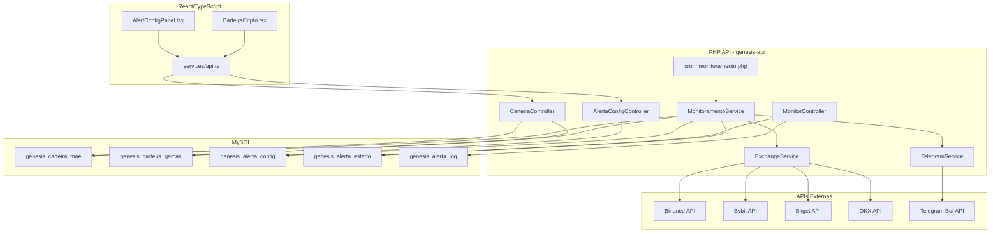
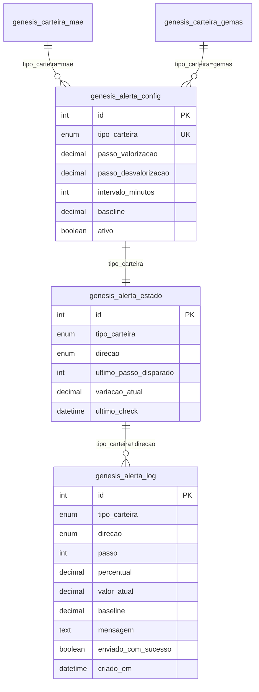

# Design — Monitoramento de Carteiras com Alertas Telegram

## Visão Geral

Este documento descreve a arquitetura e design técnico do sistema de monitoramento de variação das carteiras Mãe e Gema com disparo de alertas escalonados via Telegram. O sistema opera como um módulo backend (cron job PHP) que periodicamente consulta preços nas exchanges, calcula a variação percentual em relação ao baseline fixo de cada carteira, e envia notificações ao grupo Telegram quando limiares configurados são atingidos.

### Decisões de Design

1. **Monitoramento server-side via cron**: O monitoramento é feito exclusivamente no backend PHP via cron job, garantindo execução confiável independente do frontend estar aberto.
2. **Baseline fixo com recálculo incremental**: O baseline é registrado na criação da carteira e atualizado apenas quando novos ativos são adicionados (soma do valor de entrada do novo ativo).
3. **Alertas por passo (step-based)**: Evita spam de mensagens repetidas usando persistência do último passo notificado no banco de dados.
4. **Configuração por carteira**: Cada carteira (Mãe e Gema) tem seus próprios parâmetros de alerta independentes.
5. **Reutilização da camada de exchange existente**: O backend PHP replica a lógica do `spotPriceService.ts` para consultar preços diretamente nas APIs públicas das exchanges.

## Arquitetura



## Componentes e Interfaces

### 1. Backend PHP — Camada de Serviços

#### ExchangeService.php
Responsável por consultar preços e pares de trading nas exchanges.

```php
interface ExchangeServiceInterface {
    public function buscarPrecoSpot(string $symbol, string $corretora): ?float;
    public function buscarParesTrading(string $corretora): array;
}
```

#### TelegramService.php
Responsável por enviar mensagens ao grupo Telegram fixo.

```php
interface TelegramServiceInterface {
    public function enviarAlerta(string $mensagem): bool;
}
```

#### MonitoramentoService.php
Orquestra o ciclo de monitoramento: busca preços, calcula variação, verifica limiares, dispara alertas.

```php
interface MonitoramentoServiceInterface {
    public function executarCiclo(): void;
    public function calcularValorCarteira(string $tipoCarteira): array; // [valor_atual, baseline]
    public function calcularVariacao(float $valorAtual, float $baseline): float;
    public function verificarLimiares(string $tipoCarteira, float $variacao): ?int; // retorna passo atingido ou null
}
```

### 2. Backend PHP — Controllers (API REST)

#### AlertaConfigController.php
```
GET    /api/v1/admin/alerta-config              → Retorna configurações de alerta
PUT    /api/v1/admin/alerta-config/{carteira}    → Atualiza configuração (carteira = 'mae' | 'gemas')
```

#### MonitorController.php
```
GET    /api/v1/admin/monitor/status              → Retorna estado atual do monitoramento
POST   /api/v1/admin/monitor/reset/{carteira}    → Reseta estado de alertas de uma carteira
GET    /api/v1/admin/monitor/log                 → Retorna histórico de alertas enviados
```

### 3. Backend PHP — Cron Job

#### cron_monitoramento.php
Script executado periodicamente via cron do sistema operacional (Windows Task Scheduler no WAMP).

```
*/5 * * * * php e:\Programas\wamp64\www\genesis-api\cron_monitoramento.php
```

O intervalo real é configurável pelo admin via `genesis_alerta_config.intervalo_minutos`.

### 4. Frontend React — Componentes

#### AlertConfigPanel.tsx
Painel de configuração de alertas (somente admin), integrado à página de carteiras.

```typescript
interface AlertConfig {
    carteira: 'mae' | 'gemas';
    passo_valorizacao: number;   // ex: 5 (%)
    passo_desvalorizacao: number; // ex: 5 (%)
    intervalo_minutos: number;    // ex: 5
    ativo: boolean;
}
```

#### MonitorStatusWidget.tsx
Widget que exibe o estado atual do monitoramento (último check, variação atual, próximo passo).

## Modelos de Dados

### Tabela: genesis_alerta_config

Armazena a configuração de alertas para cada carteira monitorada.

```sql
CREATE TABLE IF NOT EXISTS genesis_alerta_config (
    id INT AUTO_INCREMENT PRIMARY KEY,
    tipo_carteira ENUM('mae', 'gemas') NOT NULL UNIQUE,
    passo_valorizacao DECIMAL(5,2) NOT NULL DEFAULT 5.00 COMMENT 'Percentual de passo para alertas de valorização',
    passo_desvalorizacao DECIMAL(5,2) NOT NULL DEFAULT 5.00 COMMENT 'Percentual de passo para alertas de desvalorização',
    intervalo_minutos INT NOT NULL DEFAULT 5 COMMENT 'Intervalo entre verificações em minutos',
    baseline DECIMAL(20,8) NOT NULL DEFAULT 0 COMMENT 'Valor total da carteira no momento da criação',
    ativo TINYINT(1) NOT NULL DEFAULT 1 COMMENT 'Se o monitoramento está ativo',
    criado_em DATETIME NOT NULL,
    atualizado_em DATETIME
) ENGINE=InnoDB DEFAULT CHARSET=utf8mb4 COLLATE=utf8mb4_unicode_ci;
```

### Tabela: genesis_alerta_estado

Persiste o último passo de alerta disparado para cada carteira, evitando reenvios após reinicializações.

```sql
CREATE TABLE IF NOT EXISTS genesis_alerta_estado (
    id INT AUTO_INCREMENT PRIMARY KEY,
    tipo_carteira ENUM('mae', 'gemas') NOT NULL,
    direcao ENUM('valorizacao', 'desvalorizacao') NOT NULL,
    ultimo_passo_disparado INT NOT NULL DEFAULT 0 COMMENT 'Último passo notificado (ex: 2 = 10% com passo de 5%)',
    variacao_atual DECIMAL(10,4) DEFAULT 0 COMMENT 'Última variação calculada',
    ultimo_check DATETIME COMMENT 'Timestamp da última verificação',
    atualizado_em DATETIME,
    UNIQUE KEY uk_carteira_direcao (tipo_carteira, direcao)
) ENGINE=InnoDB DEFAULT CHARSET=utf8mb4 COLLATE=utf8mb4_unicode_ci;
```

### Tabela: genesis_alerta_log

Histórico de alertas enviados para auditoria.

```sql
CREATE TABLE IF NOT EXISTS genesis_alerta_log (
    id INT AUTO_INCREMENT PRIMARY KEY,
    tipo_carteira ENUM('mae', 'gemas') NOT NULL,
    direcao ENUM('valorizacao', 'desvalorizacao') NOT NULL,
    passo INT NOT NULL COMMENT 'Número do passo atingido',
    percentual DECIMAL(10,4) NOT NULL COMMENT 'Percentual exato no momento do alerta',
    valor_atual DECIMAL(20,8) NOT NULL,
    baseline DECIMAL(20,8) NOT NULL,
    mensagem TEXT NOT NULL COMMENT 'Mensagem enviada ao Telegram',
    enviado_com_sucesso TINYINT(1) NOT NULL DEFAULT 0,
    criado_em DATETIME NOT NULL,
    INDEX idx_carteira_criado (tipo_carteira, criado_em)
) ENGINE=InnoDB DEFAULT CHARSET=utf8mb4 COLLATE=utf8mb4_unicode_ci;
```

### Alterações nas Tabelas Existentes

Adição do campo `baseline` nas tabelas de carteira existentes para registrar o valor total no momento da criação:

```sql
ALTER TABLE genesis_carteira_mae 
ADD COLUMN IF NOT EXISTS baseline_valor DECIMAL(20,8) DEFAULT NULL COMMENT 'Valor total da carteira no momento da criação (soma preco_entrada de todos os ativos iniciais)';

ALTER TABLE genesis_carteira_gemas 
ADD COLUMN IF NOT EXISTS baseline_valor DECIMAL(20,8) DEFAULT NULL COMMENT 'Valor total da carteira no momento da criação (soma preco_entrada de todos os ativos iniciais)';
```

### Diagrama ER




## Propriedades de Corretude

*Uma propriedade é uma característica ou comportamento que deve ser verdadeiro em todas as execuções válidas de um sistema — essencialmente, uma declaração formal sobre o que o sistema deve fazer. Propriedades servem como ponte entre especificações legíveis por humanos e garantias de corretude verificáveis por máquina.*

### Propriedade 1: Unicidade de carteiras monitoradas

*Para qualquer* sequência de operações de criação de carteira do tipo 'mae' ou 'gemas', o sistema deve garantir que exista no máximo uma instância ativa de cada tipo. Tentativas de criar uma segunda devem ser rejeitadas.

**Valida: Requisitos 1.1, 1.2**

### Propriedade 2: Round-trip de criação de ativo

*Para qualquer* conjunto válido de campos (ativo, corretora, par de trading, preço de entrada, data de entrada), ao criar um ativo em uma carteira e em seguida consultá-la, o ativo retornado deve conter exatamente os mesmos valores informados na criação.

**Valida: Requisitos 2.1, 2.2**

### Propriedade 3: Round-trip de edição de ativo

*Para qualquer* ativo existente em uma carteira e qualquer campo com um novo valor válido, ao atualizar o campo e em seguida consultar o ativo, o valor retornado deve ser igual ao novo valor informado.

**Valida: Requisito 2.3**

### Propriedade 4: Deleção remove ativo da carteira

*Para qualquer* ativo existente em uma carteira, ao deletá-lo e em seguida listar os ativos da carteira, o ativo removido não deve estar presente na lista e o tamanho da lista deve ter diminuído em 1.

**Valida: Requisito 2.4**

### Propriedade 5: Controle de acesso — operações admin-only

*Para qualquer* usuário sem permissão de administrador e qualquer operação de escrita (criar, editar, excluir) nas carteiras Mãe/Gema ou nas configurações de alerta, o sistema deve rejeitar a operação com erro de permissão negada.

**Valida: Requisitos 2.5, 7.4**

### Propriedade 6: CRUD do membro na própria carteira

*Para qualquer* membro autenticado e qualquer conjunto válido de dados de ativo, as operações de criar, editar e excluir na sua própria Carteira_Individual devem ser bem-sucedidas e os dados devem ser persistidos corretamente (round-trip).

**Valida: Requisito 4.1**

### Propriedade 7: Isolamento entre carteiras de membros

*Para quaisquer* dois membros distintos A e B, o membro A não deve conseguir ler nem modificar os ativos da Carteira_Individual do membro B. Qualquer tentativa deve resultar em erro ou retornar lista vazia.

**Valida: Requisito 4.2**

### Propriedade 8: Baseline calculado na criação

*Para qualquer* conjunto de ativos iniciais com preços de entrada conhecidos, ao criar a carteira, o baseline registrado deve ser igual à soma dos preços de entrada de todos os ativos iniciais.

**Valida: Requisito 6.1**

### Propriedade 9: Baseline imutável durante monitoramento

*Para qualquer* carteira com baseline definido, após qualquer número de ciclos de monitoramento (atualização de preços, cálculo de variação), o valor do baseline deve permanecer inalterado.

**Valida: Requisito 6.2**

### Propriedade 10: Fórmula de variação percentual

*Para qualquer* valor atual (> 0) e baseline (> 0), a variação calculada pelo sistema deve ser exatamente igual a ((valor_atual - baseline) / baseline) * 100.

**Valida: Requisito 6.3**

### Propriedade 11: Baseline atualizado ao adicionar ativo

*Para qualquer* carteira com baseline existente e qualquer novo ativo com preço de entrada P, após adicionar o ativo, o novo baseline deve ser igual ao baseline anterior + P.

**Valida: Requisito 6.4**

### Propriedade 12: Round-trip de configuração de alertas

*Para qualquer* configuração válida (passo_valorizacao, passo_desvalorizacao, intervalo_minutos) e qualquer tipo de carteira, ao salvar a configuração e em seguida consultá-la, os valores retornados devem ser idênticos aos salvos.

**Valida: Requisitos 7.1, 7.2, 7.3**

### Propriedade 13: Cálculo de valor total da carteira

*Para qualquer* lista de ativos com preços atuais conhecidos, o valor total calculado pelo módulo de monitoramento deve ser igual à soma dos preços atuais de todos os ativos ativos na carteira.

**Valida: Requisito 8.2**

### Propriedade 14: Determinação de passo atingido

*Para qualquer* variação percentual V e passo configurado P (> 0), o passo atingido deve ser igual a floor(|V| / P). Se V é positivo, é passo de valorização; se negativo, de desvalorização.

**Valida: Requisito 8.3**

### Propriedade 15: Disparo de alerta ao atingir novo passo

*Para qualquer* variação que resulte em um passo N maior que o último passo disparado registrado, o sistema deve gerar exatamente um alerta. Se o passo N é igual ou menor ao último disparado, nenhum alerta deve ser gerado.

**Valida: Requisitos 9.1, 9.2**

### Propriedade 16: Idempotência — não reenvia alerta do mesmo passo

*Para qualquer* estado onde o último passo disparado é N, executar o ciclo de monitoramento novamente com a mesma variação (mesmo passo N) não deve gerar nenhum novo alerta.

**Valida: Requisito 9.3**

### Propriedade 17: Salto múltiplo — alerta apenas do passo mais recente

*Para qualquer* salto de variação que cruze múltiplos passos (ex: último disparado = 1, passo atual = 3), o sistema deve enviar alerta apenas para o passo mais alto atingido (3), não para os intermediários (2).

**Valida: Requisito 9.4**

### Propriedade 18: Mensagem de alerta contém campos obrigatórios

*Para qualquer* alerta gerado, a mensagem formatada deve conter: nome da carteira (Mãe ou Gema), tipo de variação (valorização ou desvalorização), percentual atingido, valor atual da carteira e valor do baseline.

**Valida: Requisito 9.5**

### Propriedade 19: Persistência e recuperação de estado de alertas

*Para qualquer* estado de alerta (tipo_carteira, direção, último_passo_disparado), ao persistir no banco e em seguida recuperar, os valores devem ser idênticos. Após reinicialização do módulo, o estado recuperado deve impedir reenvio de alertas já disparados.

**Valida: Requisitos 11.1, 11.2, 11.3, 11.4, 11.5**

## Tratamento de Erros

### Falhas na API da Exchange

| Cenário | Comportamento |
|---------|---------------|
| Timeout (>10s) na busca de pares | Retorna erro ao frontend com mensagem "Falha na comunicação com a corretora" |
| Timeout na busca de preço (monitoramento) | Registra erro em log, usa último preço conhecido do campo `preco_atual` da tabela |
| Exchange retorna lista vazia de pares | Retorna mensagem "Nenhum par encontrado para a corretora selecionada" |
| Exchange retorna erro HTTP 4xx/5xx | Registra erro, tenta fallback na Binance (se não for a primária) |

### Falhas no Telegram

| Cenário | Comportamento |
|---------|---------------|
| Falha ao enviar mensagem | Registra erro em `genesis_alerta_log` com `enviado_com_sucesso = 0`, NÃO atualiza `ultimo_passo_disparado` |
| Bot token inválido | Registra erro crítico em log do sistema |
| Chat ID inválido | Registra erro crítico em log do sistema |
| Rate limit do Telegram | Aguarda 1 segundo e retenta uma vez; se falhar, registra e tenta na próxima execução |

### Falhas no Banco de Dados

| Cenário | Comportamento |
|---------|---------------|
| Falha ao ler estado de alertas | Aborta ciclo de monitoramento, registra erro |
| Falha ao persistir estado | Registra erro; na próxima execução pode reenviar alerta (comportamento seguro — melhor duplicar que perder) |
| Baseline não encontrado | Aborta monitoramento para aquela carteira, registra erro |

### Validações de Entrada

| Campo | Validação |
|-------|-----------|
| passo_valorizacao | Deve ser > 0 e <= 100 |
| passo_desvalorizacao | Deve ser > 0 e <= 100 |
| intervalo_minutos | Deve ser >= 1 e <= 1440 |
| preco_entrada | Deve ser > 0 |
| corretora | Deve ser um dos valores: Binance, Bybit, Bitget, OKX |

## Estratégia de Testes

### Abordagem Dual

O sistema será testado com uma combinação de:
- **Testes unitários**: Para exemplos específicos, edge cases e condições de erro
- **Testes de propriedade (property-based)**: Para validar propriedades universais com inputs gerados aleatoriamente

### Biblioteca de Testes de Propriedade

- **Frontend (TypeScript)**: `fast-check` com Vitest
- **Backend (PHP)**: `phpunit` com `eris/eris` (biblioteca de property-based testing para PHP)

### Configuração dos Testes de Propriedade

- Mínimo de **100 iterações** por teste de propriedade
- Cada teste deve referenciar a propriedade do design com um comentário no formato:
  - **Feature: wallet-monitoring-telegram-alerts, Property {número}: {título}**

### Testes Unitários (Exemplos e Edge Cases)

| Área | Cenário | Tipo |
|------|---------|------|
| ExchangeService | Timeout de 10s retorna erro apropriado | Edge case |
| ExchangeService | Exchange retorna lista vazia | Edge case |
| MonitoramentoService | Preço indisponível usa último conhecido | Edge case |
| TelegramService | Falha no envio não atualiza estado | Edge case |
| TelegramService | Rate limit com retry | Edge case |
| MonitoramentoService | Carteira sem ativos ativos não gera erro | Edge case |
| AlertaConfig | Validação rejeita passo = 0 | Edge case |
| AlertaConfig | Validação rejeita intervalo negativo | Edge case |

### Testes de Propriedade

| Propriedade | Foco | Tag |
|-------------|------|-----|
| P1 | Unicidade de carteiras | Feature: wallet-monitoring-telegram-alerts, Property 1: Unicidade de carteiras monitoradas |
| P5 | Controle de acesso | Feature: wallet-monitoring-telegram-alerts, Property 5: Controle de acesso — operações admin-only |
| P7 | Isolamento entre membros | Feature: wallet-monitoring-telegram-alerts, Property 7: Isolamento entre carteiras de membros |
| P8 | Baseline na criação | Feature: wallet-monitoring-telegram-alerts, Property 8: Baseline calculado na criação |
| P10 | Fórmula de variação | Feature: wallet-monitoring-telegram-alerts, Property 10: Fórmula de variação percentual |
| P11 | Baseline ao adicionar | Feature: wallet-monitoring-telegram-alerts, Property 11: Baseline atualizado ao adicionar ativo |
| P13 | Valor total | Feature: wallet-monitoring-telegram-alerts, Property 13: Cálculo de valor total da carteira |
| P14 | Passo atingido | Feature: wallet-monitoring-telegram-alerts, Property 14: Determinação de passo atingido |
| P15 | Disparo de alerta | Feature: wallet-monitoring-telegram-alerts, Property 15: Disparo de alerta ao atingir novo passo |
| P16 | Idempotência | Feature: wallet-monitoring-telegram-alerts, Property 16: Idempotência — não reenvia alerta do mesmo passo |
| P17 | Salto múltiplo | Feature: wallet-monitoring-telegram-alerts, Property 17: Salto múltiplo — alerta apenas do passo mais recente |
| P18 | Mensagem completa | Feature: wallet-monitoring-telegram-alerts, Property 18: Mensagem de alerta contém campos obrigatórios |
| P19 | Persistência de estado | Feature: wallet-monitoring-telegram-alerts, Property 19: Persistência e recuperação de estado de alertas |

### Prioridade de Implementação

1. **Crítico**: P10, P14, P15, P16, P17 (lógica core do monitoramento)
2. **Alto**: P8, P11, P13, P19 (cálculos e persistência)
3. **Médio**: P1, P5, P7, P18 (integridade e segurança)
4. **Baixo**: P2, P3, P4, P6, P12 (CRUD round-trips — cobertos parcialmente por testes de integração)
